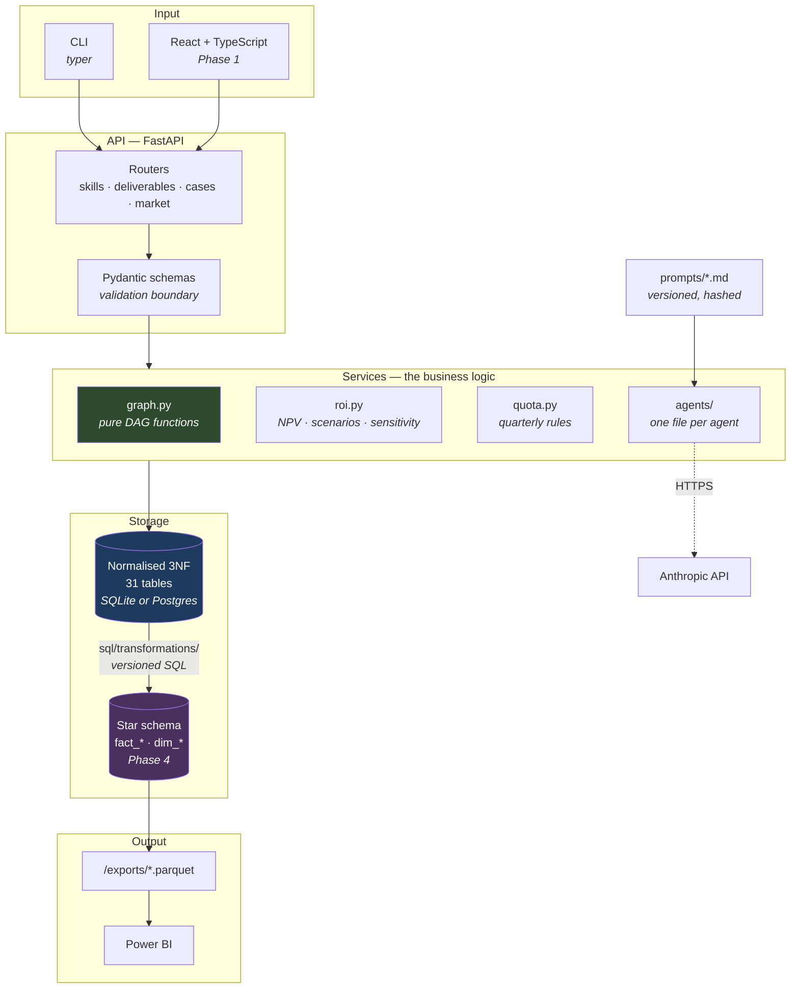
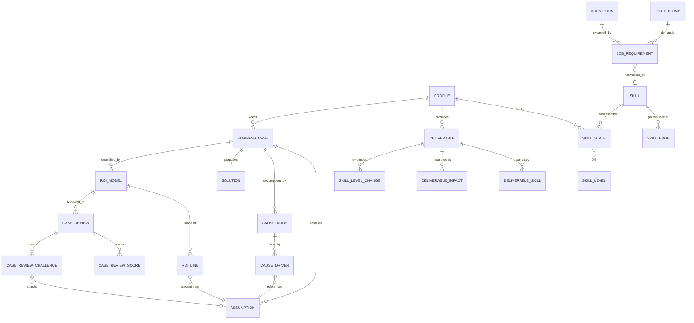

# Transformation OS

A local-first system for steering a ten-year trajectory towards data and AI
transformation architecture — and, deliberately, a portfolio piece in its own
right. The schema, the SQL and the architecture decisions are meant to be read
by other people, not only run.

It does four things:

| Module | Question it answers |
| --- | --- |
| **Skill Graph** | What is actually blocking me, and what does the evidence say I can claim? |
| **Deliverable Engine** | What have I shipped this quarter — not what have I studied? |
| **Business Case Lab** | Can I defend a number in front of a CFO who does not want to believe it? |
| **Gap Radar** | What is the market asking for, and how has that changed over years? |

Two things it deliberately does not do: measure hours worked, and write
content. The agents in this system critique, extract and structure. They do
not produce business cases or articles — a portfolio of work an agent wrote is
not a portfolio.

---

## Status

**Phase 0 complete — the foundation.** Schema, migrations, seeds, CLI, test
suite, container. Phases 1 to 4 add the API surface, the front end, the ROI
engine, the agents and the analytical layer.

| Phase | Scope | State |
| --- | --- | --- |
| 0 | Repository, Docker, migrations, data model, seeds | **done** |
| 1 | Skill Graph + Deliverable Engine + API + minimal front end | next |
| 2 | Business Case Lab: ROI model, scenarios, sensitivity | pending |
| 3 | Agents: review board, posting extraction, periodic review | pending |
| 4 | Star schema, SQL transformations, Parquet export for Power BI | pending |

---

## Getting started

```bash
make setup     # dependencies, schema, reference taxonomy, demo profile
make run       # http://localhost:8000/docs
```

Or with the container:

```bash
docker compose up --build
```

Verify the install:

```bash
make status    # what is in the database
make graph     # graph integrity and critical path
make test      # 59 tests
```

Expected output from `make graph` on a fresh install:

```
  skills            83
  edges             111
  roots             12
  leaves            33
  longest chain     8
graph is acyclic
```

---

## Architecture



Two storage layers, on purpose. The normalised layer is the source of truth
and stores no derived value — no branch totals, no NPV, no counts. The star
layer is rebuilt from it by versioned SQL and is where aggregates live. A
normalised model that caches its own aggregates eventually disagrees with
itself.

### Data model



Follow the arrows into `ASSUMPTION` and the design opinion becomes visible.
Both the cause tree and the ROI model point at it, and the review board
attacks it directly. **Every number in a business case traces back to a named,
sourced assumption** — there is no free-typed amount anywhere in the model.
That single constraint is what makes sensitivity analysis possible: if amounts
were typed directly, there would be nothing to vary.

### Three rules the database enforces itself

Not the service layer — the schema. A service method can be bypassed by a
script, a bulk import or a future endpoint. A `CHECK` constraint cannot.

```sql
-- A skill level only rises against evidence.
CHECK (to_level <= from_level OR deliverable_id IS NOT NULL)

-- A published deliverable has a date, or the quarterly quota is uncomputable.
CHECK (status <> 'published' OR published_on IS NOT NULL)

-- An assumption's range must contain its base value.
CHECK (low_value IS NULL OR low_value <= base_value)
```

Downgrades need no evidence. Admitting that a skill has decayed must never
require paperwork, or it will simply go unrecorded.

---

## Repository layout

```
backend/
  app/
    models/         SQLAlchemy models — 31 tables, one module per bounded area
    services/       Business logic. graph.py is pure functions, no database.
    api/            FastAPI routers                          (Phase 1)
    schemas/        Pydantic request/response models         (Phase 1)
    cli.py          Migrations, seeding, graph checks, export
  alembic/versions/ Migrations, timestamped and readable
  seeds/
    reference/      Taxonomy, levels, phases, quotas, rubric — upserted, idempotent
    demo/           Fictional demonstration dataset
  tests/            59 tests: graph, schema rules, seed integrity, portability
sql/
  transformations/  Versioned SQL building the star schema   (Phase 4)
  views/            Clean views for Power BI                 (Phase 4)
exports/            Parquet output                           (Phase 4)
```

---

## The demonstration dataset

`make demo` loads a fictional profile so the application has something to say
on a fresh install, without exposing a single real figure.

It is deliberately not a flattering dataset. Q1 2026 has nothing published.
Several skills are past their decay window. Statistics was downgraded from 3
to 2. The worked business case scored **6.28 out of 10** and the review board
called one of its benefits "not a saving".

The case itself is the worked example of what the Business Case Lab expects:

```
Margin lost on unfilled order lines                     1,105,808
Premium paid on emergency shipments                     1,045,200
Write-off of stock that expired in the wrong place        690,000
Cost of corrective inter-depot transfers                  449,500
Overtime spent on manual replanning                       202,100
------------------------------------------------------------------
Bottom-up total                                         3,492,608
Claimed by the client                                   4,200,000
Unexplained                                               707,392   (16.8%)
```

That gap is not a bug in the fixture. It is the most instructive thing in it,
and a test asserts it stays there — the CFO persona opens with it.

---

## Design decisions

The reasoning behind each non-obvious choice, and the alternative rejected,
is in [`ARCHITECTURE.md`](./ARCHITECTURE.md) as short ADRs. The ones worth
knowing before reading the code:

- **SQLite locally, Postgres-shaped schema.** No SQLite-specific construct is
  permitted, and a test compiles every table against the Postgres dialect to
  prove it. Moving backend is a change to one environment variable.
- **Enumerations as `VARCHAR` + `CHECK`, not native `ENUM`.** Portable, and
  altering one is not a migration in its own right.
- **Cycle detection in Python, not SQL.** A recursive CTE over a cyclic graph
  does not report the cycle; it runs until it hits a row limit.
- **No derived values in the normalised layer.** Totals, NPV and rankings are
  computed, and only snapshotted into the star schema.
- **Prompts in versioned `.md` files, hashed into `agent_run`.** A critique
  from 2027 is only interpretable if you know exactly which prompt produced it.

---

## Commands

```
make setup      dependencies, schema, seeds
make run        API with reload
make test       test suite
make lint       ruff
make reset      drop the local database and rebuild
make graph      graph integrity and critical path
make status     what is in the database

python -m app.cli db upgrade          apply migrations
python -m app.cli db revision "msg"   autogenerate a migration
python -m app.cli seed reference      update the taxonomy (safe on real data)
python -m app.cli seed demo           rebuild the demo profile
python -m app.cli graph critical      skills gating the most others
```
