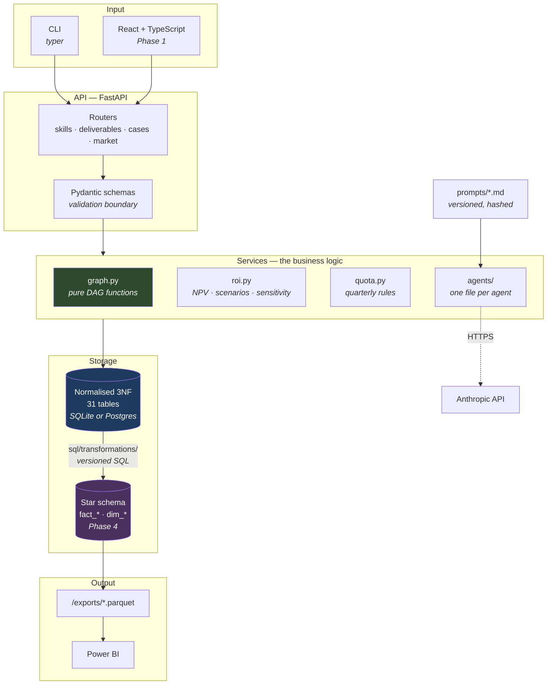
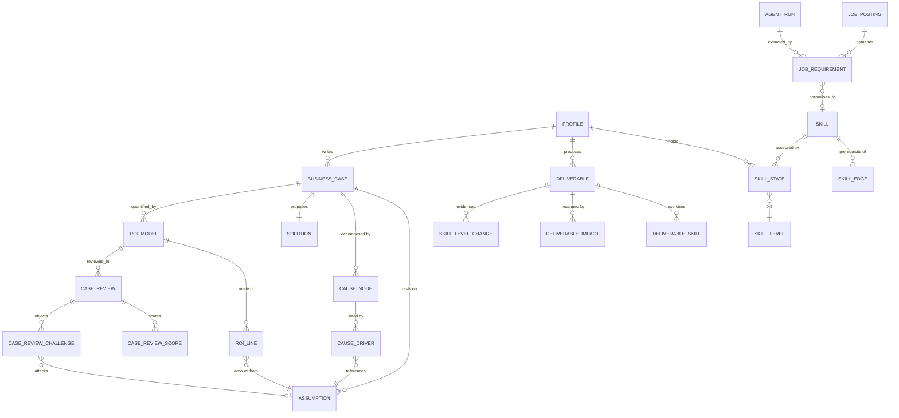

# Transformation OS

A local-first system for steering a ten-year trajectory towards data and AI
transformation architecture — and, deliberately, a portfolio piece in its own
right. The schema, the SQL and the architecture decisions are meant to be read
by other people, not only run.

It does four things:

| Module | Question it answers |
| --- | --- |
| **Skill Graph** | What is actually blocking me, and what does the evidence say I can claim? |
| **Deliverable Engine** | What have I shipped this quarter — not what have I studied? |
| **Business Case Lab** | Can I defend a number in front of a CFO who does not want to believe it? |
| **Gap Radar** | What is the market asking for, and how has that changed over years? |

Two things it deliberately does not do: measure hours worked, and write
content. The agents in this system critique, extract and structure. They do
not produce business cases or articles — a portfolio of work an agent wrote is
not a portfolio.

---

## Status

**Phase 2 complete.** The Business Case Lab computes discounted cash flow,
scenarios and sensitivity, and the review board's objections are queryable.

| Phase | Scope | State |
| --- | --- | --- |
| 0 | Repository, Docker, migrations, data model, seeds | **done** |
| 1a | Skill Graph + Deliverable Engine services and API | **done** |
| 1b | Front end: five views, Vite + React + TypeScript | **done** |
| 2 | Business Case Lab: ROI model, scenarios, sensitivity | **done** |
| 3 | Agents: review board, posting extraction, periodic review | pending |
| 4 | Star schema, SQL transformations, Parquet export for Power BI | pending |

---

## Getting started

```bash
make setup        # dependencies, schema, reference taxonomy, demo profile
make run          # API on http://localhost:8000/docs

# in a second terminal
make web-install
make web          # interface on http://localhost:5173
```

Or with the container:

```bash
docker compose up --build
```

Verify the install:

```bash
make status    # what is in the database
make graph     # graph integrity and critical path
make check     # lint, 231 backend tests, front-end type check
```

Expected output from `make graph` on a fresh install:

```
  skills            83
  edges             111
  roots             12
  leaves            33
  longest chain     8
graph is acyclic
```

---

## Architecture



Two storage layers, on purpose. The normalised layer is the source of truth
and stores no derived value — no branch totals, no NPV, no counts. The star
layer is rebuilt from it by versioned SQL and is where aggregates live. A
normalised model that caches its own aggregates eventually disagrees with
itself.

### Data model



Follow the arrows into `ASSUMPTION` and the design opinion becomes visible.
Both the cause tree and the ROI model point at it, and the review board
attacks it directly. **Every number in a business case traces back to a named,
sourced assumption** — there is no free-typed amount anywhere in the model.
That single constraint is what makes sensitivity analysis possible: if amounts
were typed directly, there would be nothing to vary.

### Three rules the database enforces itself

Not the service layer — the schema. A service method can be bypassed by a
script, a bulk import or a future endpoint. A `CHECK` constraint cannot.

```sql
-- A skill level only rises against evidence.
CHECK (to_level <= from_level OR deliverable_id IS NOT NULL)

-- A published deliverable has a date, or the quarterly quota is uncomputable.
CHECK (status <> 'published' OR published_on IS NOT NULL)

-- An assumption's range must contain its base value.
CHECK (low_value IS NULL OR low_value <= base_value)
```

Downgrades need no evidence. Admitting that a skill has decayed must never
require paperwork, or it will simply go unrecorded.

---

## API

Full interactive documentation at `/docs`. Every read endpoint takes an
optional `?profile=` (defaults to the demo profile) and an optional `?as_of=`
so the whole system can be asked what it would have said on any past date.

| Endpoint | What it answers |
| --- | --- |
| `GET /skills/graph` | The taxonomy: nodes, edges, acyclicity, longest chain |
| `GET /skills/positions` | Every skill with this profile's position on it |
| `GET /skills/critical-path` | What to work on, ranked by what it unblocks |
| `GET /skills/available` | Startable today — nothing missing upstream |
| `GET /skills/blocked` | Gated, with the specific unmet prerequisites named |
| `GET /skills/decayed` | Past the decay window, worst overrun first |
| `GET /skills/learning-order` | A sequence that never precedes a prerequisite |
| `PUT /skills/{code}/target` | Set a target level |
| `POST /skills/{code}/level` | Record a level change — evidence enforced |
| `GET/POST/PATCH /deliverables` | The evidence base |
| `GET /quota-status` | Per-quarter compliance, silent quarters flagged |
| `GET /evidence-cv` | Claimable skills with the artefacts behind them |
| `GET /phases` | The trajectory and its quarterly quotas |
| `GET /cases/{id}/cause-tree` | Bottom-up total, reconciled against the claim |
| `GET /cases/{id}/roi` | Discounted cash flow, NPV, payback, benefit-cost ratio |
| `GET /cases/{id}/roi/scenarios` | All three scenarios side by side |
| `GET /cases/{id}/roi/tornado` | One assumption varied at a time, ranked by swing |
| `GET /cases/{id}/roi/fragility` | Where the case breaks, and whether it breaks at all |
| `GET /cases/{id}/audit` | Unsourced, unused and point-estimate assumptions |

Three behaviours worth knowing before reading the code:

**The critical path counts only wanted skills.** A prerequisite scores by how
many *below-target* skills it gates, not by how central it is in the taxonomy.
A foundational skill whose dependents are all satisfied scores zero, and
correctly disappears from the recommendation.

**Promotion is refused unless the evidence holds up.** The database guarantees
a level rise carries a deliverable; the service checks the three things a
`CHECK` cannot see — that the deliverable belongs to this profile, that it is
published, and that it is linked to the skill being claimed. All three return
422, not 500.

**`evidence-cv` reports what it cannot defend.** A skill at level 3 or above
with nothing published behind it comes back with `is_defensible: false`. On the
demo profile that is eleven of them — the gaps an interviewer finds first.

---

## Repository layout

```
backend/
  app/
    models/         SQLAlchemy models — 31 tables, one module per bounded area
    services/       Business logic. graph.py is pure functions, no database.
    api/            FastAPI routers                          (Phase 1)
    schemas/        Pydantic request/response models         (Phase 1)
    cli.py          Migrations, seeding, graph checks, export
  alembic/versions/ Migrations, timestamped and readable
  seeds/
    reference/      Taxonomy, levels, phases, quotas, rubric — upserted, idempotent
    demo/           Fictional demonstration dataset
  tests/            231 tests: graph, ROI, cause tree, API, schema rules, seeds
frontend/
  src/
    api/            Typed client and hand-written response types
    components/     Primitives and the skill neighbourhood graph
    views/          Dashboard, skills, deliverables, quotas, evidence
sql/
  transformations/  Versioned SQL building the star schema   (Phase 4)
  views/            Clean views for Power BI                 (Phase 4)
exports/            Parquet output                           (Phase 4)
```

---

## Interface

Five views, at `http://localhost:5173`.

| View | What it is for |
| --- | --- |
| **Dashboard** | What to work on, what is decaying, which quarters were missed |
| **Skill graph** | Every skill by domain, with a neighbourhood view per skill |
| **Deliverables** | The evidence base, and the form to add to it |
| **Quotas** | Quarter by quarter, silent quarters flagged |
| **Business cases** | Cause tree, cash flow, tornado, and the review board's objections |
| **Evidence** | Every claim with its artefacts, undefensible ones marked |

Three decisions worth knowing:

**The graph is drawn one neighbourhood at a time.** A force-directed layout of
83 nodes and 111 edges is a hairball that looks like a graph and answers no
question. Selecting a skill shows its direct prerequisites on the left —
coloured by whether they are satisfied — and its direct dependents on the
right. That answers "why can I not start this yet", which is the question
somebody actually has.

**Levels are five segments, not a number.** Filled segments are the current
level, dashed outlines are the distance to target. The gap is the thing worth
seeing at a glance and `3/5` does not show it. Colour is a single hue: a skill
at level 2 is not "bad", it is at level 2. Red is reserved for decay and for
an undefensible claim.

**A quarter before the trajectory began cannot fail it.** Quarters outside any
phase are rendered neutrally and excluded from every count. Reporting the
history that predates the plan as a run of missed quarters would be exactly
the kind of dishonest metric this system exists to avoid.

---

## The ROI engine

Nothing it produces is stored (ADR-008). NPV, payback, branch totals and the
tornado are recomputed from the assumptions on every request, because a cached
headline figure eventually contradicts its own workings.

**A scenario is a rule, not three sets of numbers** (ADR-007). Each assumption
carries a low, base and high value; the pessimistic case takes the
*unfavourable* end, which is the high value for a cost and the low value for a
benefit. Storing three amounts per line would let the base case be revised
while the other two silently went stale.

**The tornado varies one assumption at a time**, everything else at base, so
the resulting swing is attributable to that assumption rather than to an
interaction. A bar crossing zero is drawn red: within that one assumption's
own stated range, the recommendation changes.

The most useful output distinguishes two kinds of fragility:

```
No single assumption breaks the case, but the pessimistic scenario does.
The question is whether these risks are independent — if they arrive
together, the base case is optimistic.
```

One flipping assumption is a research task: go and measure that number. A case
that survives every assumption individually but fails when they all land badly
is a question about *correlation*, and in this domain those risks usually
arrive together. A model that passes the tornado can still be the wrong call,
and saying so is the point.

Money is `Decimal` end to end. Year 0 is undiscounted by convention. Payback is
discounted and interpolated within the crossing year — 1.92 years, not 2 —
and is `None` rather than the horizon length when the case never pays back.

---

## The demonstration dataset

`make demo` loads a fictional profile so the application has something to say
on a fresh install, without exposing a single real figure.

It is deliberately not a flattering dataset. Q1 2026 has nothing published.
Several skills are past their decay window. Statistics was downgraded from 3
to 2. The worked business case scored **6.28 out of 10** and the review board
called one of its benefits "not a saving".

The case itself is the worked example of what the Business Case Lab expects:

```
Margin lost on unfilled order lines                     1,105,808
Premium paid on emergency shipments                     1,045,200
Write-off of stock that expired in the wrong place        690,000
Cost of corrective inter-depot transfers                  449,500
Overtime spent on manual replanning                       202,100
------------------------------------------------------------------
Bottom-up total                                         3,492,608
Claimed by the client                                   4,200,000
Unexplained                                               707,392   (16.8%)
```

That gap is not a bug in the fixture. It is the most instructive thing in it,
and a test asserts it stays there — the CFO persona opens with it.

---

## Design decisions

The reasoning behind each non-obvious choice, and the alternative rejected,
is in [`ARCHITECTURE.md`](./ARCHITECTURE.md) as short ADRs. The ones worth
knowing before reading the code:

- **SQLite locally, Postgres-shaped schema.** No SQLite-specific construct is
  permitted, and a test compiles every table against the Postgres dialect to
  prove it. Moving backend is a change to one environment variable.
- **Enumerations as `VARCHAR` + `CHECK`, not native `ENUM`.** Portable, and
  altering one is not a migration in its own right.
- **Cycle detection in Python, not SQL.** A recursive CTE over a cyclic graph
  does not report the cycle; it runs until it hits a row limit.
- **No derived values in the normalised layer.** Totals, NPV and rankings are
  computed, and only snapshotted into the star schema.
- **Prompts in versioned `.md` files, hashed into `agent_run`.** A critique
  from 2027 is only interpretable if you know exactly which prompt produced it.

---

## Commands

```
make setup      dependencies, schema, seeds
make run        API with reload
make test       test suite
make lint       ruff
make reset      drop the local database and rebuild
make graph      graph integrity and critical path
make status     what is in the database

python -m app.cli db upgrade          apply migrations
python -m app.cli db revision "msg"   autogenerate a migration
python -m app.cli seed reference      update the taxonomy (safe on real data)
python -m app.cli seed demo           rebuild the demo profile
python -m app.cli graph critical      skills gating the most others
```
