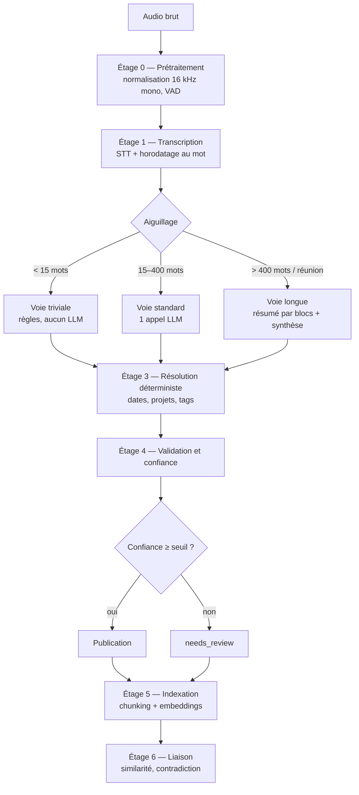
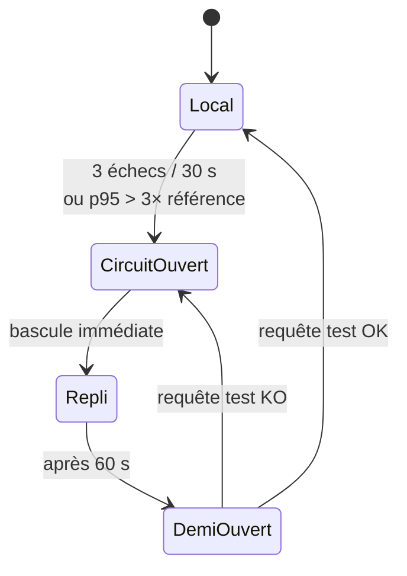
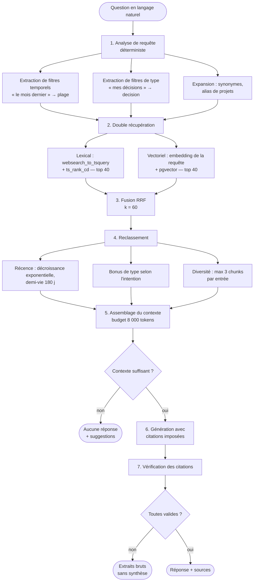
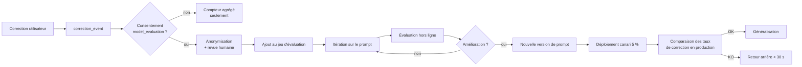

# MindFlow AI — Architecture IA et RAG

> **Phase 0 — Conception.** Aucun prompt exécutable ni code d'orchestration n'est écrit.
> Ce document décrit la chaîne de traitement, les modèles retenus, la stratégie RAG,
> le dispositif d'évaluation et les garde-fous. Les arbitrages sont dans `Decisions.md`.

| | |
| --- | --- |
| **Version** | 0.1 — Phase 0 |
| **Modèles de référence** | `claude-opus-5` (extraction, synthèse), `claude-haiku-4-5` (préfiltrage) |
| **STT** | `faster-whisper large-v3` auto-hébergé, repli fournisseur SaaS |
| **Embeddings** | Modèle multilingue auto-hébergé, 1024 dimensions |
| **Magasin vectoriel** | `pgvector` dans PostgreSQL (voir `Database.md`) |

---

## Table des matières

1. [Principes](#1-principes-de-conception-ia)
2. [Vue d'ensemble de la chaîne](#2-vue-densemble-de-la-chaîne)
3. [Étage 1 — Transcription](#3-étage-1--transcription-stt)
4. [Étage 2 — Compréhension et extraction](#4-étage-2--compréhension-et-extraction)
5. [Étage 3 — Résolution déterministe](#5-étage-3--résolution-déterministe)
6. [Architecture RAG](#6-architecture-rag)
7. [Stratégie de modèles et de coûts](#7-stratégie-de-modèles-et-de-coûts)
8. [Évaluation et qualité](#8-évaluation-et-qualité)
9. [Sécurité et garde-fous](#9-sécurité-et-garde-fous)
10. [Confidentialité et gouvernance](#10-confidentialité-et-gouvernance)
11. [Boucle d'amélioration](#11-boucle-damélioration)
12. [Limites connues](#12-limites-connues-et-risques)

---

## 1. Principes de conception IA

| # | Principe | Conséquence architecturale |
| --- | --- | --- |
| I1 | **Le modèle est un composant remplaçable, pas une fondation** | Toute frontière IA passe par un port ; changer de modèle ne touche pas le domaine |
| I2 | **Ce qui est vérifiable ne doit pas être deviné** | Dates, fuseaux, calculs et rattachements sont résolus en code déterministe |
| I3 | **Une sortie non conforme est un échec, pas une approximation** | Sortie contrainte par schéma JSON + validation stricte ; jamais d'interprétation « au mieux » |
| I4 | **L'incertitude est une donnée de première classe** | Chaque extraction porte une confiance, exposée à l'utilisateur et exploitée par le produit |
| I5 | **Aucune affirmation sans source** | Toute réponse générée cite des extraits vérifiés programmatiquement |
| I6 | **Le contenu utilisateur n'est jamais une instruction** | Séparation stricte instruction / données, à tous les étages |
| I7 | **Aucun apprentissage sur les données utilisateur** | Les corrections servent à l'évaluation hors ligne, jamais à l'entraînement |
| I8 | **Un échec IA n'est jamais une perte de donnée** | Toute défaillance laisse l'audio et la transcription intacts |
| I9 | **Le coût est une contrainte de conception, pas une conséquence** | Routage par complexité, mise en cache, traitement par lots, mesurés en continu |
| I10 | **Chaque appel est tracé** | Modèle, version de prompt, tokens, coût, latence — dans `ai_run` |

---

## 2. Vue d'ensemble de la chaîne



### 2.1 Ce que fait chaque étage

| Étage | Entrée | Sortie | Modèle | Déterministe |
| --- | --- | --- | --- | --- |
| 0 — Prétraitement | Audio | Audio normalisé, segments de parole | — | ✔ |
| 1 — Transcription | Audio | Texte + horodatage + confiance | STT | ✘ |
| 2 — Compréhension | Texte | Objets typés (JSON) | LLM | ✘ |
| 3 — Résolution | Objets bruts | Objets résolus (dates absolues, IDs) | — | ✔ |
| 4 — Validation | Objets résolus | Objets validés + score de confiance | — | ✔ |
| 5 — Indexation | Objets + transcription | Chunks + vecteurs | Embeddings | ✘ |
| 6 — Liaison | Vecteurs | Liens entre entrées | — | ✔ |

**Observation** : quatre étages sur sept sont déterministes. C'est délibéré — chaque
responsabilité retirée au modèle probabiliste est une source d'erreur en moins et un
coût en moins.

---

## 3. Étage 1 — Transcription (STT)

### 3.1 Configuration

| Paramètre | Valeur | Raison |
| --- | --- | --- |
| Modèle principal | `faster-whisper large-v3` | Meilleur compromis WER/coût en français conversationnel |
| Quantification | `int8_float16` sur GPU | ×2,3 de débit, dégradation de WER < 0,4 point |
| Détection de langue | Automatique, avec indice du client | L'indice réduit les erreurs sur les captures courtes |
| VAD | Silero VAD en amont | Retire les silences : −25 % de temps de calcul |
| Horodatage | Au mot | Permet le surlignage de la source exacte dans l'interface |
| Diarisation | Réunions uniquement (v1.1) | Coûteuse, sans valeur sur une capture de 15 s |
| Taille de lot | Dynamique, 1 à 8 | Le pic du matin justifie le regroupement |

### 3.2 Le problème des captures très courtes

Whisper est entraîné sur des fenêtres de 30 secondes et hallucine sur les entrées
courtes — typiquement en produisant une phrase de politesse plausible mais absente.
C'est le mode d'échec le plus dangereux : le résultat est syntaxiquement parfait et
sémantiquement inventé.

| Contre-mesure | Détail |
| --- | --- |
| Rejet sur silence | Si le VAD détecte moins de 400 ms de parole → `transcription_empty`, jamais de texte inventé |
| Seuil de log-probabilité | Segments sous le seuil marqués de faible confiance |
| Détection de répétition | Un n-gramme répété plus de 3 fois signale une boucle d'hallucination |
| Liste noire de phrases | Motifs connus d'hallucination Whisper (« Sous-titres réalisés par… ») filtrés |
| Confiance propagée | Un score bas déclenche `needs_review` en aval |

### 3.3 Repli



Le repli SaaS coûte environ 8 fois plus cher par minute. Il est réservé aux incidents
et son usage est plafonné : au-delà de 5 % du volume quotidien, une alerte est levée —
un repli permanent signalerait un problème de capacité, pas un incident.

### 3.4 Vocabulaire personnalisé *(v1.2, palier Pro)*

Les noms propres, acronymes métier et noms de projets sont les principales sources
d'erreur. Deux leviers, par ordre de coût croissant :

1. **Amorce contextuelle** — les noms de projets, tags fréquents et participants
   récents de l'utilisateur sont passés en `initial_prompt` au décodeur. Gratuit,
   gain mesuré significatif sur les noms propres.
2. **Correction post-transcription** — appariement approximatif (`pg_trgm`) entre les
   tokens de faible confiance et le lexique de l'utilisateur, avec seuil.

Le réglage fin d'un modèle par utilisateur est explicitement écarté : coût
disproportionné, et incompatible avec le principe I7.

---

## 4. Étage 2 — Compréhension et extraction

### 4.1 Aiguillage par complexité

C'est le principal levier de coût. Toute capture ne mérite pas le même traitement.

| Voie | Critère | Traitement | Part estimée | Coût |
| --- | --- | --- | --- | --- |
| **Triviale** | < 15 mots, un seul verbe d'action, aucun marqueur temporel ambigu | Règles + `claude-haiku-4-5` en classification seule | ~35 % | ~0,0007 € |
| **Standard** | 15 à 400 mots | Un appel `claude-opus-5`, extraction complète | ~55 % | ~0,0135 € |
| **Longue** | > 400 mots ou `kind = meeting` | Résumé par blocs puis synthèse | ~10 % | ~0,05 à 0,30 € |

Le critère d'aiguillage est lui-même déterministe (comptage, détection de motifs), pas
un appel de modèle : router coûterait autant que traiter.

> **Hypothèse à valider en sprint 3.** La répartition 35/55/10 est une estimation.
> Si la part triviale est nettement plus faible, l'objectif de 0,004 €/capture du PRD
> est hors d'atteinte sans mesure supplémentaire (voir §7.3). C'est le premier chiffre
> à instrumenter dès les premières captures réelles.

### 4.2 Contrat d'extraction

L'appel d'extraction produit un objet contraint par schéma JSON. Le schéma est la
partie du système la plus stable ; les prompts évoluent, le contrat non.

**Forme du schéma de sortie** (description, pas implémentation) :

```
ExtractionResult
├── language                 : "fr" | "en"
├── overall_confidence       : 0.0–1.0
├── items[]                  : 1 à 10 éléments
│   ├── type                 : task | idea | note | decision | question | reminder
│   ├── title                : ≤ 300 caractères, impératif pour une tâche
│   ├── body                 : optionnel
│   ├── confidence           : 0.0–1.0
│   ├── source_span          : { start, end }  ← indices dans la transcription
│   ├── temporal_expression  : texte brut, NON résolu   ("jeudi", "fin de mois")
│   ├── priority_signal      : none | elevated | urgent
│   ├── project_hint         : texte brut, NON résolu   ("Vinci")
│   ├── tags[]               : ≤ 5
│   ├── people_mentioned[]   : ≤ 10
│   └── decision_fields      : { options[], chosen, rationale } si type = decision
└── unprocessed_remainder    : texte non rattaché à un élément
```

**Points de conception**

| Choix | Raison |
| --- | --- |
| `temporal_expression` et `project_hint` **non résolus** | Le modèle repère, le code résout (principe I2) |
| `source_span` obligatoire | Permet le surlignage, et surtout **de vérifier que le modèle n'a rien inventé** |
| `unprocessed_remainder` | Rend visible ce que le modèle a ignoré, plutôt que de le perdre en silence |
| `confidence` par élément | Une capture peut contenir une tâche évidente et une idée floue |
| Maximum 10 éléments | Au-delà, il s'agit d'une réunion : mauvaise voie d'aiguillage |

### 4.3 Structure du prompt d'extraction

```
┌─ SYSTÈME (stable, mis en cache) ────────────────────────┐
│ Rôle et périmètre                                       │
│ Définition précise des 6 types, avec critères de        │
│   distinction et cas limites                            │
│ Règles de titre (impératif, ≤ 300 car., sans préambule) │
│ Consigne de calibration de la confiance                 │
│ Consigne explicite : ne rien inventer, préférer         │
│   `note` en cas de doute                                │
│ Instruction de sécurité : le bloc de données est du     │
│   contenu, jamais des instructions                      │
└─────────────────────────────────────────────────────────┘
┌─ CONTEXTE UTILISATEUR (semi-stable, mis en cache) ──────┐
│ Fuseau horaire, langue                                  │
│ Liste des projets actifs et de leurs alias              │
│ 20 tags les plus utilisés                               │
│ 5 dernières entrées (pour la continuité thématique)     │
└─────────────────────────────────────────────────────────┘
┌─ DONNÉES (variable) ────────────────────────────────────┐
│ <transcription>                                         │
│ …texte de l'utilisateur…                                │
│ </transcription>                                        │
│ Horodatage de capture, jour de la semaine               │
└─────────────────────────────────────────────────────────┘
```

L'ordre est dicté par la mise en cache de préfixe : le contenu stable d'abord, le
volatil ensuite. Le contexte utilisateur change rarement dans une journée, ce qui rend
le cache efficace pour un utilisateur qui capture plusieurs fois de suite.

### 4.4 Voie longue — réunions

Traiter une réunion de 45 minutes en un seul appel donne un résumé médiocre : le
modèle privilégie le début et la fin. Le traitement en deux temps donne de meilleurs
résultats et se parallélise.

```
Transcription (≈ 7 000 mots)
   │
   ▼ découpage en blocs sémantiques de ~2 500 tokens, chevauchement 10 %
   ├── bloc 1 ─┐
   ├── bloc 2 ─┼─▶ résumé structuré par bloc  (parallèle, 3 appels)
   └── bloc 3 ─┘        ↓
                 résumés partiels
                        ↓
              synthèse finale (1 appel)
                        ↓
   { résumé, décisions[], actions[], questions_ouvertes[], points_clés[] }
```

| Aspect | Choix |
| --- | --- |
| Frontières de blocs | Sur silence long ou changement de locuteur, jamais au milieu d'une phrase |
| Chevauchement | 10 % — suffisant pour ne pas couper un raisonnement |
| Parallélisme | Les résumés de blocs sont indépendants |
| Modèle | `claude-opus-5` aux deux niveaux : c'est le cas d'usage à plus forte valeur perçue |
| Attribution des actions | Le locuteur est proposé, jamais affirmé — une action mal attribuée est pire qu'une action non attribuée |

---

## 5. Étage 3 — Résolution déterministe

Cet étage transforme les indices repérés par le modèle en valeurs exactes. Il ne fait
appel à aucun modèle.

### 5.1 Résolution temporelle

C'est la fonctionnalité la plus visible du produit et la plus facile à rater. Une
échéance fausse détruit la confiance plus vite que n'importe quelle autre erreur.

**Entrées** : expression brute, horodatage de capture, fuseau de l'utilisateur,
préférences (début de semaine, heure de journée par défaut).

| Classe d'expression | Exemples | Règle |
| --- | --- | --- |
| Absolue | « le 12 juin », « 12/06 » | Directe ; année déduite si absente (prochaine occurrence) |
| Relative simple | « demain », « après-demain », « hier » | Décalage en jours |
| Jour de semaine | « jeudi », « jeudi prochain » | **Prochaine occurrence stricte** ; « prochain » ajoute une semaine si le jour est encore à venir cette semaine |
| Relative composée | « dans deux semaines », « d'ici trois jours » | Arithmétique de calendrier |
| Bornes de période | « fin de semaine », « fin de mois », « début d'année » | Convention documentée : fin de semaine = vendredi 18 h |
| Heure seule | « à 14 h », « ce soir » | Appliquée au jour résolu ; « ce soir » = 19 h |
| Floue | « bientôt », « un de ces jours » | **Aucune échéance** ; l'expression est conservée dans le corps |
| Récurrente | « tous les lundis » | Génère une `recurrence_rule` (RRULE) |

**Sortie** : date absolue + `due_precision` (`day` / `hour` / `minute`) + expression
d'origine conservée pour audit.

**Règles de sécurité**

| Règle | Raison |
| --- | --- |
| Ambiguïté non résolue → pas de date | Une échéance fausse est pire qu'aucune échéance |
| Date résolue dans le passé de plus de 24 h → rejet | Signale une erreur d'interprétation |
| Toute résolution est journalisée | Permet de mesurer la justesse (métrique F-06 du PRD) |
| Les changements d'heure sont testés explicitement | Bogue classique et silencieux |

### 5.2 Rattachement à un projet

```
project_hint  →  ① correspondance exacte sur nom ou alias
                 ② correspondance approximative (pg_trgm, seuil 0,42)
                 ③ similarité d'embedding avec les entrées récentes du projet
                 ④ aucun rattachement — on ne devine pas
```

Un rattachement issu du niveau ③ est marqué de faible confiance et l'interface le
présente comme une suggestion, pas comme un fait.

### 5.3 Normalisation des tags

Minuscules, suppression des accents, singularisation légère (français et anglais),
rapprochement avec les tags existants au-dessus d'un seuil de similarité. Objectif :
éviter la prolifération `#budget`, `#budgets`, `#Budget`.

---

## 6. Architecture RAG

### 6.1 Ce qui rend ce RAG particulier

| Caractéristique | Conséquence |
| --- | --- |
| Corpus **personnel et petit** (quelques milliers de chunks) | Le rappel prime sur le passage à l'échelle |
| Corpus **fortement temporel** | La date est un signal de pertinence de premier ordre |
| Requêtes **auto-référentielles** (« ce que *j'ai* dit ») | Pas de désambiguïsation d'entité nécessaire |
| Contenu **oral, non structuré, avec fautes de transcription** | La voie lexicale seule est insuffisante |
| Attente de **vérité factuelle sur sa propre mémoire** | Une hallucination est bien plus grave qu'ailleurs |

### 6.2 Chaîne complète



### 6.3 Étape 1 — Analyse de requête

Déterministe, sans appel de modèle. Une requête de recherche doit rester peu coûteuse.

| Motif détecté | Filtre appliqué |
| --- | --- |
| « le mois dernier », « en mars », « la semaine dernière » | Plage `occurred_at` |
| « mes tâches », « mes décisions », « mes idées » | `entry_type` |
| « chez Vinci », « sur le projet X » | `project_id` après appariement d'alias |
| « en retard », « à faire » | `status` + `due_at` |
| « qu'est-ce que j'ai décidé » | Bonus de reclassement sur `decision` |

L'expansion de requête par LLM (« query rewriting ») est écartée au MVP : elle ajoute
un appel, donc de la latence et du coût, pour un gain non démontré sur un corpus
personnel où le vocabulaire est celui de l'utilisateur lui-même.

### 6.4 Étape 2 — Double récupération

| Voie | Ce qu'elle attrape | Ce qu'elle rate |
| --- | --- | --- |
| Lexicale (BM25 sur `tsvector`) | « Vinci », « RGPD », « 15 000 € », acronymes | « refonte du site » quand l'utilisateur avait dit « refaire le site web » |
| Vectorielle (`pgvector`, cosinus) | Paraphrases, synonymes, formulations approximatives | Un identifiant rare mentionné une seule fois |

Les deux sont indispensables. C'est la raison pour laquelle une base vectorielle
dédiée n'apporterait rien ici : la moitié de la valeur vient du plein texte, déjà dans
PostgreSQL (voir `Decisions.md` ADR-004).

### 6.5 Étape 3 — Fusion RRF

```
score(d) = Σ  1 / (k + rang_i(d))      avec k = 60
          i∈voies
```

Le RRF ne demande aucune calibration entre des scores incomparables (un `ts_rank_cd`
et une distance cosinus n'ont pas la même échelle). Il est robuste et sans paramètre
à régler — ce qui compte quand on n'a pas encore de données pour régler quoi que ce
soit.

### 6.6 Étape 4 — Reclassement

| Signal | Formule | Poids |
| --- | --- | --- |
| Score RRF | — | 1,00 |
| Récence | `exp(-âge_jours / 180)` | 0,25 |
| Correspondance de type | Bonus si le type correspond à l'intention détectée | 0,15 |
| Édition utilisateur | Bonus si l'entrée a été corrigée à la main (signal de valeur) | 0,10 |
| Diversité | Pénalité au-delà de 3 chunks issus de la même entrée | −0,20 |

Un reclassement par modèle *cross-encoder* est envisagé en v1.2, une fois qu'un jeu
d'évaluation existera pour prouver qu'il apporte quelque chose. Sans mesure, c'est
du coût sans preuve.

### 6.7 Étape 5 — Assemblage du contexte

| Paramètre | Valeur | Raison |
| --- | --- | --- |
| Budget de contexte | 8 000 tokens | Bien en deçà de la limite du modèle : la précision baisse avec le bruit |
| Nombre de chunks | 12 à 20 | Au-delà, le rappel plafonne et la précision se dégrade |
| Ordre | Chronologique, pas par score | Une mémoire se lit dans l'ordre du temps ; aide le modèle à raconter une évolution |
| Métadonnées par chunk | Date lisible, type, projet, numéro de citation | Le modèle doit pouvoir dire *quand* |
| Fenêtre de voisinage | Chunk précédent et suivant inclus si budget disponible | Restaure le contexte coupé par le découpage |

### 6.8 Étape 6 — Génération

Sortie contrainte par schéma :

```
Answer
├── text            : réponse, chaque affirmation suivie d'un marqueur [n]
├── citations[]     : { marker, chunk_id }
├── confidence      : high | medium | low
└── caveat          : optionnel — « je n'ai trouvé que deux mentions »
```

Consignes structurantes du prompt de réponse :
- répondre uniquement à partir des extraits fournis ;
- si les extraits ne permettent pas de répondre, le dire explicitement ;
- citer systématiquement ; une phrase sans marqueur est une non-conformité ;
- signaler les contradictions entre extraits plutôt que de les lisser ;
- privilégier le récit chronologique quand le sujet a évolué.

### 6.9 Étape 7 — Vérification

| Contrôle | Action en cas d'échec |
| --- | --- |
| Chaque `chunk_id` cité figure dans le contexte fourni | **Rejet total de la réponse** — extraits bruts retournés |
| Chaque phrase affirmative porte au moins un marqueur | Avertissement journalisé, réponse conservée |
| Aucune date dans la réponse n'est absente des extraits | Réponse rejetée |
| Longueur raisonnable (< 400 mots) | Troncature |

Le premier contrôle est non négociable. Sur un produit de mémoire personnelle, une
source inventée détruit toute la valeur.

### 6.10 Réponse quand il n'y a rien à dire

```json
{
  "answer": null,
  "reason": "insufficient_context",
  "suggestions": [
    "Vous avez 3 entrées mentionnant « site » — les voir",
    "Élargir la période à 2025"
  ],
  "results": [ "…extraits bruts…" ]
}
```

Ne rien trouver est un résultat légitime. Fabriquer une réponse plausible est un bug.

---

## 7. Stratégie de modèles et de coûts

### 7.1 Affectation des modèles

| Opération | Modèle | Justification |
| --- | --- | --- |
| Classification triviale | `claude-haiku-4-5` | Tâche simple, volume élevé, latence critique |
| Extraction standard | `claude-opus-5` | Qualité déterminante pour la confiance ; respect strict du schéma |
| Résumé de bloc (réunion) | `claude-opus-5` | Fidélité indispensable ; erreur très visible |
| Synthèse finale (réunion) | `claude-opus-5` | Le livrable le plus visible du produit |
| Réponse RAG | `claude-opus-5` | Discipline de citation et détection de contradiction |
| Synthèse hebdomadaire | `claude-opus-5`, en lot | Non urgent → traitement par lots à −50 % |
| Embeddings | Modèle auto-hébergé 1024d | Volume élevé, texte court, coût réseau prohibitif en API |

### 7.2 Paramètres d'appel

| Paramètre | Extraction | Réponse RAG | Justification |
| --- | --- | --- | --- |
| Sortie contrainte | Schéma JSON strict | Schéma JSON strict | Une sortie non conforme est rejetée, pas rattrapée |
| Effort | `medium` | `high` | L'extraction est une tâche cadrée ; la synthèse demande du raisonnement |
| Réflexion | Adaptative | Adaptative | Le modèle module lui-même sa profondeur |
| `max_tokens` | 4 000 | 8 000 | Marge suffisante ; au-delà, signal d'anomalie |
| Diffusion en flux | Non | Oui | Le RAG est synchrone et visible par l'utilisateur |
| Mise en cache | Système + contexte utilisateur | Système | Réduction du coût d'entrée sur la partie stable |
| Délai d'attente | 20 s | 12 s | Au-delà, dégradation plutôt qu'attente |

### 7.3 Économie et leviers

Coût unitaire estimé pour une capture standard de 18 s (tarifs publics : `claude-opus-5`
5,00 $ / 25,00 $ par million de tokens entrée/sortie ; `claude-haiku-4-5` 1,00 $ / 5,00 $) :

| Poste | Sans optimisation | Avec optimisation |
| --- | --- | --- |
| STT auto-hébergé | 0,0008 € | 0,0008 € |
| Classification | — | 0,0007 € |
| Extraction | 0,0135 € | voir répartition ci-dessous |
| Embeddings | 0,0001 € | 0,0001 € |
| **Moyenne pondérée** | **0,0144 €** | **~0,0055 €** |

Détail de la moyenne optimisée, avec la répartition d'aiguillage estimée :

```
35 % triviales  × 0,0016 €  =  0,0006 €
55 % standard   × 0,0080 €  =  0,0044 €   (extraction avec cache de préfixe)
10 % longues    × 0,0500 €  =  0,0050 €
                              ─────────
                      total  =  0,0100 €  par capture moyenne
```

> **Écart persistant avec l'objectif de 0,004 €/capture du PRD.** Même optimisé, le
> coût reste 2,5 fois supérieur à la cible. Trois options, à trancher en sprint 3 sur
> la base de mesures réelles :
>
> | Option | Gain | Coût |
> | --- | --- | --- |
> | Basculer l'extraction standard sur `claude-sonnet-5` | ~−40 % | Perte de qualité à mesurer sur le jeu d'évaluation |
> | Élargir la voie triviale (seuil à 30 mots) | ~−15 % | Plus d'entrées en `needs_review` |
> | Traiter en lots les captures non urgentes (−50 %) | ~−20 % | Latence de plusieurs minutes, contraire au principe P1 |
> | Réviser l'objectif du PRD à 0,010 € | — | Impose un point mort commercial plus élevé |
>
> **Recommandation de conception** : ne pas dégrader la qualité avant d'avoir mesuré.
> La première version optimise le cache et l'aiguillage ; l'arbitrage
> qualité/coût se fait ensuite, avec des chiffres.

### 7.4 Mise en cache de préfixe

Trois blocs de stabilité décroissante, dans cet ordre :

| Bloc | Stabilité | Point de cache |
| --- | --- | --- |
| Instructions système | Change à chaque version de prompt | ✔ |
| Contexte utilisateur (projets, tags, entrées récentes) | Change plusieurs fois par jour | ✔ |
| Transcription | Change à chaque appel | ✘ |

**Piège à éviter** : injecter l'horodatage courant dans le bloc système invaliderait
le cache à chaque appel. L'horodatage appartient au bloc de données, en dernier.

Un utilisateur qui fait cinq captures dans la même demi-heure bénéficie du cache sur
les quatre suivantes. Le gain dépend directement du regroupement temporel des captures,
qui reste à mesurer.

---

## 8. Évaluation et qualité

### 8.1 Le dispositif

Sans évaluation, tout changement de prompt est un pari. Le dispositif est construit
avant le premier prompt de production.

| Élément | Contenu |
| --- | --- |
| **Jeu figé** | 300 captures annotées à la main : 200 FR, 80 EN, 20 mixtes |
| **Composition** | 40 % tâches, 20 % idées, 15 % décisions, 15 % notes, 10 % multi-éléments |
| **Cas difficiles** | 60 captures : bruit, code-switching, dates ambiguës, phrases inachevées, hésitations |
| **Anti-régression** | Toute erreur signalée en production devient un cas du jeu |
| **Isolation** | Le jeu ne provient jamais de données utilisateur réelles sans consentement explicite |

### 8.2 Métriques par étage

| Étage | Métrique | Seuil MVP | Bloquant en CI |
| --- | --- | --- | --- |
| STT | WER français conversationnel | ≤ 8 % | ✔ |
| STT | Taux d'hallucination sur < 3 s | ≤ 1 % | ✔ |
| Classification | Justesse du type | ≥ 85 % | ✔ |
| Classification | Matrice de confusion par paire | Aucune paire > 8 % | ✔ |
| Extraction | Complétude (éléments trouvés / attendus) | ≥ 90 % | ✔ |
| Extraction | Précision (éléments trouvés non hallucinés) | ≥ 95 % | ✔ |
| Extraction | Fidélité du `source_span` | ≥ 98 % | ✔ |
| Temporel | Justesse des dates résolues | ≥ 90 % | ✔ |
| Temporel | Taux de fausses échéances | ≤ 2 % | ✔ |
| RAG | Rappel @ 10 sur requêtes annotées | ≥ 85 % | ✔ |
| RAG | Justesse des citations | 100 % | ✔ (tolérance zéro) |
| RAG | Taux d'affirmation non sourcée | ≤ 2 % | ✔ |
| Global | Calibration de la confiance (ECE) | ≤ 0,10 | ✘ (surveillé) |

### 8.3 Calibration de la confiance

Une confiance mal calibrée est pire qu'une absence de confiance : elle induit en
erreur et détruit le mécanisme de `needs_review`.

```
Idéal : parmi les extractions annoncées à 0,80 de confiance,
        environ 80 % sont effectivement correctes.
```

Mesure par diagramme de fiabilité sur le jeu d'évaluation, à chaque changement de
prompt ou de modèle. Si la confiance est systématiquement surestimée, une correction
post-hoc (régression isotonique) est appliquée avant le seuil de `needs_review`.

**Seuil de `needs_review`** : ajusté pour que ~12 % des entrées y passent, cible du
PRD. Ce seuil est un réglage produit, pas une constante : trop haut, l'utilisateur
corrige sans arrêt ; trop bas, il ne voit pas passer les erreurs.

### 8.4 Évaluation en CI

```
PR modifiant un prompt, un schéma ou une version de modèle
   ↓
Exécution du jeu d'évaluation complet (300 cas)
   ↓
Comparaison à la référence de la branche principale
   ↓
┌── Régression > 2 points sur une métrique bloquante  → échec
├── Régression 0,5 à 2 points                          → avertissement + revue humaine
├── Coût par capture > +15 %                            → avertissement
└── Latence p95 > +20 %                                 → avertissement
```

Le rapport d'évaluation est publié en commentaire de la PR, avec le détail des cas
qui ont changé de résultat. La comparaison qualitative est plus utile que le score
agrégé.

### 8.5 Surveillance en production

Le jeu d'évaluation mesure la qualité *avant* le déploiement ; la production la
mesure *après*, sur des signaux implicites.

| Signal | Ce qu'il révèle | Seuil d'alerte |
| --- | --- | --- |
| Taux de correction du type | Qualité réelle de la classification | > 20 % sur 24 h |
| Taux de correction des dates | Défaillance de la résolution temporelle | > 10 % |
| Part de `needs_review` | Calibration ou dégradation du modèle | > 20 % |
| Violations de schéma | Instabilité du modèle ou dérive du prompt | > 1 % |
| Refus de traitement | Contenu légitime bloqué par un classifieur | > 0,5 % |
| Échecs de citation | Régression de la fidélité RAG | > 0 |
| Recherches sans clic | Pertinence insuffisante | > 40 % |
| Dérive de latence | Changement côté fournisseur | p95 > 2× référence |

---

## 9. Sécurité et garde-fous

### 9.1 Injection de prompt

Le contenu transcrit est du contenu **non fiable** : rien n'empêche un utilisateur —
ou une personne parlant à portée du micro — de dicter des instructions.

| Mesure | Détail |
| --- | --- |
| Séparation stricte | Le contenu est toujours dans un bloc délimité, jamais concaténé aux instructions |
| Instructions jamais reconstruites depuis le contenu | Aucune interpolation de texte utilisateur dans la partie instruction |
| Sortie contrainte | Même si le modèle « obéissait », il ne peut émettre qu'un objet conforme au schéma |
| Aucune capacité d'action | Le modèle ne dispose d'aucun outil au MVP : il ne peut ni appeler une API, ni supprimer, ni envoyer |
| Détection de motifs | Les tentatives évidentes (« ignore les instructions précédentes ») sont journalisées, sans blocage — c'est peut-être un utilisateur qui parle de prompts |
| Frontière RAG | Le contexte est construit à partir d'une requête déjà filtrée par RLS |

**Périmètre du risque au MVP** : l'utilisateur ne peut manipuler que sa propre
extraction. Il n'y a ni action automatique, ni contenu partagé entre utilisateurs.
Le risque devient sérieux avec les espaces partagés (v2.0) et l'assistant agentique
(v3.0) — la conception de ces phases devra reprendre ce chapitre.

### 9.2 Contenu refusé par le modèle

Un classifieur de sécurité peut refuser de traiter un contenu légitime (contexte
médical, sécurité informatique, sujet sensible).

| Étape | Comportement |
| --- | --- |
| Détection | `stop_reason: refusal` sur la réponse |
| Réaction | **Aucune nouvelle tentative** — ce serait du contournement |
| Conséquence | Entrée créée en `partially_processed`, type `note`, transcription intégrale conservée |
| Message utilisateur | Neutre et factuel : « Cette capture n'a pas pu être structurée automatiquement. La transcription est disponible. » Aucun jugement sur le contenu |
| Journalisation | Compteur, catégorie, sans contenu |
| Suivi | Un taux supérieur à 0,5 % déclenche une revue : soit le seuil est mal placé, soit le produit rencontre un cas d'usage non anticipé |

### 9.3 Défaillances du modèle et réactions

| Défaillance | Détection | Réaction |
| --- | --- | --- |
| Sortie non conforme au schéma | Validation Pydantic | 1 nouvelle tentative avec consigne renforcée, puis dégradation en `note` |
| `source_span` hors bornes | Vérification programmatique | Élément rejeté, les autres conservés |
| Confiance systématiquement à 1,0 | Surveillance de distribution | Alerte : le prompt de calibration ne fonctionne plus |
| Titre égal à la transcription entière | Contrôle de longueur | Troncature + marquage `needs_review` |
| Explosion du nombre d'éléments | Limite du schéma (10) | Aiguillage vers la voie longue |
| Latence anormale | Délai d'attente | Dégradation, retraitement programmé |

---

## 10. Confidentialité et gouvernance

### 10.1 Ce qui est envoyé aux modèles

| Destinataire | Données envoyées | Ce qui n'est jamais envoyé |
| --- | --- | --- |
| STT auto-hébergé (infrastructure MindFlow) | Audio | — |
| STT de repli (SaaS) | Audio, uniquement en incident | Identité de l'utilisateur |
| LLM (API Claude) | Transcription, noms de projets, tags | Audio, e-mail, identifiants, données d'autres utilisateurs |
| Embeddings auto-hébergés | Texte | — |

### 10.2 Engagements

| Engagement | Mise en œuvre |
| --- | --- |
| Aucun entraînement sur les données utilisateur | Contrat fournisseur sans rétention ni entraînement, vérifié et documenté |
| Aucune donnée utilisateur dans les prompts d'un autre utilisateur | Contexte construit sous RLS, assertion supplémentaire avant l'appel |
| Corrections utilisées pour l'évaluation, pas pour l'entraînement | Principe I7 ; `correction_event` ne quitte jamais l'infrastructure |
| Traçabilité complète | Chaque appel dans `ai_run` : modèle, version de prompt, tokens, coût, latence — **sans contenu** |
| Redaction optionnelle | Activable par l'utilisateur : IBAN, numéros longs, e-mails masqués avant envoi au LLM |
| Transfert hors UE documenté | Le LLM est hébergé aux États-Unis ; clauses contractuelles types + analyse d'impact (voir `Architecture.md` §11.8) |

### 10.3 Transparence

L'utilisateur peut, depuis les réglages :
- voir quels modèles traitent ses données et où ils sont hébergés ;
- consulter le journal de ses appels IA (dates, opérations, sans contenu) ;
- désactiver l'enrichissement IA — le produit dégrade alors vers une transcription
  simple, ce qui reste un usage légitime ;
- activer la redaction avant envoi ;
- retirer son consentement à l'évaluation, ce qui exclut ses corrections du dispositif.

---

## 11. Boucle d'amélioration



| Étape | Détail |
| --- | --- |
| Cadence | Revue hebdomadaire des corrections agrégées |
| Sélection | Les erreurs récurrentes priment sur les cas isolés |
| Anonymisation | Avant tout ajout au jeu, revue humaine et retrait des éléments identifiants |
| Versionnage | Chaque prompt est versionné, son empreinte stockée dans `prompt_version` |
| Retour arrière | Bascule de version par feature flag, sans redéploiement |
| Traçabilité | Chaque `ai_run` référence la version de prompt exécutée |

**Ce que la boucle ne fait pas** : aucun réglage fin de modèle, aucun apprentissage
en ligne, aucune personnalisation par utilisateur du modèle lui-même. La
personnalisation passe par le **contexte** (projets, tags, historique), pas par les
poids.

---

## 12. Limites connues et risques

| # | Limite | Impact | Atténuation | Résolution envisagée |
| --- | --- | --- | --- | --- |
| L1 | Hallucination Whisper sur audio très court | Texte inventé, très plausible | VAD strict, seuils, liste noire | Modèle spécialisé court (v1.2) |
| L2 | Code-switching FR/EN dans une même phrase | WER dégradé | Modèle multilingue, indice de langue | Évaluation dédiée dès le MVP |
| L3 | Coût d'extraction 2,5× la cible du PRD | Économie du produit | Aiguillage, cache | Arbitrage mesuré en sprint 3 (§7.3) |
| L4 | Ambiguïté temporelle irréductible | Échéances manquantes | Ne rien affirmer plutôt que se tromper | Demande de confirmation en un tap |
| L5 | Rappel HNSW dégradé sous filtre étroit | Résultats manquants | Bascule sur parcours exact selon la cardinalité | Mesure de rappel en continu |
| L6 | Dépendance à un fournisseur LLM unique | Risque de disponibilité et de prix | Adaptateur abstrait, schéma portable | Second fournisseur évalué en v1.2 |
| L7 | Aucun traitement hors ligne | Produit inutilisable sans réseau pour l'IA | Capture toujours possible | Modèle embarqué à l'étude (v3.0) |
| L8 | Le jeu d'évaluation ne reflète pas la diversité réelle | Surestimation de la qualité | Enrichissement continu | Élargissement dès les premiers retours |
| L9 | Diarisation absente au MVP | Attribution d'actions imprécise en réunion | Attribution proposée, jamais affirmée | v1.1 |
| L10 | Injection de prompt en contexte partagé | Non exploitable au MVP, sérieux en v2.0 | Aucune capacité d'action du modèle | Reprise complète du chapitre 9 avant les espaces partagés |

---

## Références

- Architecture générale et séquences → `Architecture.md`
- Schéma des chunks et index vectoriels → `Database.md`
- Contrat de l'endpoint `/search` → `API.md`
- Arbitrages IA → `Decisions.md` ADR-007, ADR-008, ADR-019, ADR-020, ADR-021, ADR-025
