# MindFlow AI — Architecture logicielle

> **Phase 0 — Conception.** Aucun code applicatif n'est écrit. Ce document décrit la
> structure cible : composants, frontières, flux, découpage en modules et
> exploitation. Les arbitrages qui ont conduit à ces choix sont consignés dans
> `Decisions.md` (ADR). Le modèle de données est dans `Database.md`, le contrat
> d'API dans `API.md`, l'architecture IA dans `AI.md`.

| | |
| --- | --- |
| **Version** | 0.1 — Phase 0 |
| **Portée** | Système complet, du client mobile à l'exploitation |
| **Style architectural** | Monolithe modulaire + workers asynchrones |

---

## Table des matières

1. [Vue d'ensemble](#1-vue-densemble)
2. [Moteurs de qualité](#2-moteurs-de-qualité-architecturaux)
3. [Diagrammes C4](#3-diagrammes-c4)
4. [Diagrammes de séquence](#4-diagrammes-de-séquence)
5. [Choix techniques justifiés](#5-choix-techniques-justifiés)
6. [Architecture Flutter](#6-architecture-flutter)
7. [Architecture FastAPI](#7-architecture-fastapi)
8. [Découpage en modules](#8-découpage-en-modules)
9. [Découpage en micro-services potentiels](#9-découpage-en-micro-services-potentiels)
10. [Gestion des erreurs](#10-gestion-des-erreurs)
11. [Sécurité](#11-sécurité)
12. [Observabilité et logs](#12-observabilité-et-logs)
13. [Pipeline CI/CD](#13-pipeline-cicd)
14. [Environnements et infrastructure](#14-environnements-et-infrastructure)
15. [Capacité et coûts](#15-capacité-et-coûts)

---

## 1. Vue d'ensemble

### 1.1 Style architectural retenu

**Monolithe modulaire déployable + plan de traitement asynchrone.**

```
┌────────────────────────────────────────────────────────────────┐
│                        CLIENTS                                 │
│   Flutter (iOS, Android, Web)   ·   Widgets   ·   Wearables    │
└───────────────────────────┬────────────────────────────────────┘
                            │ HTTPS / REST + SSE
┌───────────────────────────▼────────────────────────────────────┐
│                       PLAN DE CONTRÔLE                         │
│   API FastAPI — synchrone, < 200 ms, sans appel LLM            │
│   auth · captures · entries · search · projects · billing      │
└──────┬──────────────────────────────────────┬──────────────────┘
       │ enqueue                              │ read/write
┌──────▼──────────────────┐        ┌──────────▼──────────────────┐
│   PLAN DE TRAITEMENT    │        │      PLAN DE DONNÉES        │
│  Workers asynchrones    │◀──────▶│  PostgreSQL + pgvector      │
│  STT · NLU · Embeddings │        │  Redis · Stockage objet S3  │
└──────┬──────────────────┘        └─────────────────────────────┘
       │
┌──────▼──────────────────────────────────────────────────────────┐
│                      SERVICES EXTERNES                          │
│   STT (auto-hébergé + repli)  ·  LLM Claude  ·  Push  ·  Mail   │
└─────────────────────────────────────────────────────────────────┘
```

**La séparation fondamentale** : le chemin de capture (synchrone, doit être
infaillible et rapide) est totalement découplé du chemin d'enrichissement
(asynchrone, coûteux, faillible). Une panne LLM ne doit jamais empêcher une capture.

### 1.2 Frontières et responsabilités

| Plan | Responsabilité | Contrainte dominante | Mode de dégradation |
| --- | --- | --- | --- |
| **Client** | Capture, cache local, file d'attente | Ne jamais perdre un audio | Fonctionne totalement hors ligne |
| **Contrôle (API)** | Autorisation, persistance, orchestration | Latence p95 < 200 ms | Lecture seule si la base est en lecture seule |
| **Traitement (workers)** | STT, extraction, embeddings | Débit et coût | Traitement différé, jamais perdu |
| **Données** | Vérité, durabilité, isolation locataire | Intégrité et RLS | Réplique en lecture |

### 1.3 Décisions structurantes en une page

| # | Décision | ADR |
| --- | --- | --- |
| 1 | Monolithe modulaire, pas de micro-services au départ | ADR-001 |
| 2 | Flutter pour un seul code base multi-plateforme | ADR-002 |
| 3 | FastAPI + Python pour la proximité avec l'écosystème IA | ADR-003 |
| 4 | PostgreSQL + `pgvector` comme unique magasin (pas de base vectorielle dédiée) | ADR-004 |
| 5 | Isolation multi-locataire par `Row Level Security` | ADR-005 |
| 6 | Workers `arq` sur Redis plutôt que Celery | ADR-006 |
| 7 | STT auto-hébergé avec repli fournisseur | ADR-007 |
| 8 | Claude comme LLM d'extraction, sortie contrainte par schéma | ADR-008 |
| 9 | Capture offline-first avec file d'attente locale et idempotence | ADR-009 |
| 10 | Événements internes en table `outbox`, pas de bus de messages | ADR-010 |

---

## 2. Moteurs de qualité architecturaux

Les attributs de qualité classés par ordre de priorité. En cas de conflit, l'attribut
le plus haut gagne.

| Rang | Attribut | Scénario de qualité mesurable | Tactique architecturale |
| --- | --- | --- | --- |
| 1 | **Durabilité de la capture** | Une capture faite hors ligne, batterie à 3 %, app tuée par l'OS, est présente après redémarrage | Écriture disque synchrone avant tout ; file d'attente persistante SQLite ; idempotence par `client_capture_id` |
| 2 | **Latence de capture** | Tap → enregistrement en ≤ 300 ms p95 | Pré-initialisation de la session audio ; aucun appel réseau sur le chemin de capture |
| 3 | **Confidentialité** | Aucune donnée utilisateur n'entraîne un modèle ; suppression effective sous 30 j | Chiffrement au repos et en transit ; contrat fournisseur sans rétention ; suppression en cascade documentée |
| 4 | **Débit de traitement** | 10 000 captures/heure sans dégradation de la file | Workers horizontalement scalables ; file prioritaire par SLA |
| 5 | **Coût unitaire** | ≤ 0,004 € par capture de 15 s | Routage de modèle par complexité ; cache de prompt ; batch pour le non urgent |
| 6 | **Évolutivité du modèle IA** | Changer de modèle STT ou LLM sans toucher au domaine | Ports & adaptateurs sur toute frontière IA |
| 7 | **Disponibilité** | 99,5 % sur l'API, dégradation gracieuse du traitement | Découplage des plans ; circuit breakers |
| 8 | **Testabilité** | Le domaine se teste sans réseau ni base | Domaine pur, effets aux frontières |

---

## 3. Diagrammes C4

### 3.1 Niveau 1 — Contexte système

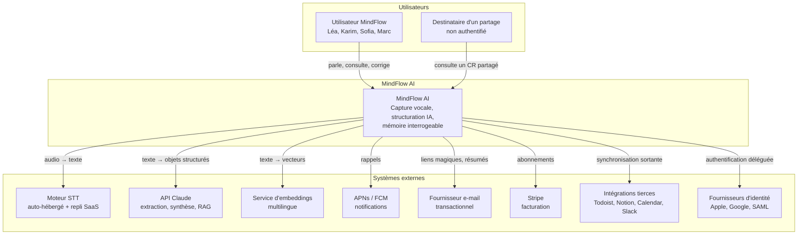

**Frontières de confiance**

| Frontière | Nature | Contrôle |
| --- | --- | --- |
| Client ↔ API | Réseau public | mTLS non requis, JWT court + rotation, certificate pinning côté mobile |
| API ↔ Données | Réseau privé | Pas d'exposition publique, RLS active |
| Système ↔ LLM/STT | Réseau public sortant | Contrat sans rétention, minimisation des données envoyées, redaction PII optionnelle |
| Système ↔ Intégrations | OAuth sortant | Jetons chiffrés au repos, périmètre minimal |

---

### 3.2 Niveau 2 — Conteneurs

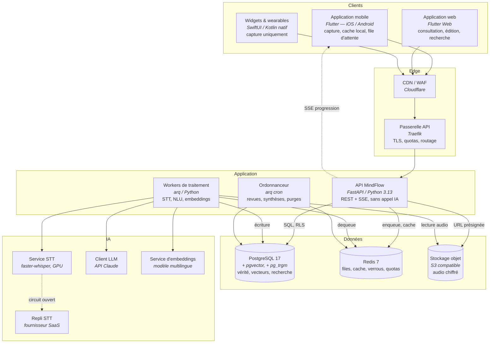

| Conteneur | Technologie | Responsabilité | Dimensionnement initial |
| --- | --- | --- | --- |
| Application mobile | Flutter 3.x, Dart | Capture, file locale, cache, UI | — |
| Application web | Flutter Web | Consultation, édition, recherche | — |
| Widgets / wearables | SwiftUI, Kotlin/Compose | Capture uniquement, écrit dans le conteneur partagé | — |
| Passerelle | Traefik | TLS, quotas, routage, en-têtes de sécurité | 2 instances |
| API | FastAPI, Uvicorn | Contrôle, jamais d'appel IA synchrone | 3 instances, autoscaling CPU |
| Workers | arq | Traitement asynchrone, files prioritaires | 4 instances, autoscaling sur profondeur de file |
| Ordonnanceur | arq cron | Tâches périodiques | 1 instance (verrou distribué) |
| PostgreSQL | PostgreSQL 17 + pgvector | Vérité + vecteurs + FTS | 1 primaire, 1 réplique lecture |
| Redis | Redis 7 | Files, cache, verrous, compteurs | 1 primaire + réplique |
| Stockage objet | S3 compatible | Audio chiffré, exports | — |
| Service STT | faster-whisper large-v3 sur GPU | Transcription | 1 nœud GPU, mise à l'échelle par file |

---

### 3.3 Niveau 3 — Composants de l'API

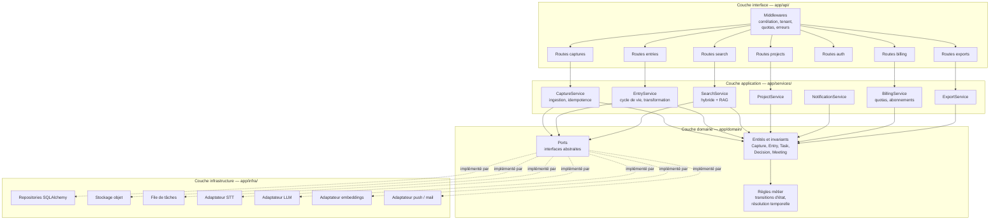

**Règle de dépendance** : `api → services → domain ← infra`. Le domaine ne dépend
de rien. L'infrastructure implémente les ports définis par le domaine. Cette règle
est vérifiée automatiquement en CI (`import-linter`).

---

### 3.4 Niveau 3 — Composants du pipeline de traitement

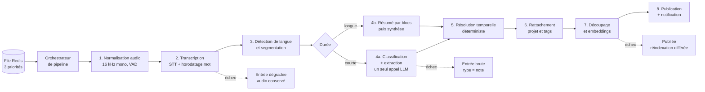

**Propriété clé** : chaque étape est idempotente et reprend depuis son état
persisté. Un échec à l'étape 7 ne réexécute pas la transcription — qui est
l'étape la plus coûteuse.

---

### 3.5 Niveau 4 — Vue de code (illustrative)

Un exemple de structure interne d'un module, décrit sans implémentation :

```
app/domain/capture/
├── entities.py        Capture, CaptureStatus — objets purs, invariants
├── events.py          CaptureIngested, TranscriptionCompleted…
├── ports.py           AudioStoragePort, TranscriberPort, CaptureRepository
├── services.py        règles métier sans effet de bord
└── errors.py          CaptureTooLong, DuplicateCapture…
```

Invariants portés par `Capture` :
- `duration_ms > 0` et `duration_ms ≤ plan.max_capture_ms`
- transition d'état uniquement selon la machine à états définie en §10.4
- `client_capture_id` unique par utilisateur — porte l'idempotence
- l'audio ne peut être supprimé que si toutes les entrées dérivées le sont aussi,
  ou si l'utilisateur demande explicitement la conservation des dérivés

---

## 4. Diagrammes de séquence

### 4.1 SEQ-01 — Capture courte, chemin nominal

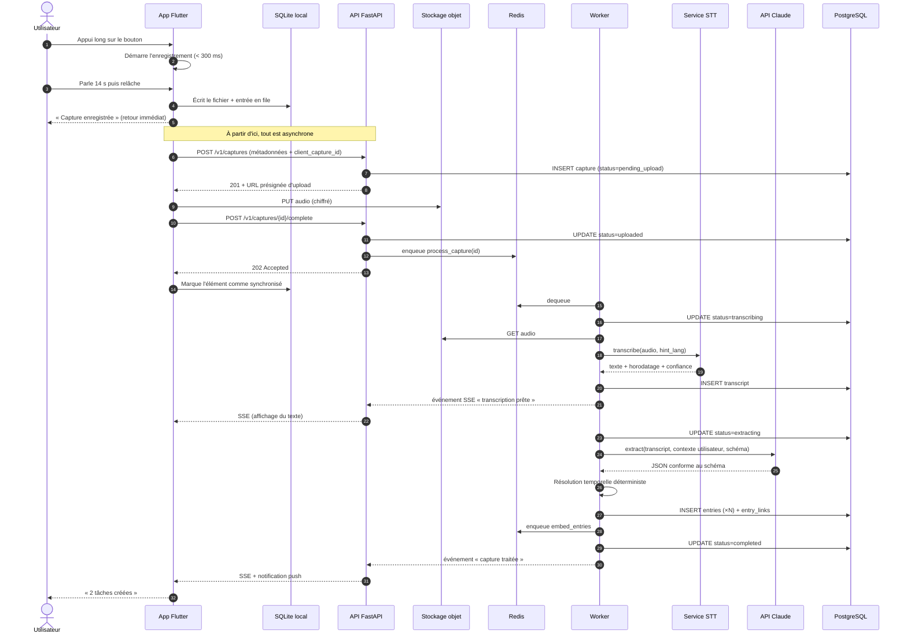

**Points de conception visibles dans cette séquence**
- L'utilisateur reçoit un accusé (étape 5) **avant** tout appel réseau.
- `client_capture_id` est généré côté client : rejouer le POST est sans effet.
- Le SSE donne un retour progressif ; le push est le filet si l'app est fermée.
- La résolution temporelle est faite en code déterministe, pas par le LLM (voir `AI.md`).

---

### 4.2 SEQ-02 — Capture hors ligne et reprise

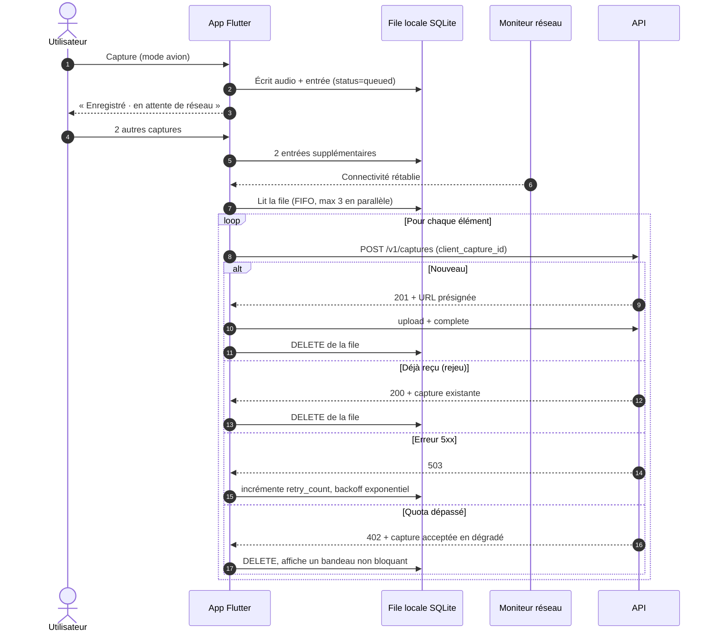

**Règle** : un 402 (quota) ne fait jamais échouer l'upload. La capture est stockée
et transcrite ; c'est l'enrichissement IA qui est différé ou dégradé.

---

### 4.3 SEQ-03 — Recherche sémantique avec RAG

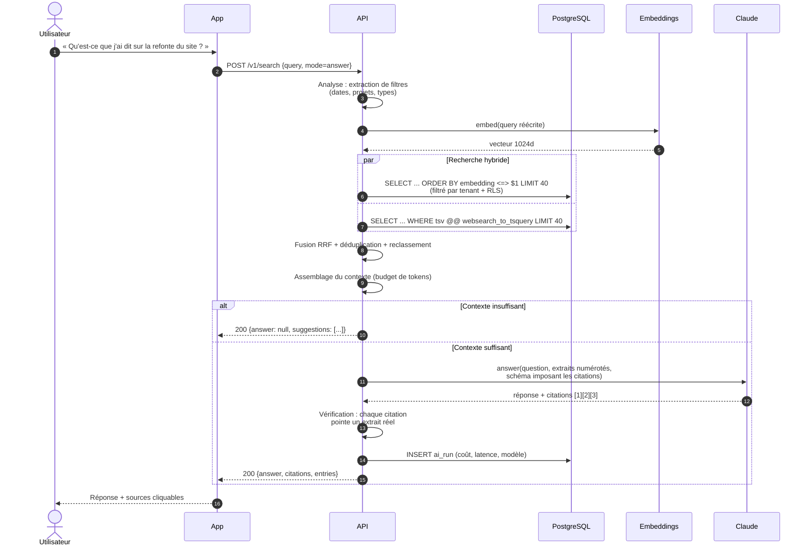

**Garde-fou** : si une citation renvoyée par le modèle ne correspond à aucun extrait
fourni, la réponse est rejetée et l'API retourne les extraits bruts sans synthèse.
Une hallucination de source est traitée comme une erreur, pas comme un aléa.

---

### 4.4 SEQ-04 — Traitement d'une réunion longue

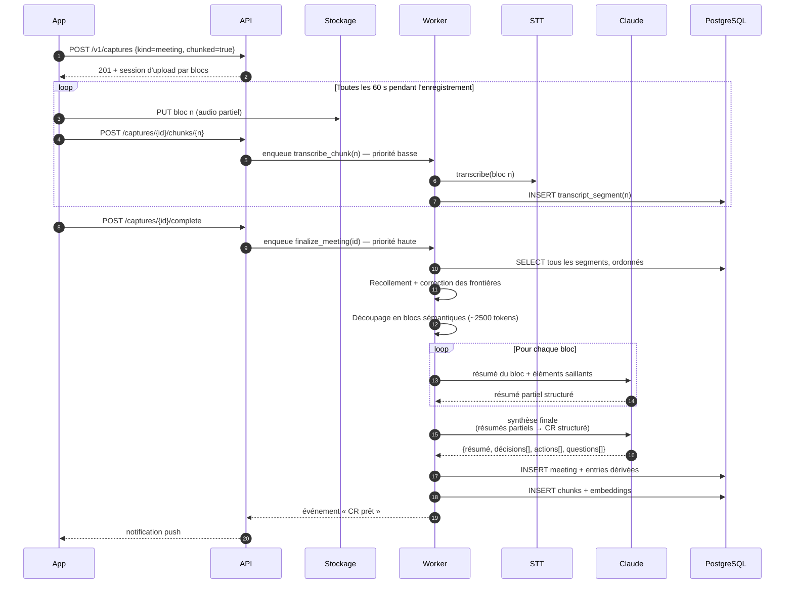

**Compromis assumé** : la transcription en flux pendant l'enregistrement double le
nombre d'appels STT mais divise par ~4 le délai perçu entre la fin de la réunion et
le compte-rendu. Voir `Decisions.md` ADR-013.

---

### 4.5 SEQ-05 — Correction utilisateur et boucle d'apprentissage

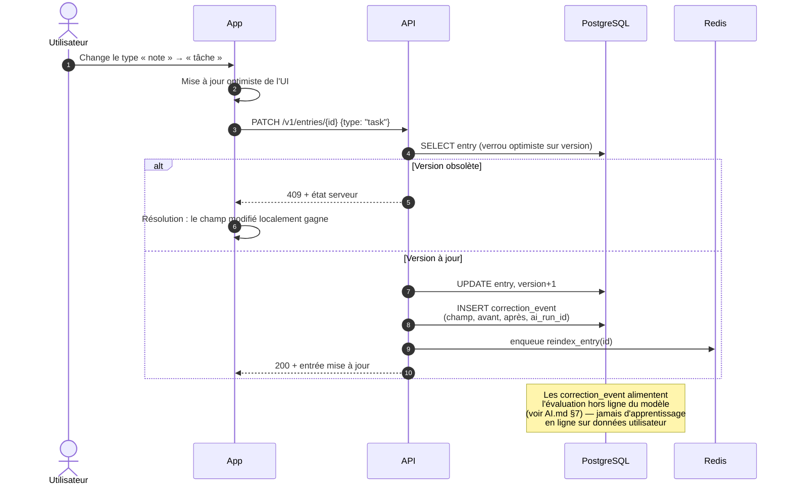

---

### 4.6 SEQ-06 — Suppression RGPD d'un compte

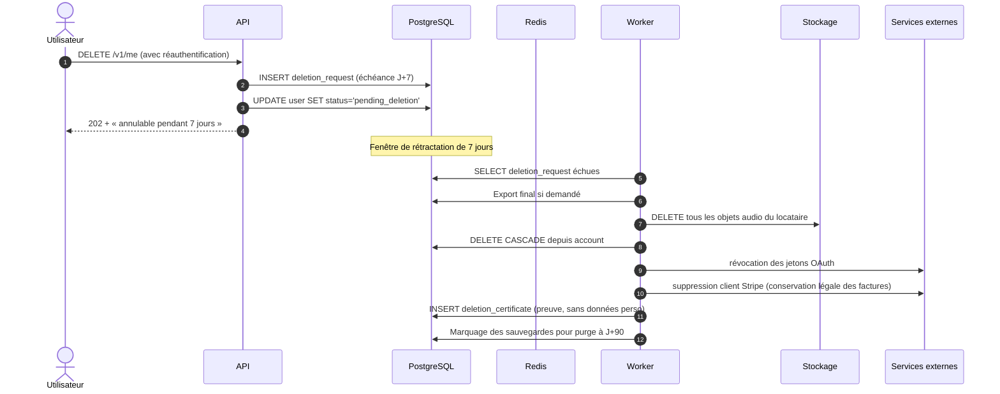

---

## 5. Choix techniques justifiés

Chaque ligne renvoie à l'ADR qui porte le raisonnement complet.

### 5.1 Client

| Choix | Alternative écartée | Justification courte | Coût accepté | ADR |
| --- | --- | --- | --- | --- |
| **Flutter** | React Native ; natif iOS+Android | Un seul code base pour 3 plateformes ; rendu propre et cohérent ; performance suffisante — l'app n'est pas gourmande, elle enregistre et affiche des listes | Le canal audio et les widgets exigent du code natif par plateforme ; taille du binaire supérieure ; recrutement Dart plus étroit | ADR-002 |
| **Riverpod** | BLoC ; Provider | État déclaratif, testable sans widget tree, compatible avec la génération de code | Courbe d'apprentissage ; verbosité initiale | ADR-014 |
| **Drift (SQLite)** | Hive ; Isar | SQL réel côté client — les mêmes requêtes que le serveur ; migrations versionnées | Plus lourd qu'un magasin clé-valeur | ADR-015 |
| **Widgets natifs** | Widget Flutter | Les widgets d'écran verrouillé et les apps de montre n'ont pas d'équivalent Flutter viable | Deux implémentations à maintenir | ADR-016 |

### 5.2 Serveur

| Choix | Alternative écartée | Justification courte | Coût accepté | ADR |
| --- | --- | --- | --- | --- |
| **FastAPI / Python 3.13** | Node/NestJS ; Go ; Django | Le cœur du produit est le pipeline IA : Python est là où vivent les bibliothèques, les SDK et les outils d'évaluation. Un seul langage serveur du contrôleur au worker | Débit brut inférieur à Go ; GIL ; typage moins strict | ADR-003 |
| **Monolithe modulaire** | Micro-services d'emblée | Une équipe de 3 à 6 personnes ; les frontières métier ne sont pas encore stables ; le coût opérationnel des micro-services précède leur bénéfice | Discipline nécessaire pour ne pas coupler les modules ; mise à l'échelle par bloc | ADR-001 |
| **arq (Redis)** | Celery ; RabbitMQ ; SQS | Natif `asyncio`, aligné avec FastAPI ; Redis est déjà présent ; opérations simples | Moins de fonctionnalités que Celery ; pas de routage complexe | ADR-006 |
| **SQLAlchemy 2 + Alembic** | SQLModel ; requêtes brutes | Maturité, contrôle fin du SQL, migrations réversibles éprouvées | Verbosité | ADR-017 |
| **Pydantic v2** | dataclasses ; attrs | Validation + sérialisation + génération OpenAPI en un seul modèle | Couplage à l'écosystème FastAPI | ADR-017 |

### 5.3 Données

| Choix | Alternative écartée | Justification courte | Coût accepté | ADR |
| --- | --- | --- | --- | --- |
| **PostgreSQL 17** | MySQL ; MongoDB | Transactions, JSONB, recherche plein texte, RLS, extensions vectorielles : un seul moteur couvre tous les besoins | Mise à l'échelle en écriture limitée à un primaire | ADR-004 |
| **pgvector** | Pinecone ; Qdrant ; Weaviate | Évite un second magasin à synchroniser ; les filtres locataire/date sont dans la même requête ; suffisant jusqu'à ~10 M de vecteurs | Performance inférieure à un moteur dédié à très grande échelle ; index HNSW à ajuster | ADR-004 |
| **Row Level Security** | Filtrage applicatif ; base par locataire | La sécurité ne repose pas sur la rigueur du développeur : une clause `WHERE` oubliée ne fuit pas | Surcharge de requête ; sessions à configurer ; débogage plus subtil | ADR-005 |
| **Table `outbox`** | Kafka ; NATS | Publication d'événements transactionnellement cohérente avec l'écriture métier, sans opérer un bus | Latence de propagation de quelques secondes ; pas de rejeu longue durée | ADR-010 |
| **Stockage objet S3** | Base de données ; disque local | Coût, durabilité, URL présignées, cycle de vie automatique | Consistance éventuelle ; latence réseau | ADR-018 |

### 5.4 IA

| Choix | Alternative écartée | Justification courte | Coût accepté | ADR |
| --- | --- | --- | --- | --- |
| **STT auto-hébergé (faster-whisper large-v3)** | 100 % SaaS | Coût marginal effondré à volume ; données audio qui ne sortent pas ; pas de dépendance de disponibilité | Nœuds GPU à opérer ; latence à froid ; repli à maintenir | ADR-007 |
| **Repli STT SaaS** | Aucun repli | La transcription est sur le chemin critique de valeur ; un incident GPU ne doit pas arrêter le produit | Coût du double contrat ; surface de données élargie | ADR-007 |
| **Claude (`claude-opus-5`) pour l'extraction** | Modèle ouvert auto-hébergé | Qualité d'extraction structurée et de respect de schéma décisive pour la confiance ; sortie contrainte par schéma JSON native | Dépendance fournisseur ; coût par appel ; données envoyées à un tiers (contrat sans rétention) | ADR-008 |
| **`claude-haiku-4-5` pour le préfiltrage** | Un seul modèle partout | Le tri « capture triviale vs riche » ne justifie pas le modèle le plus capable | Deux chemins à évaluer et surveiller | ADR-019 |
| **Résolution temporelle déterministe** | Confier les dates au LLM | Les dates sont vérifiables : un code déterministe avec fuseau horaire est plus fiable et gratuit | Couverture linguistique à construire et maintenir | ADR-020 |
| **Embeddings multilingues auto-hébergés** | API d'embeddings | Volume élevé et prévisible, texte court ; le coût réseau et financier dominerait | Un service de plus à opérer | ADR-021 |

### 5.5 Infrastructure

| Choix | Alternative écartée | Justification courte | Coût accepté | ADR |
| --- | --- | --- | --- | --- |
| **Conteneurs sur Kubernetes managé (UE)** | PaaS ; serverless ; VM | Besoin de nœuds GPU et de workers longue durée ; portabilité entre fournisseurs | Complexité opérationnelle ; besoin de compétence | ADR-022 |
| **Terraform + Helm** | Scripts ; console | Infrastructure reproductible et revue en PR | Courbe d'apprentissage | ADR-022 |
| **GitHub Actions** | GitLab CI ; Jenkins | Là où vit le code ; runners GPU disponibles pour les évaluations | Verrouillage modéré | ADR-023 |
| **Hébergement UE par défaut** | US | RGPD, argument commercial, personas européens | Latence pour les utilisateurs hors UE | ADR-024 |

---

## 6. Architecture Flutter

### 6.1 Principes

1. **La couche capture est isolée et sanctuarisée.** Elle ne dépend d'aucune autre
   couche, ne fait aucun appel réseau, et doit fonctionner si tout le reste est cassé.
2. **Offline-first, pas offline-tolerant.** La base locale est la source de vérité de
   l'affichage ; le serveur est un pair de synchronisation.
3. **Feature-first**, pas layer-first : un dossier par fonctionnalité, chacun contenant
   ses propres couches.
4. **L'état est déclaratif** et dérivé de la base locale, jamais dupliqué.

### 6.2 Structure de dossiers

```
lib/
├── main.dart
├── app/
│   ├── app.dart                    racine, thème, routage
│   ├── router.dart                 go_router, routes typées
│   └── bootstrap.dart              init des conteneurs, migrations locales
│
├── core/                           transverse, sans logique métier
│   ├── audio/                      ⚠ ZONE SANCTUARISÉE
│   │   ├── recorder.dart           abstraction d'enregistrement
│   │   ├── platform_channel.dart   pont vers le natif
│   │   └── audio_session.dart      gestion des interruptions (appel, autre app)
│   ├── db/                         Drift : schéma local, migrations, DAO
│   ├── network/                    client HTTP, intercepteurs, rejeu
│   ├── sync/                       moteur de synchronisation, file sortante
│   ├── errors/                     taxonomie d'erreurs, mapping vers messages
│   ├── i18n/                       ARB, pluriels, formats de dates
│   ├── design/                     tokens, composants réutilisables
│   └── telemetry/                  traces, métriques, journal client
│
├── features/
│   ├── capture/
│   │   ├── domain/                 entités, cas d'usage
│   │   ├── data/                   repository local + distant
│   │   ├── application/            providers Riverpod
│   │   └── presentation/           écrans, widgets, contrôleurs
│   ├── inbox/
│   ├── entry_detail/
│   ├── search/
│   ├── projects/
│   ├── review/
│   ├── meetings/
│   ├── settings/
│   └── onboarding/
│
└── platform/                       code natif appelé par les canaux
    ├── ios/                        widget écran verrouillé, watchOS, CarPlay
    └── android/                    service de premier plan, tuile, Wear OS
```

### 6.3 Flux de données côté client

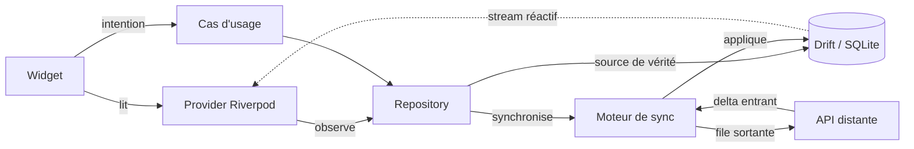

**Conséquence** : l'interface ne connaît jamais le réseau. Elle observe la base
locale. Une capture apparaît instantanément dans l'inbox, avec un état
`en cours de traitement` qui se résout quand la synchronisation ramène le résultat.

### 6.4 La chaîne de capture en détail

| Étape | Composant | Garantie |
| --- | --- | --- |
| 1 | `AudioSession` pré-initialisée au démarrage de l'app | Le démarrage d'enregistrement ne fait pas d'initialisation coûteuse |
| 2 | `Recorder` écrit en flux dans un fichier temporaire | Une app tuée en cours d'enregistrement laisse un fichier partiel récupérable |
| 3 | `fsync` du fichier + `INSERT` dans `outbox_local` **dans la même transaction logique** | Aucune capture ne peut exister sans être en file |
| 4 | Retour haptique + visuel à l'utilisateur | L'accusé est donné après la persistance, jamais avant |
| 5 | `SyncEngine` prend la file en charge | Reprise sur redémarrage, backoff exponentiel plafonné |

**Interruptions gérées explicitement** : appel entrant, autre app prenant le micro,
Bluetooth déconnecté, mémoire insuffisante, batterie critique. Dans chaque cas
l'audio déjà capté est conservé et mis en file.

### 6.5 Synchronisation et conflits

| Aspect | Stratégie |
| --- | --- |
| Sens | Bidirectionnel, delta par curseur `updated_at` + `id` |
| Granularité de conflit | Au champ, pas à l'objet |
| Résolution | Dernière écriture gagnante par champ, avec `version` optimiste |
| Divergence non résoluble | Conservation des deux versions, entrée marquée `conflict`, résolution utilisateur |
| Suppressions | Marqueurs de suppression (tombstones) avec purge à 90 jours |
| Idempotence | `client_capture_id` (UUIDv7 généré localement) sur toute création |

### 6.6 Tests côté client

| Niveau | Portée | Outil | Couverture cible |
| --- | --- | --- | --- |
| Unitaire | Domaine, résolution de conflits, file | `flutter test` | ≥ 85 % sur `core/` et `domain/` |
| Widget | Écrans critiques : capture, inbox | `flutter test` + golden | Écrans P0 |
| Intégration | Parcours capture → inbox, hors ligne | `integration_test` | 6 parcours |
| Bout en bout | Sur appareil réel, avec réseau dégradé | Maestro | 3 parcours |
| Performance | Latence tap → enregistrement | Benchmark automatisé en CI | Seuil bloquant à 300 ms |

---

## 7. Architecture FastAPI

### 7.1 Structure de dossiers

```
backend/
├── app/
│   ├── main.py                     création de l'app, montage des routeurs
│   ├── config.py                   settings Pydantic, validés au démarrage
│   ├── deps.py                     dépendances FastAPI partagées
│   │
│   ├── api/                        ── COUCHE INTERFACE ──
│   │   ├── v1/
│   │   │   ├── auth.py
│   │   │   ├── captures.py
│   │   │   ├── entries.py
│   │   │   ├── search.py
│   │   │   ├── projects.py
│   │   │   ├── meetings.py
│   │   │   ├── reviews.py
│   │   │   ├── exports.py
│   │   │   ├── billing.py
│   │   │   ├── integrations.py
│   │   │   └── admin.py
│   │   ├── middleware/
│   │   │   ├── correlation.py      request_id, trace_id
│   │   │   ├── tenancy.py          pose le contexte RLS sur la session
│   │   │   ├── rate_limit.py       quotas par plan et par route
│   │   │   ├── errors.py           handler global → RFC 9457
│   │   │   └── logging.py          journal structuré d'accès
│   │   └── schemas/                DTO Pydantic entrée/sortie
│   │
│   ├── services/                   ── COUCHE APPLICATION ──
│   │   ├── capture_service.py
│   │   ├── entry_service.py
│   │   ├── search_service.py
│   │   ├── meeting_service.py
│   │   ├── review_service.py
│   │   ├── billing_service.py
│   │   ├── export_service.py
│   │   └── notification_service.py
│   │
│   ├── domain/                     ── COUCHE DOMAINE (pure) ──
│   │   ├── capture/
│   │   ├── entry/
│   │   ├── search/
│   │   ├── billing/
│   │   ├── shared/                 value objects, temps, identifiants
│   │   └── ports.py                interfaces abstraites
│   │
│   ├── infra/                      ── COUCHE INFRASTRUCTURE ──
│   │   ├── db/
│   │   │   ├── session.py          moteur async, contexte RLS
│   │   │   ├── models/             tables SQLAlchemy
│   │   │   └── repositories/       implémentations des ports
│   │   ├── storage/                S3, URL présignées, chiffrement
│   │   ├── queue/                  arq, définition des files
│   │   ├── ai/
│   │   │   ├── stt/                adaptateurs auto-hébergé + repli
│   │   │   ├── llm/                adaptateur Claude
│   │   │   ├── embeddings/
│   │   │   └── prompts/            versionnés, testés (voir AI.md)
│   │   ├── notifications/          APNs, FCM, e-mail
│   │   └── integrations/           connecteurs sortants
│   │
│   ├── workers/                    ── PLAN DE TRAITEMENT ──
│   │   ├── settings.py             définition arq, files, priorités
│   │   ├── pipeline/
│   │   │   ├── orchestrator.py
│   │   │   ├── transcribe.py
│   │   │   ├── extract.py
│   │   │   ├── embed.py
│   │   │   └── finalize_meeting.py
│   │   ├── scheduled/
│   │   │   ├── daily_review.py
│   │   │   ├── weekly_digest.py
│   │   │   ├── decision_followup.py
│   │   │   ├── quota_reset.py
│   │   │   └── gdpr_purge.py
│   │   └── outbox_dispatcher.py
│   │
│   └── observability/
│       ├── logging.py              structlog + JSON
│       ├── tracing.py              OpenTelemetry
│       └── metrics.py              Prometheus
│
├── migrations/                     Alembic
├── tests/
│   ├── unit/                       domaine, sans I/O
│   ├── integration/                base réelle, adaptateurs simulés
│   ├── contract/                   validation OpenAPI
│   ├── e2e/                        parcours complets
│   └── evals/                      évaluation des prompts (voir AI.md)
├── pyproject.toml
└── Dockerfile
```

### 7.2 Chaîne de traitement d'une requête

```
Requête HTTP
   │
   ▼ TLS terminé à la passerelle
   ▼ [1] Middleware de corrélation      → request_id, trace_id, span racine
   ▼ [2] Middleware de journalisation   → début de requête
   ▼ [3] Dépendance d'authentification  → vérification JWT → Principal
   ▼ [4] Middleware de tenancy          → SET LOCAL app.account_id = …
   ▼ [5] Middleware de quotas           → vérification plan + compteur Redis
   ▼ [6] Validation Pydantic            → 422 si le corps est invalide
   ▼ [7] Route                          → traduit DTO → commande
   ▼ [8] Service applicatif             → orchestre, ouvre la transaction
   ▼ [9] Domaine                        → applique les règles, lève des erreurs métier
   ▼ [10] Repository                    → SQL sous RLS
   ▼ [11] Outbox                        → événement écrit dans la même transaction
   ▼ [12] Commit
   ▼ [13] Sérialisation Pydantic        → DTO de sortie
   ▼ [14] Middleware d'erreurs          → toute exception → RFC 9457
Réponse HTTP
```

**Invariants de la chaîne**
- Aucune route n'appelle un LLM ou un STT de manière synchrone.
- Aucune route ne fait plus d'une transaction en écriture.
- Le contexte RLS est posé avant toute requête et retiré à la fin (`SET LOCAL`).
- Toute écriture métier qui doit déclencher un effet publie dans `outbox`.

### 7.3 Files de traitement

| File | Priorité | Contenu | SLA cible | Concurrence |
| --- | --- | --- | --- | --- |
| `capture.realtime` | Haute | Captures < 3 min | p95 < 25 s | 32 |
| `capture.batch` | Moyenne | Réunions, retraitements | p95 < 5 min | 8 |
| `index` | Basse | Embeddings, réindexation | p95 < 2 min | 16 |
| `scheduled` | Basse | Revues, synthèses, purges | Fenêtre horaire | 4 |
| `dead_letter` | — | Échecs après 5 tentatives | Inspection manuelle | — |

**Politique de reprise** : 5 tentatives, backoff exponentiel `2^n` secondes plafonné
à 10 minutes, jitter ±20 %. Après épuisement, la tâche part en `dead_letter` et
l'entrée passe en état dégradé mais reste consultable.

### 7.4 Configuration

Toute la configuration est un modèle Pydantic validé **au démarrage** : un
paramètre manquant ou incohérent fait échouer le lancement, pas la première requête.
Aucun secret n'est en clair dans le dépôt ; ils sont injectés par le gestionnaire de
secrets de la plateforme.

---

## 8. Découpage en modules

### 8.1 Carte des modules

| Module | Responsabilité | Possède les tables | Dépend de |
| --- | --- | --- | --- |
| `identity` | Comptes, utilisateurs, sessions, appareils | `account`, `user`, `session`, `device`, `identity_link` | — |
| `capture` | Ingestion, cycle de vie de l'audio, transcriptions | `capture`, `transcript`, `transcript_segment` | `identity`, `storage` |
| `knowledge` | Entrées typées, liens, projets, tags | `entry`, `task`, `decision`, `meeting`, `entry_link`, `project`, `tag` | `identity`, `capture` |
| `search` | Chunks, embeddings, index, RAG | `chunk`, `embedding`, `search_log` | `knowledge` |
| `intelligence` | Orchestration IA, prompts, traçabilité des runs | `ai_run`, `prompt_version`, `correction_event` | `capture`, `knowledge` |
| `reminders` | Rappels, revues, notifications | `reminder`, `notification`, `review_run` | `knowledge`, `identity` |
| `billing` | Plans, abonnements, quotas, usage | `plan`, `subscription`, `usage_counter`, `invoice_ref` | `identity` |
| `integrations` | Connecteurs sortants, jetons OAuth | `integration`, `integration_sync`, `oauth_token` | `knowledge` |
| `sharing` | Liens de partage, exports publics | `share_link`, `share_access_log` | `knowledge` |
| `compliance` | RGPD, audit, rétention, consentements | `audit_log`, `deletion_request`, `consent`, `data_export` | tous (lecture) |
| `platform` | Transverse : outbox, jobs, feature flags | `outbox`, `job`, `feature_flag` | — |

### 8.2 Règles de couplage

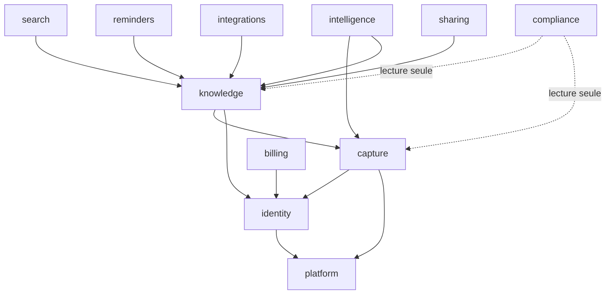

**Contraintes vérifiées automatiquement en CI**

| Règle | Vérification |
| --- | --- |
| Un module n'importe jamais l'`infra` d'un autre module | `import-linter`, échec bloquant |
| Aucune dépendance circulaire entre modules | `import-linter` |
| Le domaine n'importe jamais `sqlalchemy`, `fastapi`, `httpx`, `arq` | `import-linter` |
| Une table n'est écrite que par son module propriétaire | Revue + convention de nommage des repositories |
| La communication inter-modules passe par une interface publique (`<module>/api.py`) ou par un événement `outbox` | `import-linter` |

### 8.3 Contrat public d'un module

Chaque module expose un fichier `api.py` contenant : ses commandes, ses requêtes,
ses événements publiés, ses types publics. Tout le reste est privé. Ce fichier est
la future frontière de service (§9).

Exemple de contrat, décrit et non implémenté :

```
knowledge/api.py
  Commandes   CreateEntry, UpdateEntry, TransformEntry, LinkEntries, DeleteEntry
  Requêtes    GetEntry, ListEntries, GetProjectTree
  Événements  EntryCreated, EntryUpdated, EntryDeleted, EntryTypeChanged
  Types       EntryId, EntryType, EntryView
```

---

## 9. Découpage en micro-services potentiels

### 9.1 Position de départ

Le système démarre en **monolithe modulaire**. Les micro-services ne sont pas un
objectif : ce sont une réponse à un problème constaté. Le découpage ci-dessous est
une **carte d'extraction préparée**, pas un plan de mise en œuvre.

### 9.2 Candidats à l'extraction, par ordre de probabilité

| # | Service candidat | Module d'origine | Déclencheur d'extraction | Difficulté |
| --- | --- | --- | --- | --- |
| **1** | `transcription-service` | `capture` (partie STT) | Besoin de nœuds GPU dédiés, mise à l'échelle et cycle de vie totalement différents du reste | **Faible** — déjà derrière un port, sans état, contrat audio→texte simple |
| **2** | `embedding-service` | `search` (partie vectorisation) | Charge d'indexation qui perturbe le service en ligne ; besoin de GPU | **Faible** — sans état, contrat texte→vecteur |
| **3** | `extraction-service` | `intelligence` | Cycle de déploiement des prompts découplé de celui de l'API ; besoin d'expérimentation A/B rapide | **Moyenne** — nécessite un accès au contexte utilisateur |
| **4** | `search-service` | `search` | Volume de requêtes de recherche > 10× celui des écritures | **Moyenne** — lecture seule, mais partage la base |
| **5** | `notification-service` | `reminders` | Volume de notifications indépendant du reste ; besoin de fenêtres d'envoi | **Moyenne** — sortant uniquement |
| **6** | `integration-service` | `integrations` | Chaque connecteur a sa propre cadence de panne et de limitation de débit | **Moyenne** — isole bien les défaillances tierces |
| **7** | `billing-service` | `billing` | Exigences de conformité financière distinctes | **Élevée** — couplé à `identity` |
| **8** | `identity-service` | `identity` | Besoin de SSO entreprise à grande échelle | **Élevée** — tout en dépend |

### 9.3 Cible plausible à 3 ans

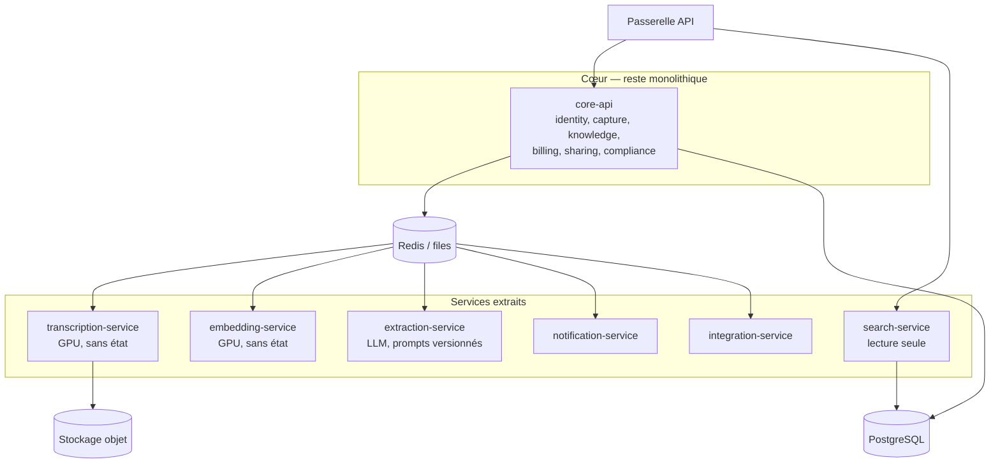

### 9.4 Ce qu'il faut avoir en place *avant* toute extraction

| Prérequis | Pourquoi | Statut cible |
| --- | --- | --- |
| Traçage distribué de bout en bout | Sans lui, un incident inter-services est indébuggable | Dès le MVP (OpenTelemetry) |
| Contrats versionnés et testés | Une extraction sans contrat crée un couplage caché | Dès le MVP (`api.py` par module) |
| Idempotence sur toutes les commandes | Le réseau introduit des rejeux | Dès le MVP |
| Budget d'erreur et SLO par module | Sinon on ne sait pas ce qu'on isole | v1.1 |
| Pipeline de déploiement indépendant | Sinon on paie la complexité sans le bénéfice | v1.1 |
| Propriété de données claire | Deux services écrivant la même table est le pire des mondes | Dès le MVP |

### 9.5 Ce qui ne sera jamais extrait

| Élément | Raison |
| --- | --- |
| `knowledge` et `capture` séparés | Leur cohérence transactionnelle est le cœur du produit ; les séparer imposerait des sagas pour un bénéfice nul |
| Un service par type d'entrée (tâches, décisions…) | Découpage par entité et non par capacité — anti-pattern classique |
| Une base de données par service dès le départ | Le coût de la cohérence éventuelle dépasse largement le bénéfice à cette échelle |

---

## 10. Gestion des erreurs

### 10.1 Philosophie

| Principe | Conséquence |
| --- | --- |
| Une erreur est une information, pas un échec de communication | Chaque erreur a un code stable, un message utilisateur et une action possible |
| Les erreurs attendues sont typées, les inattendues sont des bugs | Le domaine lève des erreurs métier ; tout le reste est une 500 tracée |
| L'utilisateur ne doit jamais voir un détail technique | Traduction systématique à la frontière |
| **Une erreur ne doit jamais coûter une capture** | Toute défaillance du pipeline laisse l'audio intact et l'entrée consultable |

### 10.2 Taxonomie

```
MindFlowError
├── DomainError                  (4xx — l'utilisateur peut agir)
│   ├── ValidationError          422 — champ invalide
│   ├── NotFoundError            404 — ressource inexistante ou hors périmètre
│   ├── ConflictError            409 — version obsolète, doublon
│   ├── PermissionError          403 — ressource d'un autre locataire
│   ├── QuotaExceededError       402 — limite du plan atteinte
│   └── PreconditionError        400 — état incompatible avec l'action
│
├── AuthError                    (401 — authentification)
│   ├── TokenExpiredError
│   ├── TokenInvalidError
│   └── MfaRequiredError
│
├── InfrastructureError          (5xx — l'utilisateur ne peut rien)
│   ├── DatabaseError
│   ├── StorageError
│   └── QueueError
│
└── UpstreamError                (502/503 — dépendance externe)
    ├── TranscriptionUnavailable  → repli, puis file d'attente
    ├── LlmUnavailable            → entrée dégradée, retraitement programmé
    ├── LlmRateLimited            → backoff + file basse priorité
    ├── LlmRefusal                → contenu non traité, audio conservé, notification neutre
    └── IntegrationError          → désactivation du connecteur, alerte utilisateur
```

### 10.3 Format de réponse — RFC 9457

Toute erreur de l'API renvoie un `application/problem+json`. Le format complet et
le catalogue des codes sont dans `API.md` §6. Résumé de la structure :

| Champ | Rôle |
| --- | --- |
| `type` | URI stable documentant la classe d'erreur |
| `title` | Libellé court, invariant |
| `status` | Code HTTP |
| `detail` | Message destiné au développeur |
| `instance` | URI de la ressource concernée |
| `code` | Code applicatif stable (`quota_exceeded`, `entry_version_conflict`…) |
| `request_id` | Corrélation avec les journaux |
| `errors[]` | Détail par champ pour les erreurs de validation |
| `retry_after` | Présent sur 429 et 503 |

### 10.4 États dégradés du pipeline

C'est le mécanisme central de résilience. Une capture n'échoue jamais complètement.

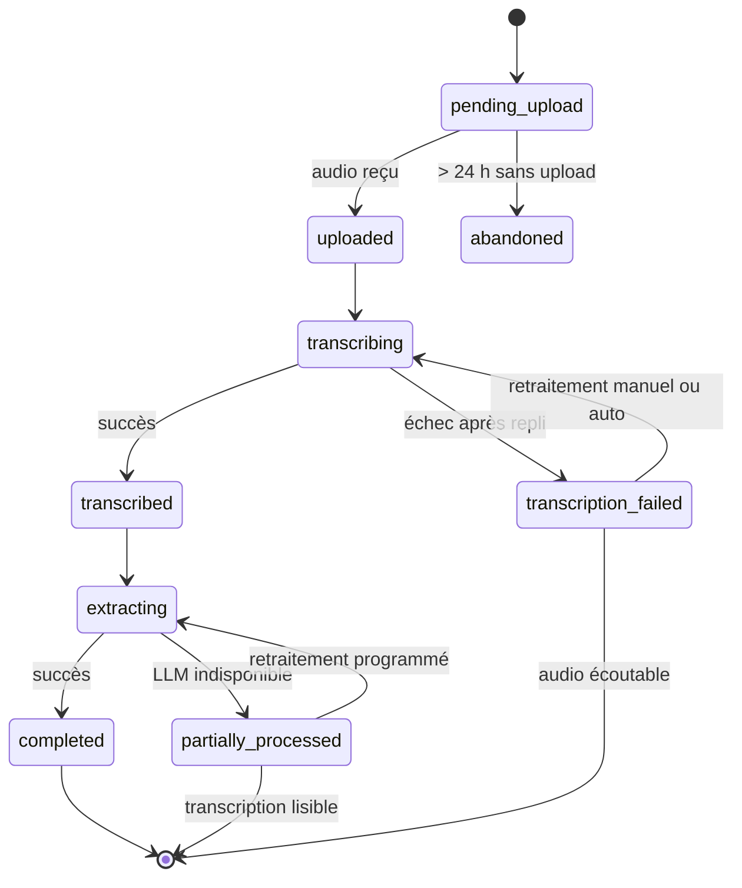

| État terminal | Ce que l'utilisateur voit | Ce qu'il peut faire |
| --- | --- | --- |
| `completed` | Entrées structurées | Tout |
| `partially_processed` | Transcription complète, entrée de type `note` | Structurer manuellement, relancer |
| `transcription_failed` | Audio écoutable, bandeau explicite | Réécouter, réessayer, saisir manuellement |
| `abandoned` | Rien côté serveur ; l'audio local reste | Réessayer l'upload |

### 10.5 Résilience des dépendances

| Dépendance | Détection | Réaction | Retour à la normale |
| --- | --- | --- | --- |
| STT auto-hébergé | 3 échecs / 30 s, ou p95 > 3× la référence | Circuit ouvert 60 s → bascule sur le repli SaaS | Demi-ouverture, 1 requête test |
| API LLM | 429 ou 5xx | Backoff exponentiel + jitter, file basse priorité | Automatique |
| API LLM — refus de contenu | `stop_reason: refusal` | Aucune nouvelle tentative ; entrée en `partially_processed` ; message neutre, sans jugement | — |
| Stockage objet | Échec d'écriture | 3 tentatives, puis conservation locale côté client | Automatique |
| PostgreSQL primaire | Perte de connexion | Lecture bascule sur la réplique, écritures en erreur 503 | Bascule gérée par la plateforme |
| Redis | Indisponible | Les captures sont acceptées et marquées pour reprise par balayage de la base | Reprise automatique |
| Intégration tierce | 5 échecs consécutifs | Désactivation du connecteur + notification utilisateur | Réactivation manuelle |

### 10.6 Erreurs côté client

| Situation | Comportement | Message |
| --- | --- | --- |
| Pas de réseau | Silencieux, mise en file | Badge discret « en attente » |
| Permission micro refusée | Écran explicatif, lien vers les réglages | Explique *pourquoi* le micro est nécessaire |
| Micro occupé par une autre app | Retour immédiat, pas d'enregistrement vide | « Le micro est utilisé par une autre application » |
| Stockage local plein | Blocage préventif + proposition de purge du cache | Chiffré : « 340 Mo de captures en attente » |
| Jeton expiré | Rafraîchissement transparent | Aucun message |
| Rafraîchissement échoué | Reconnexion demandée, **la file locale est préservée** | « Reconnectez-vous — vos captures sont conservées » |
| Version d'API incompatible | Blocage doux avec lien de mise à jour | « Une mise à jour est nécessaire » |

---

## 11. Sécurité

### 11.1 Modèle de menaces (STRIDE, abrégé)

| Menace | Vecteur principal | Contre-mesure |
| --- | --- | --- |
| **Spoofing** | Vol de jeton, réutilisation | JWT d'accès de 15 min, jeton de rafraîchissement rotatif à usage unique, détection de rejeu → révocation de la famille |
| **Tampering** | Modification en transit ; falsification de webhook | TLS 1.3 obligatoire, HSTS, épinglage de certificat mobile ; signature HMAC vérifiée sur tout webhook entrant |
| **Repudiation** | Contestation d'une action | Journal d'audit immuable et horodaté sur les actions sensibles |
| **Information disclosure** | Fuite inter-locataires ; URL présignée fuitée ; audio exposé | RLS PostgreSQL ; URL présignées de 5 min liées à l'utilisateur ; chiffrement au repos par clé de locataire |
| **Denial of service** | Upload massif, requêtes coûteuses | Quotas par plan et par IP, taille et durée d'audio plafonnées, coût maximal par requête de recherche |
| **Elevation of privilege** | IDOR, escalade de rôle | Autorisation systématique par ressource, jamais par identifiant deviné ; RLS en dernier rempart |

### 11.2 Authentification

| Mécanisme | Usage | Détail |
| --- | --- | --- |
| Lien magique par e-mail | Inscription et connexion par défaut | Jeton à usage unique, 15 min, lié à l'appareil demandeur |
| Sign in with Apple / Google | Mobile | OIDC, uniquement le sub et l'e-mail vérifié |
| SAML / OIDC entreprise | Business | v2.0 |
| Jeton d'appareil | Widgets et wearables | Périmètre restreint : création de capture uniquement |
| Clés d'API | Business, API publique | Périmètre explicite, rotation, préfixe visible pour la détection de fuite |

**Cycle de vie des jetons**

| Jeton | Durée | Portée | Révocation |
| --- | --- | --- | --- |
| Accès | 15 min | Toutes les routes autorisées | Expiration naturelle |
| Rafraîchissement | 60 jours glissants | Renouvellement uniquement | Rotation à chaque usage ; réutilisation détectée = révocation de toute la famille |
| Appareil (widget) | 1 an | `captures:create` seulement | Depuis les réglages |
| Partage public | ≤ 30 jours | Une ressource, lecture seule | Depuis l'entrée partagée |

### 11.3 Autorisation

Trois couches, dans cet ordre :

1. **Périmètre du jeton** — le jeton porte-t-il le droit d'appeler cette route ?
2. **Autorisation applicative** — le principal a-t-il le droit sur *cette* ressource ?
3. **Row Level Security** — filet de sécurité au niveau de la base : même une requête
   fautive ne retourne rien d'un autre locataire.

La couche 3 est ce qui rend la promesse d'isolation crédible. Un test d'intégration
dédié tente explicitement de lire les données d'un autre locataire, sur chaque table,
et échoue la CI si une seule ligne remonte.

### 11.4 Protection des données

| Donnée | Sensibilité | Au repos | En transit | Rétention |
| --- | --- | --- | --- | --- |
| Audio | **Très élevée** | AES-256-GCM, clé par locataire (KMS) | TLS 1.3 | Configurable : 90 j / 1 an / illimité |
| Transcription | **Très élevée** | Chiffrement disque + colonne | TLS 1.3 | Idem entrée |
| Entrées structurées | Élevée | Chiffrement disque | TLS 1.3 | Jusqu'à suppression |
| Embeddings | Élevée (inversibles partiellement) | Chiffrement disque | Interne | Idem entrée |
| Jetons OAuth tiers | **Critique** | Chiffrement applicatif, clé distincte | TLS 1.3 | Jusqu'à déconnexion |
| Journaux | Moyenne | Chiffrement disque | TLS | 30 j (90 j pour l'audit) |
| Métriques | Faible | — | TLS | 13 mois |

**Règles de minimisation**
- Aucune donnée personnelle dans les journaux : les identifiants sont des UUID, jamais
  des e-mails ni du contenu.
- Les extraits envoyés au LLM sont limités au strict nécessaire pour la tâche.
- Redaction optionnelle (activable par l'utilisateur) des entités sensibles avant envoi
  au LLM : numéros longs, IBAN, adresses e-mail.

### 11.5 Sécurité de la chaîne IA

| Risque | Mesure |
| --- | --- |
| Injection de prompt via le contenu transcrit | Le contenu utilisateur est toujours dans un bloc de données délimité, jamais dans les instructions ; les instructions ne sont jamais reconstruites à partir du contenu |
| Sortie non conforme | Sortie contrainte par schéma JSON + validation Pydantic ; toute sortie non valide est rejetée, jamais interprétée en « meilleur effort » |
| Fuite entre utilisateurs par le contexte | Le contexte RAG est construit à partir d'une requête déjà filtrée par RLS ; assertion supplémentaire avant l'appel |
| Exfiltration via une réponse générée | Aucune capacité d'action côté modèle au MVP ; toute action passe par une confirmation utilisateur |
| Rétention chez le fournisseur | Contrat sans rétention ni entraînement ; vérification contractuelle documentée |
| Hallucination de source | Vérification programmatique des citations ; réponse rejetée si une citation ne correspond pas |

### 11.6 Sécurité applicative et chaîne d'approvisionnement

| Contrôle | Outil | Blocage CI |
| --- | --- | --- |
| Dépendances vulnérables | `pip-audit`, `osv-scanner` | Oui, sur critique et élevé |
| Secrets dans le code | `gitleaks` | Oui |
| Analyse statique | `bandit`, `semgrep` | Oui, sur élevé |
| Vulnérabilités d'image | `trivy` | Oui, sur critique |
| SBOM | `syft`, format CycloneDX | Généré à chaque version |
| Signature d'artefact | `cosign` | Signature obligatoire avant déploiement |
| Test dynamique | `ZAP` en préproduction | Non bloquant, rapport hebdomadaire |
| Test d'intrusion externe | Prestataire | Avant l'ouverture publique, puis annuel |

### 11.7 En-têtes et durcissement

- `Strict-Transport-Security`, `Content-Security-Policy`, `X-Content-Type-Options`,
  `Referrer-Policy`, `Permissions-Policy` sur toutes les réponses web.
- CORS restreint à une liste explicite d'origines.
- Corps de requête plafonné ; durée d'audio plafonnée par plan.
- Conteneurs sans privilèges, système de fichiers en lecture seule, utilisateur non root.
- Réseau : accès à la base uniquement depuis les sous-réseaux applicatifs ; aucun
  accès public.

### 11.8 Conformité RGPD

| Exigence | Mise en œuvre |
| --- | --- |
| Base légale | Contrat pour le service ; consentement explicite pour l'amélioration produit (désactivé par défaut) |
| Droit d'accès | Export complet en JSON + Markdown, généré sous 24 h |
| Droit de rectification | Toute entrée est éditable ; l'historique est conservé |
| Droit à l'effacement | Suppression en cascade documentée, effective à J+7, sauvegardes purgées à J+90 |
| Portabilité | Formats ouverts, sans dépendance à MindFlow |
| Registre des traitements | Maintenu, versionné avec le code |
| Sous-traitants | Liste publique : hébergeur, fournisseur LLM, repli STT, e-mail, paiement |
| Transferts hors UE | LLM aux US : clauses contractuelles types + analyse d'impact documentée |
| Analyse d'impact (AIPD) | Réalisée avant l'ouverture publique — traitement de données vocales à grande échelle |
| Notification de violation | Procédure documentée, 72 h |

---

## 12. Observabilité et logs

### 12.1 Les trois piliers, et ce qu'on en attend

| Pilier | Question à laquelle il répond | Outil |
| --- | --- | --- |
| **Journaux** | *Que s'est-il passé pour cette requête précise ?* | structlog → JSON → Loki |
| **Métriques** | *Le système va-t-il bien, en tendance ?* | Prometheus → Grafana |
| **Traces** | *Où le temps est-il passé, à travers les composants ?* | OpenTelemetry → Tempo |

Le fil conducteur est le `trace_id`, généré à l'entrée et propagé partout — y compris
dans les tâches asynchrones et jusqu'aux journaux client.

### 12.2 Journalisation structurée

**Format** : JSON, une ligne par événement. Jamais de texte libre non structuré.

**Champs obligatoires sur chaque ligne**

| Champ | Exemple | Rôle |
| --- | --- | --- |
| `ts` | `2026-06-09T11:47:03.221Z` | Horodatage UTC |
| `level` | `info` | Niveau |
| `event` | `capture.transcription.completed` | Nom d'événement stable, en `domaine.objet.action` |
| `trace_id` | `4bf92f...` | Corrélation distribuée |
| `request_id` | `req_01J...` | Corrélation requête |
| `account_id` | `acc_01J...` | Locataire — **jamais** l'e-mail |
| `service` | `api` \| `worker` \| `scheduler` | Origine |
| `version` | `1.4.2+a3f9c1` | Version déployée |
| `env` | `prod` | Environnement |

**Interdits absolus dans les journaux**

Contenu de transcription · audio · e-mails · noms · jetons · clés d'API · en-têtes
d'autorisation · corps de requête complets. Un test automatisé rejoue un échantillon
de journaux contre une liste de motifs interdits et échoue la CI en cas de détection.

**Niveaux — sémantique stricte**

| Niveau | Signification | Exemple |
| --- | --- | --- |
| `debug` | Diagnostic, désactivé en production | Contenu d'une requête SQL |
| `info` | Événement métier normal | `capture.completed` |
| `warning` | Anomalie absorbée par le système | Repli STT activé |
| `error` | Échec d'une opération pour un utilisateur | Extraction échouée après reprises |
| `critical` | Le service est dégradé pour tous | Base inaccessible |

### 12.3 Événements métier journalisés

| Domaine | Événements |
| --- | --- |
| Capture | `created`, `uploaded`, `transcription.started/completed/failed`, `extraction.completed/failed`, `abandoned` |
| Entrée | `created`, `updated`, `type_corrected`, `transformed`, `deleted` |
| Recherche | `query.executed` (avec mode, nombre de résultats, latence — **jamais la requête en clair**) |
| IA | `run.started/completed/failed`, `refusal`, `schema_violation`, `citation_mismatch` |
| Facturation | `quota.warned`, `quota.exceeded`, `subscription.changed` |
| Sécurité | `auth.failed`, `token.reuse_detected`, `rls.violation_attempt`, `permission.denied` |
| Conformité | `export.requested/completed`, `deletion.requested/completed` |

### 12.4 Métriques

**Métriques techniques (RED / USE)**

| Métrique | Type | Étiquettes |
| --- | --- | --- |
| `http_requests_total` | Compteur | route, méthode, statut |
| `http_request_duration_seconds` | Histogramme | route, méthode |
| `queue_depth` | Jauge | file |
| `job_duration_seconds` | Histogramme | type de tâche, résultat |
| `job_retries_total` | Compteur | type, raison |
| `db_pool_in_use` | Jauge | — |
| `stt_duration_seconds` | Histogramme | moteur (local/repli) |
| `llm_tokens_total` | Compteur | modèle, opération, type (entrée/sortie/cache) |
| `llm_cost_eur_total` | Compteur | modèle, opération |
| `circuit_breaker_state` | Jauge | dépendance |

**Métriques produit**

| Métrique | Pourquoi elle est instrumentée |
| --- | --- |
| `captures_created_total` | Métrique nord |
| `capture_time_to_publish_seconds` | Expérience perçue — l'attente |
| `entries_corrected_ratio` | Qualité réelle du modèle |
| `entries_needs_review_ratio` | Calibration du seuil de confiance |
| `search_queries_total` | Validation de l'hypothèse H3 |
| `search_zero_result_ratio` | Qualité de la recherche |
| `captures_lost_total` | **Doit rester à zéro — alerte immédiate** |

### 12.5 Traces

Un enregistrement de trace typique pour une capture :

```
trace 4bf92f3577b34da6
├── POST /v1/captures                          38 ms
│   ├── auth.verify_token                       2 ms
│   ├── db.insert_capture                       9 ms
│   ├── storage.presign                         6 ms
│   └── queue.enqueue                           3 ms
└── worker.process_capture                  11 842 ms   [lien de trace]
    ├── storage.download                      420 ms
    ├── stt.transcribe                      6 210 ms   ← dominant
    ├── llm.extract                         4 105 ms   ← dominant
    │   └── attributs : modèle, tokens_in, tokens_out, coût
    ├── temporal.resolve                        3 ms
    ├── db.insert_entries                      41 ms
    └── queue.enqueue(embed)                    2 ms
```

Échantillonnage : 100 % des erreurs, 100 % des requêtes lentes (> p99), 5 % du reste.

### 12.6 Tableaux de bord

| Tableau de bord | Public | Contenu |
| --- | --- | --- |
| **Santé du service** | Astreinte | Disponibilité, latence p50/p95/p99, taux d'erreur, profondeur de files, budget d'erreur |
| **Pipeline** | Ingénierie | Débit, latence par étape, taux d'échec par étape, taille de la file `dead_letter` |
| **Qualité IA** | Ingénierie IA | Taux de correction, distribution de confiance, violations de schéma, refus, dérive de latence |
| **Coûts** | Direction, ingénierie | Coût par capture, par utilisateur actif, par modèle ; projection mensuelle |
| **Produit** | Produit | Activation, rétention, captures/UAH, usage de la recherche |

### 12.7 Alertes

| Alerte | Condition | Sévérité | Réaction |
| --- | --- | --- | --- |
| Capture perdue | `captures_lost_total` > 0 | **Critique** | Astreinte immédiate |
| API indisponible | Taux d'erreur 5xx > 5 % sur 5 min | **Critique** | Astreinte |
| File saturée | `queue_depth` > 5 000 pendant 10 min | Élevée | Astreinte heures ouvrées |
| Latence de publication | p95 > 60 s pendant 15 min | Élevée | Astreinte heures ouvrées |
| Dépassement de coût | Coût quotidien > 150 % de la moyenne 7 j | Élevée | Notification équipe |
| Circuit STT ouvert | > 5 min | Moyenne | Notification |
| Dégradation de qualité | Taux de correction > 25 % sur 24 h | Moyenne | Revue par l'équipe IA |
| Tentative de violation RLS | > 0 | **Critique** | Astreinte sécurité |
| Certificat proche expiration | < 14 jours | Moyenne | Ticket |

**Principe anti-fatigue** : une alerte qui ne demande pas d'action humaine immédiate
n'est pas une alerte, c'est un tableau de bord. Toute alerte réveillant quelqu'un doit
avoir un runbook.

### 12.8 Télémétrie côté client

| Élément | Détail |
| --- | --- |
| Journal local | Anneau circulaire de 500 entrées, joignable à un rapport de bug par l'utilisateur |
| Événements remontés | Latence de capture, échecs de synchronisation, plantages, permissions refusées |
| Contenu | **Jamais** de transcription ni d'audio |
| Consentement | Analytique produit désactivable ; rapports de plantage activés par défaut, sans données personnelles |

---

## 13. Pipeline CI/CD

### 13.1 Stratégie de branches

**Trunk-based development.**

```
main ─────●────●────●────●────●────●──────▶  toujours déployable
           \    \         \
            ●    ●         ●                 branches courtes (< 2 jours)
            feat/capture-queue
```

| Règle | Détail |
| --- | --- |
| Branches | Courtes, nommées `feat/`, `fix/`, `chore/`, `docs/` |
| Intégration | Pull request obligatoire, 1 revue minimum, CI verte |
| `main` | Protégée, historique linéaire (squash merge) |
| Versions | `v<major>.<minor>.<patch>`, étiquettes signées |
| Fonctionnalités inachevées | Derrière un feature flag, jamais dans une branche longue |

### 13.2 Pipeline backend

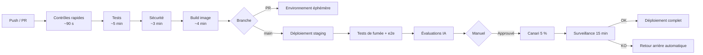

| Étape | Contenu | Bloquant |
| --- | --- | --- |
| **Contrôles rapides** | `ruff` (lint + format), `mypy --strict`, `import-linter` (architecture), vérification des migrations | Oui |
| **Tests** | Unitaires (couverture ≥ 85 % sur `domain/`), intégration sur PostgreSQL réel, contrat OpenAPI | Oui |
| **Sécurité** | `pip-audit`, `bandit`, `semgrep`, `gitleaks`, `trivy` sur l'image | Oui, selon sévérité |
| **Build** | Image multi-étages, non root, SBOM, signature `cosign` | Oui |
| **Environnement éphémère** | Namespace dédié par PR, base réduite, détruit à la fermeture | Non |
| **Staging** | Déploiement automatique sur `main`, migrations appliquées | Oui |
| **Tests de fumée et e2e** | 8 parcours critiques contre staging | Oui |
| **Évaluations IA** | Jeu d'évaluation figé, seuils de non-régression (voir `AI.md` §7) | **Oui** |
| **Canari** | 5 % du trafic, 15 min, surveillance automatique de 4 signaux | Oui |
| **Production** | Progression 5 % → 25 % → 100 % | — |

### 13.3 Pipeline mobile

| Étape | Contenu |
| --- | --- |
| Contrôles | `dart analyze`, `dart format --set-exit-if-changed` |
| Tests | Unitaires, widget, golden |
| Intégration | `integration_test` sur émulateur, incluant le mode hors ligne |
| Performance | Benchmark de latence de capture — **bloquant au-delà de 300 ms** |
| Build | iOS (Xcode Cloud ou runner macOS), Android (App Bundle) |
| Distribution | TestFlight / Play Internal Testing sur `main` ; production sur étiquette |
| Déploiement progressif | Play Store 10 % → 50 % → 100 % sur 3 jours ; App Store phased release |

### 13.4 Migrations de base de données

**Règle absolue : compatibilité ascendante.** Toute migration doit fonctionner avec la
version de code précédente, car canari signifie deux versions simultanées.

Modèle en trois temps pour tout changement destructif :

| Étape | Version | Action |
| --- | --- | --- |
| **Expand** | N | Ajouter la nouvelle colonne, nullable, avec double écriture |
| **Migrate** | N+1 | Basculer la lecture, remplir l'historique en tâche de fond |
| **Contract** | N+2 | Supprimer l'ancienne colonne, après vérification |

| Contrôle CI | Effet |
| --- | --- |
| Migration sans `downgrade` | Échec |
| `DROP COLUMN` ou `ALTER TYPE` sans étiquette `#expand-contract` | Échec |
| Index créé sans `CONCURRENTLY` sur une table > 10 000 lignes | Échec |
| Migration non testée à l'aller **et au retour** | Échec |

### 13.5 Environnements

| Environnement | Données | Déploiement | Accès | Coût |
| --- | --- | --- | --- | --- |
| Local | Générées, `docker compose` | Manuel | Développeur | — |
| Éphémère (PR) | Générées | Automatique par PR | Équipe | Faible |
| Staging | Anonymisées, volume réaliste | Automatique sur `main` | Équipe | Moyen |
| Production | Réelles | Manuel après approbation | Astreinte uniquement | — |

**Aucune donnée de production n'est copiée en staging.** Les jeux de données de
staging sont synthétiques ou anonymisés de manière irréversible.

### 13.6 Retour arrière

| Type de changement | Retour arrière | Délai cible |
| --- | --- | --- |
| Code applicatif | Redéploiement de l'image précédente | < 3 min |
| Fonctionnalité | Bascule du feature flag | < 30 s |
| Migration ascendante | Aucune action (compatible) | — |
| Migration destructive | Interdite hors fenêtre planifiée avec sauvegarde vérifiée | — |
| Version mobile | Arrêt du déploiement progressif + correctif | < 24 h |
| Prompt IA | Bascule sur la version précédente du prompt | < 30 s |

### 13.7 Qualité du code — seuils

| Contrôle | Seuil | Bloquant |
| --- | --- | --- |
| Couverture `domain/` | ≥ 85 % | Oui |
| Couverture globale | ≥ 70 % | Oui |
| Complexité cyclomatique | ≤ 12 par fonction | Oui |
| Typage | `mypy --strict` sans erreur | Oui |
| Architecture | `import-linter` sans violation | Oui |
| Durée du pipeline PR | ≤ 10 min | Non — mais surveillé |

---

## 14. Environnements et infrastructure

### 14.1 Topologie de production (cible MVP)

```
                        Internet
                           │
                    ┌──────▼──────┐
                    │  Cloudflare  │  WAF, CDN, anti-DDoS
                    └──────┬──────┘
                           │
              ┌────────────▼────────────┐
              │   Load balancer (UE)     │
              └────────────┬────────────┘
                           │
    ┌──────────────────────▼──────────────────────────┐
    │        Cluster Kubernetes managé — UE            │
    │                                                  │
    │  ┌────────────┐  ┌────────────┐  ┌────────────┐ │
    │  │ api × 3    │  │ worker × 4 │  │ scheduler  │ │
    │  │ 1 vCPU     │  │ 2 vCPU     │  │ × 1        │ │
    │  │ 2 Gio      │  │ 4 Gio      │  │            │ │
    │  └────────────┘  └────────────┘  └────────────┘ │
    │                                                  │
    │  ┌──────────────────────────────────────────┐   │
    │  │ stt × 1 (nœud GPU, autoscaling par file) │   │
    │  │ embeddings × 1 (partage le nœud GPU)     │   │
    │  └──────────────────────────────────────────┘   │
    └──────────┬──────────────────┬────────────────────┘
               │                  │
     ┌─────────▼────────┐  ┌──────▼─────────┐
     │ PostgreSQL 17    │  │ Redis 7        │
     │ managé, 4 vCPU   │  │ managé, 2 Gio  │
     │ + 1 réplique     │  │ + réplique     │
     │ PITR 7 jours     │  └────────────────┘
     └──────────────────┘
               │
     ┌─────────▼────────────────────┐
     │ Stockage objet S3 (UE)        │
     │ chiffré, versionné,           │
     │ cycle de vie configuré        │
     └───────────────────────────────┘
```

### 14.2 Mise à l'échelle

| Composant | Signal | Min | Max |
| --- | --- | --- | --- |
| `api` | CPU > 65 % ou p95 > 250 ms | 3 | 20 |
| `worker` | Profondeur de `capture.realtime` > 50 | 4 | 40 |
| `stt` | Profondeur de file STT > 20 | 1 | 8 |
| `embeddings` | Profondeur de `index` > 500 | 1 | 4 |
| PostgreSQL | Manuel, sur alerte | — | — |

### 14.3 Sauvegarde et reprise

| Élément | Fréquence | Rétention | RPO | RTO |
| --- | --- | --- | --- | --- |
| PostgreSQL | Continue (PITR) | 7 jours | 5 min | 1 h |
| PostgreSQL — instantané | Quotidien | 30 jours | 24 h | 2 h |
| Stockage objet | Versionnage + réplication inter-région | 30 jours | ~0 | 30 min |
| Configuration | Dans Git | Illimitée | 0 | 15 min |
| Secrets | Sauvegarde chiffrée hors ligne | — | — | 1 h |

**Test de restauration trimestriel obligatoire**, avec chronométrage réel. Une
sauvegarde jamais restaurée n'est pas une sauvegarde.

---

## 15. Capacité et coûts

### 15.1 Hypothèses de charge

| Hypothèse | Valeur MVP |
| --- | --- |
| Utilisateurs actifs mensuels | 5 000 |
| Utilisateurs actifs quotidiens | 1 500 |
| Captures par UAQ par jour | 4 |
| Captures totales par jour | 6 000 |
| Durée moyenne d'une capture courte | 18 s |
| Réunions par jour | 120 (moyenne 32 min) |
| Requêtes de recherche par jour | 900 |
| Pic (facteur sur la moyenne) | ×4 entre 8 h–10 h et 17 h–19 h |

### 15.2 Coût unitaire estimé

| Poste | Base de calcul | Coût par capture de 18 s |
| --- | --- | --- |
| STT auto-hébergé | Nœud GPU amorti sur le volume | ~0,0008 € |
| Classification (`claude-haiku-4-5`) | ~400 tokens entrée / 60 sortie · 1,00 $ / 5,00 $ par M | ~0,0007 € |
| Extraction (`claude-opus-5`) | ~1 200 tokens entrée / 350 sortie · 5,00 $ / 25,00 $ par M | ~0,0135 € |
| Embeddings auto-hébergés | Amorti | ~0,0001 € |
| Stockage (audio 18 s ≈ 140 Ko) | Mensualisé | ~0,00001 € |
| Base et calcul | Amorti | ~0,0004 € |
| **Total** | | **~0,0155 €** |

> **Écart avec l'objectif de 0,004 €/capture du PRD.** L'extraction par le modèle
> le plus capable représente à elle seule 87 % du coût. Trois leviers sont
> disponibles, détaillés dans `AI.md` §5 : routage par complexité (une capture
> triviale n'a pas besoin d'`opus`), mise en cache de préfixe de prompt sur la
> partie stable du contexte, et traitement par lots pour les captures non urgentes.
> L'objectif de 0,004 € est atteignable avec un routage où ~80 % des captures
> passent par un modèle de tier inférieur. **Le sprint 3 doit mesurer la
> distribution réelle de complexité avant de figer la stratégie de routage.**

### 15.3 Coût mensuel d'infrastructure estimé (MVP, 5 000 UAM)

| Poste | Estimation mensuelle |
| --- | --- |
| Kubernetes (nœuds CPU) | ~320 € |
| Nœud GPU (STT + embeddings) | ~450 € |
| PostgreSQL managé + réplique | ~180 € |
| Redis managé | ~45 € |
| Stockage objet + sortie réseau | ~60 € |
| API LLM | ~2 700 € (à optimiser, voir §15.2) |
| Repli STT (usage résiduel) | ~40 € |
| Observabilité | ~90 € |
| CDN / WAF | ~25 € |
| **Total** | **~3 900 €/mois**, soit **~0,78 €/UAM** |

Avec un tarif Pro à 9 €/mois et un taux de conversion de 4 %, le revenu par UAM est
de ~0,36 € : **le MVP n'est pas rentable à ce volume**, ce qui est attendu. Le point
mort se situe autour de 8 % de conversion *ou* d'une division par trois du coût IA.
Les deux leviers sont travaillés en parallèle (voir `Roadmap.md`).

---

## Références

- Produit et périmètre → `PRD.md`
- Arbitrages et ADR → `Decisions.md`
- Modèle de données et DDL → `Database.md`
- Contrat d'API et conventions → `API.md`
- Architecture IA et RAG → `AI.md`
- Trajectoire → `Roadmap.md`
