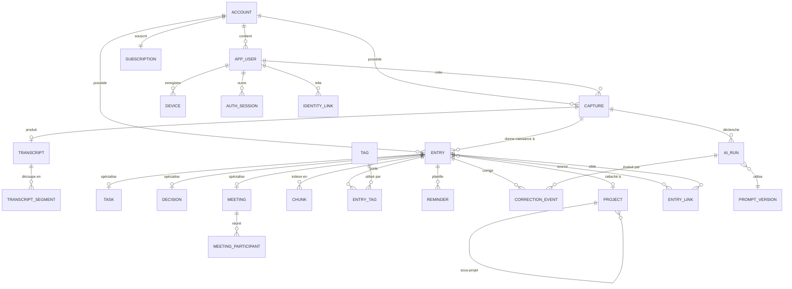
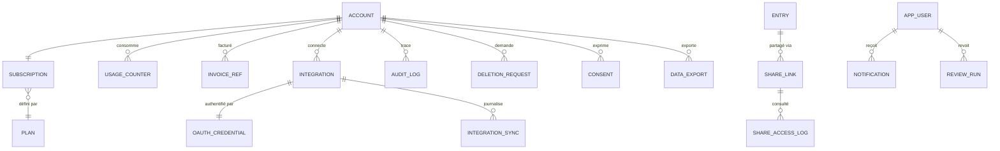
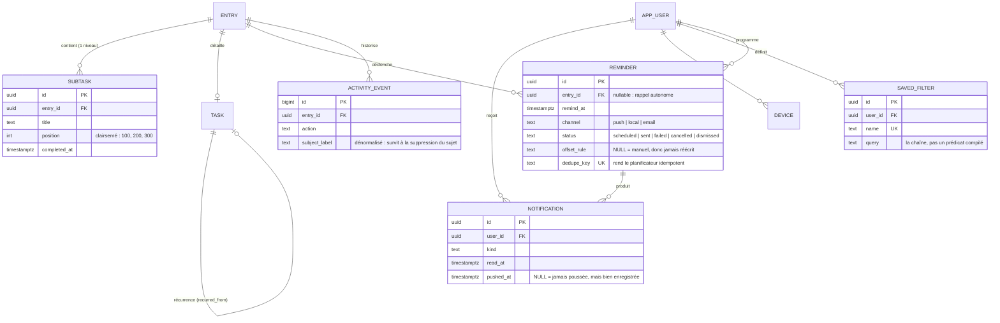

# MindFlow AI — Modèle de données et structure PostgreSQL

> **Phase 0 — Conception.** Le DDL présenté ici est une **spécification de schéma**,
> pas du code applicatif : il décrit la forme cible de la base. Aucune migration n'est
> écrite, aucun code d'accès n'est produit. Les arbitrages sont dans `Decisions.md`.

| | |
| --- | --- |
| **SGBD** | PostgreSQL 17 |
| **Extensions** | `pgvector`, `pg_trgm`, `unaccent`, `pgcrypto`, `btree_gin` |
| **Stratégie multi-locataire** | Base unique, `account_id` partout, Row Level Security |
| **Identifiants** | UUID v7 (ordonnés dans le temps, générés côté client ou serveur) |

---

## Table des matières

1. [Principes de modélisation](#1-principes-de-modélisation)
2. [Vue d'ensemble des entités](#2-vue-densemble-des-entités)
3. [Diagramme entité-relation](#3-diagramme-entité-relation)
4. [Relations entre entités](#4-relations-entre-entités)
5. [Structure PostgreSQL détaillée](#5-structure-postgresql-détaillée)
6. [Row Level Security](#6-row-level-security)
7. [Index et stratégie de performance](#7-index-et-stratégie-de-performance)
8. [Recherche : plein texte et vectorielle](#8-recherche--plein-texte-et-vectorielle)
9. [Cycle de vie, rétention et suppression](#9-cycle-de-vie-rétention-et-suppression)
10. [Volumétrie prévisionnelle](#10-volumétrie-prévisionnelle)
11. [Conventions et migrations](#11-conventions-et-migrations)

---

## 1. Principes de modélisation

| # | Principe | Conséquence |
| --- | --- | --- |
| M1 | **Le brut est immuable** | `capture` et `transcript` ne sont jamais modifiés après création. Une correction crée une nouvelle version, elle n'écrase pas. |
| M2 | **Toute donnée dérivée est traçable jusqu'à sa source** | Chaque `entry` référence sa `capture` et le `ai_run` qui l'a produite. |
| M3 | **`account_id` sur chaque table portant des données utilisateur** | Rend la RLS uniforme et les index de locataire efficaces. Redondance assumée. |
| M4 | **Héritage par tables spécialisées** | `entry` porte le tronc commun ; `task`, `decision`, `meeting` portent les attributs propres, en relation 1–1. |
| M5 | **Pas de suppression physique immédiate** | `deleted_at` puis purge différée — permet l'annulation et la synchronisation des suppressions. |
| M6 | **Les énumérations fermées sont des `VARCHAR` + `CHECK`** | Un type PostgreSQL `ENUM` ne se modifie pas sans verrou ; les listes qui grandissent deviennent des tables de référence. |
| M7 | **Les montants et durées sont des entiers** | Millisecondes et centimes ; jamais de flottant sur une grandeur métier. |
| M8 | **Tout horodatage est `TIMESTAMPTZ` en UTC** | Le fuseau de l'utilisateur est une donnée de présentation, stockée sur `user`. |
| M9 | **Le verrouillage optimiste est explicite** | Colonne `version` incrémentée à chaque écriture ; indispensable pour la synchronisation client. |
| M10 | **Chaque table écrite par un seul module** | Voir la carte des modules dans `Architecture.md` §8. |

---

## 2. Vue d'ensemble des entités

### 2.1 Par domaine

| Domaine | Tables | Rôle |
| --- | --- | --- |
| **Identité** | `account`, `app_user`, `device`, `auth_session`, `identity_link` | Qui est là, sur quel appareil |
| **Capture** | `capture`, `transcript`, `transcript_segment` | La matière première : audio et texte brut |
| **Connaissance** | `entry`, `task`, `decision`, `meeting`, `meeting_participant`, `entry_link`, `project`, `tag`, `entry_tag` | Les objets structurés |
| **Recherche** | `chunk`, `search_query_log` | Index sémantique et lexical |
| **Intelligence** | `ai_run`, `prompt_version`, `correction_event` | Traçabilité et amélioration du modèle |
| **Rappels** | `reminder`, `notification`, `review_run` | Ce qui revient vers l'utilisateur |
| **Facturation** | `plan`, `subscription`, `usage_counter`, `invoice_ref` | Quotas et abonnements |
| **Intégrations** | `integration`, `integration_sync`, `oauth_credential` | Connecteurs sortants |
| **Partage** | `share_link`, `share_access_log` | Diffusion contrôlée |
| **Conformité** | `audit_log`, `deletion_request`, `consent`, `data_export` | RGPD et traçabilité |
| **Plateforme** | `outbox`, `job_run`, `feature_flag` | Mécanique transverse |

### 2.2 Les cinq entités centrales

| Entité | Ce qu'elle représente | Cardinalité typique par utilisateur/an |
| --- | --- | --- |
| `capture` | Un enregistrement audio et son cycle de traitement | 1 200 |
| `transcript` | Le texte produit à partir d'une capture | 1 200 |
| `entry` | Un objet exploitable extrait d'une capture | 2 100 |
| `chunk` | Un fragment vectorisé, unité de recherche | 3 400 |
| `ai_run` | Un appel à un modèle, avec son coût et son résultat | 2 800 |

---

## 3. Diagramme entité-relation

### 3.1 Cœur du modèle



### 3.2 Domaines périphériques



---

## 4. Relations entre entités

### 4.1 Table des relations principales

| # | De | Vers | Cardinalité | Suppression | Justification |
| --- | --- | --- | --- | --- | --- |
| R1 | `account` | `app_user` | 1 — N | `CASCADE` | Un compte peut porter plusieurs utilisateurs (Business) |
| R2 | `app_user` | `device` | 1 — N | `CASCADE` | Multi-appareils |
| R3 | `app_user` | `capture` | 1 — N | `RESTRICT` | On ne supprime pas un utilisateur sans traiter ses captures |
| R4 | `capture` | `transcript` | 1 — 0..1 | `CASCADE` | Une capture peut échouer sans transcription |
| R5 | `transcript` | `transcript_segment` | 1 — N | `CASCADE` | Segments horodatés, utiles aux réunions |
| R6 | `capture` | `entry` | 1 — N | `SET NULL` | **Clé** : supprimer l'audio ne détruit pas les tâches créées |
| R7 | `entry` | `task` | 1 — 0..1 | `CASCADE` | Spécialisation |
| R8 | `entry` | `decision` | 1 — 0..1 | `CASCADE` | Spécialisation |
| R9 | `entry` | `meeting` | 1 — 0..1 | `CASCADE` | Spécialisation |
| R10 | `entry` | `project` | N — 0..1 | `SET NULL` | Supprimer un projet ne supprime pas les entrées |
| R11 | `project` | `project` | 1 — N | `CASCADE` | Hiérarchie, profondeur max 3 |
| R12 | `entry` ↔ `tag` | via `entry_tag` | N — N | `CASCADE` | Étiquetage libre |
| R13 | `entry` ↔ `entry` | via `entry_link` | N — N typée | `CASCADE` | Graphe de connaissance |
| R14 | `entry` | `chunk` | 1 — N | `CASCADE` | Un chunk n'existe que par son entrée |
| R15 | `entry` | `reminder` | 1 — N | `CASCADE` | Rappels attachés |
| R16 | `capture` | `ai_run` | 1 — N | `SET NULL` | La trace de coût survit à la capture (agrégats de facturation) |
| R17 | `ai_run` | `prompt_version` | N — 1 | `RESTRICT` | On ne supprime pas une version de prompt utilisée |
| R18 | `account` | `subscription` | 1 — 1 | `CASCADE` | Un compte, un abonnement actif |
| R19 | `subscription` | `plan` | N — 1 | `RESTRICT` | Les plans sont des données de référence |
| R20 | `meeting` | `meeting_participant` | 1 — N | `CASCADE` | Participants détectés ou saisis |

### 4.2 Le choix de `SET NULL` sur `entry.capture_id`

C'est la relation la plus discutée du modèle. Deux options :

| Option | Conséquence |
| --- | --- |
| `ON DELETE CASCADE` | Supprimer une capture supprime les tâches qui en sont issues |
| `ON DELETE SET NULL` | Supprimer une capture laisse les tâches, orphelines de leur source |

**Retenu : `SET NULL`.** L'utilisateur qui supprime un enregistrement audio veut se
débarrasser de l'audio (sensible, volumineux), pas des tâches qu'il en a tirées.
La suppression en cascade des dérivés est proposée explicitement dans l'interface
comme une seconde action, jamais comme un effet de bord.

Conséquence : `entry.capture_id` est nullable, et l'interface doit gérer l'affichage
d'une entrée sans source.

### 4.3 Types de liens entre entrées (`entry_link.link_type`)

| Type | Sémantique | Créé par |
| --- | --- | --- |
| `derived_from` | B est issue de A (transformation) | Système |
| `similar_to` | A et B se ressemblent sémantiquement | Système (embeddings) |
| `blocks` | A bloque B | Utilisateur |
| `follows_up` | B est le suivi de A | Système ou utilisateur |
| `contradicts` | B contredit une décision A | Système (détection) ou utilisateur |
| `mentions` | A mentionne B | Système |
| `supersedes` | B remplace A (décision révisée) | Utilisateur |

Les liens sont **dirigés**. Un lien symétrique (`similar_to`) est stocké une fois,
avec une contrainte d'ordre sur les identifiants pour éviter les doublons.

---

## 5. Structure PostgreSQL détaillée

> Spécification DDL. Les commentaires expliquent les choix non évidents.

### 5.1 Extensions et types partagés

```sql
CREATE EXTENSION IF NOT EXISTS pgcrypto;      -- gen_random_uuid, chiffrement
CREATE EXTENSION IF NOT EXISTS vector;        -- pgvector
CREATE EXTENSION IF NOT EXISTS pg_trgm;       -- recherche approximative
CREATE EXTENSION IF NOT EXISTS unaccent;      -- normalisation FR
CREATE EXTENSION IF NOT EXISTS btree_gin;     -- index composites GIN

-- Configuration de recherche plein texte française sans accents.
CREATE TEXT SEARCH CONFIGURATION fr_unaccent (COPY = french);
ALTER TEXT SEARCH CONFIGURATION fr_unaccent
    ALTER MAPPING FOR hword, hword_part, word
    WITH unaccent, french_stem;

-- Fonction de contexte locataire, lue par toutes les politiques RLS.
CREATE OR REPLACE FUNCTION current_account_id() RETURNS uuid
LANGUAGE sql STABLE AS $$
    SELECT NULLIF(current_setting('app.account_id', true), '')::uuid
$$;
```

### 5.2 Domaine Identité

```sql
CREATE TABLE account (
    id                  uuid PRIMARY KEY,
    kind                varchar(16)  NOT NULL DEFAULT 'personal'
                        CHECK (kind IN ('personal', 'team')),
    display_name        varchar(120),
    data_region         varchar(8)   NOT NULL DEFAULT 'eu'
                        CHECK (data_region IN ('eu', 'us')),
    status              varchar(24)  NOT NULL DEFAULT 'active'
                        CHECK (status IN ('active','suspended','pending_deletion','deleted')),
    created_at          timestamptz  NOT NULL DEFAULT now(),
    updated_at          timestamptz  NOT NULL DEFAULT now(),
    deleted_at          timestamptz
);

CREATE TABLE app_user (
    id                  uuid PRIMARY KEY,
    account_id          uuid NOT NULL REFERENCES account(id) ON DELETE CASCADE,
    email               citext NOT NULL,
    email_verified_at   timestamptz,
    display_name        varchar(120),
    -- Fuseau et langue : données de présentation, indispensables à la
    -- résolution temporelle ("jeudi" dépend du fuseau de l'utilisateur).
    timezone            varchar(64)  NOT NULL DEFAULT 'Europe/Paris',
    locale              varchar(8)   NOT NULL DEFAULT 'fr-FR',
    role                varchar(16)  NOT NULL DEFAULT 'member'
                        CHECK (role IN ('owner','admin','member')),
    daily_review_at     time,                      -- NULL = revue désactivée
    status              varchar(24)  NOT NULL DEFAULT 'active'
                        CHECK (status IN ('active','suspended','pending_deletion','deleted')),
    created_at          timestamptz  NOT NULL DEFAULT now(),
    updated_at          timestamptz  NOT NULL DEFAULT now(),
    deleted_at          timestamptz,
    CONSTRAINT app_user_email_unique UNIQUE (email)
);

CREATE TABLE identity_link (
    id                  uuid PRIMARY KEY,
    user_id             uuid NOT NULL REFERENCES app_user(id) ON DELETE CASCADE,
    provider            varchar(24) NOT NULL
                        CHECK (provider IN ('apple','google','saml','magic_link')),
    provider_subject    varchar(255) NOT NULL,
    created_at          timestamptz NOT NULL DEFAULT now(),
    CONSTRAINT identity_link_unique UNIQUE (provider, provider_subject)
);

CREATE TABLE device (
    id                  uuid PRIMARY KEY,
    account_id          uuid NOT NULL REFERENCES account(id) ON DELETE CASCADE,
    user_id             uuid NOT NULL REFERENCES app_user(id) ON DELETE CASCADE,
    platform            varchar(16) NOT NULL
                        CHECK (platform IN ('ios','android','web','watchos','wearos')),
    app_version         varchar(32),
    os_version          varchar(32),
    push_token          text,                       -- chiffré applicativement
    push_provider       varchar(8) CHECK (push_provider IN ('apns','fcm')),
    last_seen_at        timestamptz,
    -- Curseur de synchronisation : le client demande le delta depuis cette valeur.
    sync_cursor         timestamptz,
    created_at          timestamptz NOT NULL DEFAULT now(),
    revoked_at          timestamptz
);

CREATE TABLE auth_session (
    id                  uuid PRIMARY KEY,
    account_id          uuid NOT NULL REFERENCES account(id) ON DELETE CASCADE,
    user_id             uuid NOT NULL REFERENCES app_user(id) ON DELETE CASCADE,
    device_id           uuid REFERENCES device(id) ON DELETE SET NULL,
    -- On stocke un hash, jamais le jeton lui-même.
    refresh_token_hash  bytea NOT NULL,
    -- Chaîne de rotation : la réutilisation d'un jeton révoqué révoque la famille.
    family_id           uuid NOT NULL,
    parent_session_id   uuid REFERENCES auth_session(id) ON DELETE SET NULL,
    ip_hash             bytea,
    user_agent_hash     bytea,
    expires_at          timestamptz NOT NULL,
    revoked_at          timestamptz,
    revoked_reason      varchar(32),
    created_at          timestamptz NOT NULL DEFAULT now()
);
```

### 5.3 Domaine Capture

```sql
CREATE TABLE capture (
    id                  uuid PRIMARY KEY,
    account_id          uuid NOT NULL REFERENCES account(id) ON DELETE CASCADE,
    user_id             uuid NOT NULL REFERENCES app_user(id) ON DELETE RESTRICT,
    device_id           uuid REFERENCES device(id) ON DELETE SET NULL,

    -- Idempotence : généré côté client avant l'enregistrement.
    -- Rejouer le POST d'upload est sans effet de bord.
    client_capture_id   uuid NOT NULL,

    kind                varchar(16) NOT NULL DEFAULT 'quick'
                        CHECK (kind IN ('quick','meeting','dictation','imported')),
    status              varchar(32) NOT NULL DEFAULT 'pending_upload'
                        CHECK (status IN (
                            'pending_upload','uploaded','transcribing','transcribed',
                            'extracting','completed','partially_processed',
                            'transcription_failed','abandoned')),

    -- Emplacement de l'objet audio ; NULL si l'audio a été purgé.
    audio_object_key    text,
    audio_bytes         bigint CHECK (audio_bytes >= 0),
    audio_format        varchar(16) CHECK (audio_format IN ('m4a','opus','wav','mp3')),
    audio_sample_rate   integer,
    duration_ms         integer NOT NULL CHECK (duration_ms > 0),
    -- Clé de chiffrement enveloppée par le KMS, propre au locataire.
    encryption_key_ref  varchar(255),

    -- Contexte de capture : sert à l'interprétation ("jeudi" relatif à quand)
    -- et à d'éventuelles suggestions de projet.
    captured_at         timestamptz NOT NULL,
    capture_timezone    varchar(64) NOT NULL,
    source              varchar(24) NOT NULL DEFAULT 'app'
                        CHECK (source IN ('app','widget','watch','carplay','shortcut','web','api')),
    language_hint       varchar(8),

    -- Traitement
    processing_started_at   timestamptz,
    processing_finished_at  timestamptz,
    failure_code            varchar(48),
    retry_count             smallint NOT NULL DEFAULT 0,

    version             integer NOT NULL DEFAULT 1,
    created_at          timestamptz NOT NULL DEFAULT now(),
    updated_at          timestamptz NOT NULL DEFAULT now(),
    deleted_at          timestamptz,

    CONSTRAINT capture_client_id_unique UNIQUE (user_id, client_capture_id),
    -- Une capture achevée doit avoir été traitée.
    CONSTRAINT capture_completed_has_timing CHECK (
        status <> 'completed' OR processing_finished_at IS NOT NULL
    )
);

CREATE TABLE transcript (
    id                  uuid PRIMARY KEY,
    account_id          uuid NOT NULL REFERENCES account(id) ON DELETE CASCADE,
    capture_id          uuid NOT NULL REFERENCES capture(id) ON DELETE CASCADE,

    engine              varchar(48) NOT NULL,        -- 'faster-whisper-large-v3'
    engine_version      varchar(32) NOT NULL,
    is_fallback         boolean NOT NULL DEFAULT false,

    language            varchar(8) NOT NULL,
    -- Confiance moyenne pondérée par la durée. Sert au seuil needs_review.
    confidence          numeric(4,3) CHECK (confidence BETWEEN 0 AND 1),
    text                text NOT NULL,
    word_count          integer NOT NULL DEFAULT 0,

    -- Horodatage au mot : [{"w":"faut","s":120,"e":310,"c":0.97}, ...]
    -- JSONB plutôt qu'une table dédiée : jamais requêté, toujours lu en bloc.
    words               jsonb,

    -- Versionnage : une retranscription crée une nouvelle ligne, elle n'écrase pas.
    revision            smallint NOT NULL DEFAULT 1,
    is_current          boolean NOT NULL DEFAULT true,

    tsv                 tsvector,                    -- rempli par trigger
    created_at          timestamptz NOT NULL DEFAULT now(),

    CONSTRAINT transcript_one_current
        EXCLUDE (capture_id WITH =) WHERE (is_current)
);

CREATE TABLE transcript_segment (
    id                  uuid PRIMARY KEY,
    account_id          uuid NOT NULL REFERENCES account(id) ON DELETE CASCADE,
    transcript_id       uuid NOT NULL REFERENCES transcript(id) ON DELETE CASCADE,
    seq                 integer NOT NULL,
    start_ms            integer NOT NULL CHECK (start_ms >= 0),
    end_ms              integer NOT NULL,
    speaker_label       varchar(32),                 -- 'SPK_1', ou nom résolu
    text                text NOT NULL,
    confidence          numeric(4,3),
    CONSTRAINT transcript_segment_order CHECK (end_ms > start_ms),
    CONSTRAINT transcript_segment_seq_unique UNIQUE (transcript_id, seq)
);
```

### 5.4 Domaine Connaissance

```sql
CREATE TABLE project (
    id                  uuid PRIMARY KEY,
    account_id          uuid NOT NULL REFERENCES account(id) ON DELETE CASCADE,
    parent_id           uuid REFERENCES project(id) ON DELETE CASCADE,
    name                varchar(120) NOT NULL,
    slug                varchar(140) NOT NULL,
    color               varchar(7),
    -- Aliases reconnus à l'oral : ["Vinci", "le client Vinci", "VNC"]
    -- Alimente la détection de projet lors de l'extraction.
    aliases             text[] NOT NULL DEFAULT '{}',
    depth               smallint NOT NULL DEFAULT 0 CHECK (depth BETWEEN 0 AND 2),
    archived_at         timestamptz,
    created_at          timestamptz NOT NULL DEFAULT now(),
    updated_at          timestamptz NOT NULL DEFAULT now(),
    CONSTRAINT project_slug_unique UNIQUE (account_id, slug)
);

CREATE TABLE tag (
    id                  uuid PRIMARY KEY,
    account_id          uuid NOT NULL REFERENCES account(id) ON DELETE CASCADE,
    label               varchar(60) NOT NULL,
    normalized          varchar(60) NOT NULL,        -- minuscules, sans accent
    usage_count         integer NOT NULL DEFAULT 0,
    created_at          timestamptz NOT NULL DEFAULT now(),
    CONSTRAINT tag_unique UNIQUE (account_id, normalized)
);

CREATE TABLE entry (
    id                  uuid PRIMARY KEY,
    account_id          uuid NOT NULL REFERENCES account(id) ON DELETE CASCADE,
    user_id             uuid NOT NULL REFERENCES app_user(id) ON DELETE RESTRICT,
    -- SET NULL : supprimer l'audio ne détruit pas les objets qui en sont issus.
    capture_id          uuid REFERENCES capture(id) ON DELETE SET NULL,
    project_id          uuid REFERENCES project(id) ON DELETE SET NULL,

    entry_type          varchar(16) NOT NULL
                        CHECK (entry_type IN ('task','idea','note','decision',
                                              'question','meeting','reminder')),
    title               varchar(300) NOT NULL,
    body                text,

    status              varchar(24) NOT NULL DEFAULT 'active'
                        CHECK (status IN ('needs_review','active','done',
                                          'archived','snoozed')),

    -- Moment auquel le contenu se rapporte (≠ created_at).
    occurred_at         timestamptz NOT NULL,

    -- Provenance et confiance : rendent l'incertitude du modèle visible et
    -- exploitable (seuil de needs_review, tableau de bord qualité).
    origin              varchar(16) NOT NULL DEFAULT 'ai'
                        CHECK (origin IN ('ai','user','integration','transform')),
    ai_run_id           uuid,                        -- FK ajoutée après ai_run
    confidence          numeric(4,3) CHECK (confidence BETWEEN 0 AND 1),
    -- Position dans la transcription : permet de surligner la source exacte.
    source_span_start   integer,
    source_span_end     integer,

    -- Recherche
    tsv                 tsvector,
    -- Édition : une entrée éditée à la main n'est jamais écrasée par un
    -- retraitement automatique.
    edited_by_user_at   timestamptz,

    version             integer NOT NULL DEFAULT 1,
    created_at          timestamptz NOT NULL DEFAULT now(),
    updated_at          timestamptz NOT NULL DEFAULT now(),
    deleted_at          timestamptz,

    CONSTRAINT entry_span_valid CHECK (
        source_span_start IS NULL OR source_span_end > source_span_start
    )
);

CREATE TABLE task (
    entry_id            uuid PRIMARY KEY REFERENCES entry(id) ON DELETE CASCADE,
    account_id          uuid NOT NULL REFERENCES account(id) ON DELETE CASCADE,
    due_at              timestamptz,
    -- Une échéance "jeudi" sans heure n'est pas la même chose que "jeudi 14h".
    due_precision       varchar(8) CHECK (due_precision IN ('day','hour','minute')),
    -- Expression d'origine, conservée pour audit de la résolution temporelle.
    due_raw_expression  varchar(120),
    priority            varchar(8) NOT NULL DEFAULT 'normal'
                        CHECK (priority IN ('low','normal','high','urgent')),
    completed_at        timestamptz,
    snoozed_until       timestamptz,
    estimated_minutes   integer CHECK (estimated_minutes > 0),
    assignee_label      varchar(120),                -- texte libre au MVP
    recurrence_rule     varchar(255),                -- RRULE RFC 5545
    external_ref        jsonb                        -- {"todoist": {"id": "..."}}
);

CREATE TABLE decision (
    entry_id            uuid PRIMARY KEY REFERENCES entry(id) ON DELETE CASCADE,
    account_id          uuid NOT NULL REFERENCES account(id) ON DELETE CASCADE,
    context             text,
    -- Alternatives envisagées : [{"label":"...","pros":[...],"cons":[...]}]
    options_considered  jsonb NOT NULL DEFAULT '[]',
    chosen_option       text,
    rationale           text,
    stakeholders        text[] NOT NULL DEFAULT '{}',
    decided_at          timestamptz,
    -- Ce qui distingue MindFlow d'une note : la décision se relance d'elle-même.
    review_at           timestamptz,
    reviewed_at         timestamptz,
    outcome             varchar(16) CHECK (outcome IN ('confirmed','revised','abandoned')),
    superseded_by       uuid REFERENCES entry(id) ON DELETE SET NULL
);

CREATE TABLE meeting (
    entry_id            uuid PRIMARY KEY REFERENCES entry(id) ON DELETE CASCADE,
    account_id          uuid NOT NULL REFERENCES account(id) ON DELETE CASCADE,
    started_at          timestamptz NOT NULL,
    ended_at            timestamptz,
    duration_ms         integer,
    location            varchar(200),
    summary             text,
    -- Points saillants structurés, produits par la synthèse finale.
    key_points          jsonb NOT NULL DEFAULT '[]',
    open_questions      jsonb NOT NULL DEFAULT '[]',
    speaker_count       smallint,
    external_event_ref  jsonb                        -- lien calendrier
);

CREATE TABLE meeting_participant (
    id                  uuid PRIMARY KEY,
    account_id          uuid NOT NULL REFERENCES account(id) ON DELETE CASCADE,
    meeting_entry_id    uuid NOT NULL REFERENCES meeting(entry_id) ON DELETE CASCADE,
    speaker_label       varchar(32),                 -- 'SPK_1'
    display_name        varchar(120),
    email               citext,
    is_organizer        boolean NOT NULL DEFAULT false,
    talk_time_ms        integer,
    CONSTRAINT meeting_participant_unique UNIQUE (meeting_entry_id, speaker_label)
);

CREATE TABLE entry_tag (
    entry_id            uuid NOT NULL REFERENCES entry(id) ON DELETE CASCADE,
    tag_id              uuid NOT NULL REFERENCES tag(id) ON DELETE CASCADE,
    account_id          uuid NOT NULL REFERENCES account(id) ON DELETE CASCADE,
    origin              varchar(8) NOT NULL DEFAULT 'ai'
                        CHECK (origin IN ('ai','user')),
    created_at          timestamptz NOT NULL DEFAULT now(),
    PRIMARY KEY (entry_id, tag_id)
);

CREATE TABLE entry_link (
    id                  uuid PRIMARY KEY,
    account_id          uuid NOT NULL REFERENCES account(id) ON DELETE CASCADE,
    source_entry_id     uuid NOT NULL REFERENCES entry(id) ON DELETE CASCADE,
    target_entry_id     uuid NOT NULL REFERENCES entry(id) ON DELETE CASCADE,
    link_type           varchar(24) NOT NULL
                        CHECK (link_type IN ('derived_from','similar_to','blocks',
                                             'follows_up','contradicts','mentions',
                                             'supersedes')),
    -- Pour similar_to : la distance qui a produit le lien.
    strength            numeric(4,3),
    origin              varchar(8) NOT NULL DEFAULT 'ai'
                        CHECK (origin IN ('ai','user')),
    created_at          timestamptz NOT NULL DEFAULT now(),
    CONSTRAINT entry_link_no_self CHECK (source_entry_id <> target_entry_id),
    CONSTRAINT entry_link_unique UNIQUE (source_entry_id, target_entry_id, link_type)
);
```

### 5.5 Domaine Recherche

```sql
CREATE TABLE chunk (
    id                  uuid PRIMARY KEY,
    account_id          uuid NOT NULL REFERENCES account(id) ON DELETE CASCADE,
    entry_id            uuid REFERENCES entry(id) ON DELETE CASCADE,
    -- Un chunk peut porter sur une transcription entière (recherche dans le brut)
    -- ou sur une entrée structurée (recherche dans les objets).
    transcript_id       uuid REFERENCES transcript(id) ON DELETE CASCADE,

    seq                 integer NOT NULL,
    content             text NOT NULL,
    token_count         integer NOT NULL,

    -- Contexte dénormalisé : évite une jointure sur le chemin chaud de la
    -- recherche et permet un filtrage par date sans toucher à `entry`.
    occurred_at         timestamptz NOT NULL,
    entry_type          varchar(16),
    project_id          uuid,

    embedding           vector(1024),
    embedding_model     varchar(64) NOT NULL,
    embedding_version   smallint NOT NULL DEFAULT 1,

    tsv                 tsvector,
    created_at          timestamptz NOT NULL DEFAULT now(),

    CONSTRAINT chunk_has_parent CHECK (
        entry_id IS NOT NULL OR transcript_id IS NOT NULL
    )
);

CREATE TABLE search_query_log (
    id                  uuid PRIMARY KEY,
    account_id          uuid NOT NULL REFERENCES account(id) ON DELETE CASCADE,
    user_id             uuid NOT NULL REFERENCES app_user(id) ON DELETE CASCADE,
    -- Le texte de la requête n'est PAS stocké : seulement sa forme.
    query_hash          bytea NOT NULL,
    query_length        smallint,
    mode                varchar(16) NOT NULL CHECK (mode IN ('lexical','semantic','answer')),
    result_count        smallint NOT NULL,
    clicked_rank        smallint,
    latency_ms          integer,
    had_answer          boolean,
    created_at          timestamptz NOT NULL DEFAULT now()
);
```

### 5.6 Domaine Intelligence

```sql
CREATE TABLE prompt_version (
    id                  uuid PRIMARY KEY,
    name                varchar(64) NOT NULL,        -- 'extract_quick_capture'
    version             integer NOT NULL,
    model_id            varchar(64) NOT NULL,        -- 'claude-opus-5'
    -- Le corps du prompt vit dans le dépôt ; on stocke son empreinte pour
    -- garantir que la trace correspond bien au prompt réellement exécuté.
    template_sha256     bytea NOT NULL,
    json_schema         jsonb,
    is_active           boolean NOT NULL DEFAULT false,
    -- Résultats de la dernière évaluation hors ligne (voir AI.md §7).
    eval_scores         jsonb,
    created_at          timestamptz NOT NULL DEFAULT now(),
    activated_at        timestamptz,
    CONSTRAINT prompt_version_unique UNIQUE (name, version)
);

CREATE TABLE ai_run (
    id                  uuid PRIMARY KEY,
    account_id          uuid REFERENCES account(id) ON DELETE SET NULL,
    capture_id          uuid REFERENCES capture(id) ON DELETE SET NULL,
    prompt_version_id   uuid REFERENCES prompt_version(id) ON DELETE RESTRICT,

    operation           varchar(32) NOT NULL
                        CHECK (operation IN ('classify','extract','summarize',
                                             'answer','embed','transcribe','link')),
    model_id            varchar(64) NOT NULL,
    provider            varchar(24) NOT NULL,

    status              varchar(16) NOT NULL
                        CHECK (status IN ('succeeded','failed','refused',
                                          'schema_violation','timeout')),

    input_tokens        integer,
    output_tokens       integer,
    cache_read_tokens   integer,
    cache_write_tokens  integer,
    cost_micro_eur      bigint,                      -- micro-euros, entier
    latency_ms          integer,

    -- Pas de contenu : ni prompt rendu, ni réponse. Seulement des métadonnées.
    error_code          varchar(48),
    retry_count         smallint NOT NULL DEFAULT 0,
    created_at          timestamptz NOT NULL DEFAULT now()
);

ALTER TABLE entry
    ADD CONSTRAINT entry_ai_run_fk
    FOREIGN KEY (ai_run_id) REFERENCES ai_run(id) ON DELETE SET NULL;

CREATE TABLE correction_event (
    id                  uuid PRIMARY KEY,
    account_id          uuid NOT NULL REFERENCES account(id) ON DELETE CASCADE,
    entry_id            uuid NOT NULL REFERENCES entry(id) ON DELETE CASCADE,
    ai_run_id           uuid REFERENCES ai_run(id) ON DELETE SET NULL,
    field               varchar(48) NOT NULL,        -- 'entry_type', 'due_at'…
    -- Valeurs sérialisées en texte, tronquées. Alimentent l'évaluation
    -- hors ligne du modèle, jamais un apprentissage en ligne.
    old_value           text,
    new_value           text,
    corrected_at        timestamptz NOT NULL DEFAULT now()
);
```

### 5.7 Domaine Rappels

```sql
CREATE TABLE reminder (
    id                  uuid PRIMARY KEY,
    account_id          uuid NOT NULL REFERENCES account(id) ON DELETE CASCADE,
    entry_id            uuid NOT NULL REFERENCES entry(id) ON DELETE CASCADE,
    remind_at           timestamptz NOT NULL,
    channel             varchar(16) NOT NULL DEFAULT 'push'
                        CHECK (channel IN ('push','email','none')),
    status              varchar(16) NOT NULL DEFAULT 'scheduled'
                        CHECK (status IN ('scheduled','sent','dismissed','cancelled')),
    sent_at             timestamptz,
    created_at          timestamptz NOT NULL DEFAULT now()
);

CREATE TABLE notification (
    id                  uuid PRIMARY KEY,
    account_id          uuid NOT NULL REFERENCES account(id) ON DELETE CASCADE,
    user_id             uuid NOT NULL REFERENCES app_user(id) ON DELETE CASCADE,
    device_id           uuid REFERENCES device(id) ON DELETE SET NULL,
    kind                varchar(32) NOT NULL,        -- 'capture_ready', 'reminder'…
    payload             jsonb NOT NULL DEFAULT '{}', -- identifiants seulement
    status              varchar(16) NOT NULL DEFAULT 'pending'
                        CHECK (status IN ('pending','sent','failed','opened')),
    provider_message_id varchar(128),
    error_code          varchar(48),
    created_at          timestamptz NOT NULL DEFAULT now(),
    sent_at             timestamptz
);

CREATE TABLE review_run (
    id                  uuid PRIMARY KEY,
    account_id          uuid NOT NULL REFERENCES account(id) ON DELETE CASCADE,
    user_id             uuid NOT NULL REFERENCES app_user(id) ON DELETE CASCADE,
    period              varchar(16) NOT NULL CHECK (period IN ('daily','weekly','monthly')),
    period_start        date NOT NULL,
    period_end          date NOT NULL,
    stats               jsonb NOT NULL DEFAULT '{}',
    summary             text,
    ai_run_id           uuid REFERENCES ai_run(id) ON DELETE SET NULL,
    opened_at           timestamptz,
    created_at          timestamptz NOT NULL DEFAULT now(),
    CONSTRAINT review_run_unique UNIQUE (user_id, period, period_start)
);
```

### 5.8 Domaine Facturation

```sql
CREATE TABLE plan (
    code                    varchar(24) PRIMARY KEY,   -- 'free','pro','business'
    display_name            varchar(60) NOT NULL,
    price_cents_month       integer NOT NULL,
    currency                varchar(3) NOT NULL DEFAULT 'EUR',
    max_quick_captures_month    integer,               -- NULL = illimité
    max_meeting_minutes_month   integer,
    max_capture_duration_ms     integer NOT NULL,
    max_semantic_queries_month  integer,
    history_retention_days      integer,               -- NULL = illimité
    max_integrations            smallint,
    features                jsonb NOT NULL DEFAULT '{}',
    is_public               boolean NOT NULL DEFAULT true
);

CREATE TABLE subscription (
    id                  uuid PRIMARY KEY,
    account_id          uuid NOT NULL UNIQUE REFERENCES account(id) ON DELETE CASCADE,
    plan_code           varchar(24) NOT NULL REFERENCES plan(code) ON DELETE RESTRICT,
    status              varchar(24) NOT NULL
                        CHECK (status IN ('trialing','active','past_due',
                                          'canceled','incomplete')),
    seats               smallint NOT NULL DEFAULT 1 CHECK (seats > 0),
    current_period_start timestamptz NOT NULL,
    current_period_end   timestamptz NOT NULL,
    cancel_at_period_end boolean NOT NULL DEFAULT false,
    provider            varchar(16) NOT NULL DEFAULT 'stripe',
    provider_ref        varchar(128),
    created_at          timestamptz NOT NULL DEFAULT now(),
    updated_at          timestamptz NOT NULL DEFAULT now()
);

CREATE TABLE usage_counter (
    account_id          uuid NOT NULL REFERENCES account(id) ON DELETE CASCADE,
    metric              varchar(32) NOT NULL
                        CHECK (metric IN ('quick_captures','meeting_minutes',
                                          'semantic_queries','ai_cost_micro_eur')),
    period_start        date NOT NULL,
    value               bigint NOT NULL DEFAULT 0,
    updated_at          timestamptz NOT NULL DEFAULT now(),
    PRIMARY KEY (account_id, metric, period_start)
);

CREATE TABLE invoice_ref (
    id                  uuid PRIMARY KEY,
    account_id          uuid NOT NULL REFERENCES account(id) ON DELETE RESTRICT,
    provider_invoice_id varchar(128) NOT NULL,
    amount_cents        integer NOT NULL,
    currency            varchar(3) NOT NULL,
    status              varchar(16) NOT NULL,
    issued_at           timestamptz NOT NULL,
    -- Conservation légale : ne suit pas la suppression du compte.
    CONSTRAINT invoice_ref_unique UNIQUE (provider_invoice_id)
);
```

### 5.9 Domaines Intégrations, Partage, Conformité, Plateforme

```sql
CREATE TABLE integration (
    id                  uuid PRIMARY KEY,
    account_id          uuid NOT NULL REFERENCES account(id) ON DELETE CASCADE,
    user_id             uuid NOT NULL REFERENCES app_user(id) ON DELETE CASCADE,
    provider            varchar(24) NOT NULL
                        CHECK (provider IN ('todoist','notion','google_calendar',
                                            'google_tasks','slack','webhook')),
    status              varchar(16) NOT NULL DEFAULT 'active'
                        CHECK (status IN ('active','paused','error','revoked')),
    config              jsonb NOT NULL DEFAULT '{}',
    last_sync_at        timestamptz,
    consecutive_errors  smallint NOT NULL DEFAULT 0,
    created_at          timestamptz NOT NULL DEFAULT now(),
    CONSTRAINT integration_unique UNIQUE (account_id, provider)
);

CREATE TABLE oauth_credential (
    integration_id      uuid PRIMARY KEY REFERENCES integration(id) ON DELETE CASCADE,
    account_id          uuid NOT NULL REFERENCES account(id) ON DELETE CASCADE,
    -- Chiffrement applicatif, clé distincte de celle de la base.
    access_token_enc    bytea NOT NULL,
    refresh_token_enc   bytea,
    scopes              text[] NOT NULL DEFAULT '{}',
    expires_at          timestamptz,
    updated_at          timestamptz NOT NULL DEFAULT now()
);

CREATE TABLE integration_sync (
    id                  uuid PRIMARY KEY,
    account_id          uuid NOT NULL REFERENCES account(id) ON DELETE CASCADE,
    integration_id      uuid NOT NULL REFERENCES integration(id) ON DELETE CASCADE,
    entry_id            uuid REFERENCES entry(id) ON DELETE SET NULL,
    direction           varchar(8) NOT NULL CHECK (direction IN ('out','in')),
    status              varchar(16) NOT NULL CHECK (status IN ('ok','failed','skipped')),
    external_id         varchar(128),
    error_code          varchar(48),
    created_at          timestamptz NOT NULL DEFAULT now()
);

CREATE TABLE share_link (
    id                  uuid PRIMARY KEY,
    account_id          uuid NOT NULL REFERENCES account(id) ON DELETE CASCADE,
    entry_id            uuid NOT NULL REFERENCES entry(id) ON DELETE CASCADE,
    created_by          uuid NOT NULL REFERENCES app_user(id) ON DELETE CASCADE,
    token_hash          bytea NOT NULL UNIQUE,
    -- L'audio n'est jamais partagé par défaut.
    include_audio       boolean NOT NULL DEFAULT false,
    include_transcript  boolean NOT NULL DEFAULT false,
    password_hash       bytea,
    expires_at          timestamptz NOT NULL,
    max_views           integer,
    view_count          integer NOT NULL DEFAULT 0,
    revoked_at          timestamptz,
    created_at          timestamptz NOT NULL DEFAULT now()
);

CREATE TABLE share_access_log (
    id                  uuid PRIMARY KEY,
    share_link_id       uuid NOT NULL REFERENCES share_link(id) ON DELETE CASCADE,
    ip_hash             bytea,
    user_agent_hash     bytea,
    accessed_at         timestamptz NOT NULL DEFAULT now()
);

CREATE TABLE audit_log (
    id                  bigserial PRIMARY KEY,
    account_id          uuid REFERENCES account(id) ON DELETE SET NULL,
    actor_user_id       uuid,
    actor_type          varchar(16) NOT NULL
                        CHECK (actor_type IN ('user','system','admin','integration')),
    action              varchar(64) NOT NULL,
    resource_type       varchar(48),
    resource_id         uuid,
    -- Métadonnées non personnelles uniquement.
    metadata            jsonb NOT NULL DEFAULT '{}',
    ip_hash             bytea,
    occurred_at         timestamptz NOT NULL DEFAULT now()
);

CREATE TABLE deletion_request (
    id                  uuid PRIMARY KEY,
    account_id          uuid NOT NULL REFERENCES account(id) ON DELETE CASCADE,
    requested_by        uuid REFERENCES app_user(id) ON DELETE SET NULL,
    scope               varchar(16) NOT NULL
                        CHECK (scope IN ('account','captures','entry','audio_only')),
    target_id           uuid,
    -- Fenêtre de rétractation.
    execute_after       timestamptz NOT NULL,
    status              varchar(16) NOT NULL DEFAULT 'pending'
                        CHECK (status IN ('pending','cancelled','executing','completed','failed')),
    executed_at         timestamptz,
    -- Preuve d'exécution, sans donnée personnelle.
    certificate         jsonb,
    created_at          timestamptz NOT NULL DEFAULT now()
);

CREATE TABLE consent (
    id                  uuid PRIMARY KEY,
    account_id          uuid NOT NULL REFERENCES account(id) ON DELETE CASCADE,
    user_id             uuid NOT NULL REFERENCES app_user(id) ON DELETE CASCADE,
    purpose             varchar(48) NOT NULL
                        CHECK (purpose IN ('product_improvement','analytics',
                                           'marketing','model_evaluation')),
    granted             boolean NOT NULL,
    policy_version      varchar(16) NOT NULL,
    granted_at          timestamptz NOT NULL DEFAULT now(),
    CONSTRAINT consent_unique UNIQUE (user_id, purpose, policy_version)
);

CREATE TABLE data_export (
    id                  uuid PRIMARY KEY,
    account_id          uuid NOT NULL REFERENCES account(id) ON DELETE CASCADE,
    user_id             uuid NOT NULL REFERENCES app_user(id) ON DELETE CASCADE,
    format              varchar(16) NOT NULL CHECK (format IN ('json','markdown','both')),
    include_audio       boolean NOT NULL DEFAULT false,
    status              varchar(16) NOT NULL DEFAULT 'pending'
                        CHECK (status IN ('pending','building','ready','expired','failed')),
    object_key          text,
    size_bytes          bigint,
    expires_at          timestamptz,
    created_at          timestamptz NOT NULL DEFAULT now()
);

-- Publication d'événements transactionnellement cohérente avec l'écriture métier.
CREATE TABLE outbox (
    id                  bigserial PRIMARY KEY,
    account_id          uuid,
    event_type          varchar(64) NOT NULL,
    aggregate_type      varchar(48) NOT NULL,
    aggregate_id        uuid NOT NULL,
    payload             jsonb NOT NULL,
    trace_id            varchar(64),
    status              varchar(16) NOT NULL DEFAULT 'pending'
                        CHECK (status IN ('pending','dispatched','failed')),
    attempts            smallint NOT NULL DEFAULT 0,
    available_at        timestamptz NOT NULL DEFAULT now(),
    dispatched_at       timestamptz,
    created_at          timestamptz NOT NULL DEFAULT now()
);

CREATE TABLE job_run (
    id                  uuid PRIMARY KEY,
    job_name            varchar(64) NOT NULL,
    account_id          uuid,
    aggregate_id        uuid,
    queue               varchar(32) NOT NULL,
    status              varchar(16) NOT NULL
                        CHECK (status IN ('queued','running','succeeded','failed','dead')),
    attempt             smallint NOT NULL DEFAULT 1,
    error_code          varchar(48),
    trace_id            varchar(64),
    started_at          timestamptz,
    finished_at         timestamptz,
    created_at          timestamptz NOT NULL DEFAULT now()
);

CREATE TABLE feature_flag (
    key                 varchar(64) PRIMARY KEY,
    enabled             boolean NOT NULL DEFAULT false,
    rollout_percent     smallint NOT NULL DEFAULT 0
                        CHECK (rollout_percent BETWEEN 0 AND 100),
    allowed_accounts    uuid[] NOT NULL DEFAULT '{}',
    updated_at          timestamptz NOT NULL DEFAULT now()
);
```

---

## 6. Row Level Security

### 6.1 Principe

Chaque requête applicative pose son contexte de locataire en début de transaction :

```sql
SET LOCAL app.account_id = '018f2c...';
```

Les politiques RLS filtrent alors automatiquement. Une clause `WHERE account_id = …`
oubliée dans le code applicatif ne provoque **aucune fuite** — c'est tout l'intérêt.

### 6.2 Politiques

```sql
-- Modèle appliqué à toutes les tables portant account_id.
ALTER TABLE entry ENABLE ROW LEVEL SECURITY;
ALTER TABLE entry FORCE ROW LEVEL SECURITY;   -- s'applique même au propriétaire

CREATE POLICY entry_tenant_isolation ON entry
    USING (account_id = current_account_id())
    WITH CHECK (account_id = current_account_id());

-- Les entrées supprimées ne sont visibles que par les traitements de purge,
-- qui utilisent un rôle distinct.
CREATE POLICY entry_hide_deleted ON entry
    FOR SELECT
    USING (deleted_at IS NULL);
```

### 6.3 Rôles de base de données

| Rôle | Usage | RLS | Droits |
| --- | --- | --- | --- |
| `mindflow_app` | API et workers | **Active** | `SELECT/INSERT/UPDATE` sur les tables métier |
| `mindflow_readonly` | Réplique de lecture, tableaux de bord | **Active** | `SELECT` |
| `mindflow_maintenance` | Purges RGPD, rétention | Contournement explicite | `DELETE` sur les tables concernées |
| `mindflow_migrate` | Alembic | Sans objet | DDL |
| `mindflow_analytics` | Agrégats produit | **Active** | `SELECT` sur des vues agrégées uniquement |

### 6.4 Tables sans RLS

| Table | Raison |
| --- | --- |
| `plan` | Données de référence publiques |
| `prompt_version` | Configuration système, sans donnée utilisateur |
| `feature_flag` | Configuration système |
| `outbox`, `job_run` | Mécanique interne, accès par rôle dédié |
| `invoice_ref` | Conservation légale, périmètre facturation |

### 6.5 Test d'isolation obligatoire

Un test d'intégration parcourt **chaque table portant `account_id`**, crée deux
locataires, et tente depuis le contexte du locataire A de lire, modifier et supprimer
les lignes du locataire B. Toute ligne retournée fait échouer la CI. Ce test est le
garant vérifiable de la promesse d'isolation.

---

## 7. Index et stratégie de performance

### 7.1 Index de locataire et de parcours

```sql
-- Le motif dominant : "les entrées de ce compte, du plus récent au plus ancien".
CREATE INDEX entry_account_occurred_idx
    ON entry (account_id, occurred_at DESC)
    WHERE deleted_at IS NULL;

-- Inbox : ce qui reste à traiter.
CREATE INDEX entry_needs_review_idx
    ON entry (account_id, created_at DESC)
    WHERE status = 'needs_review' AND deleted_at IS NULL;

-- Filtrage par type, très fréquent dans l'interface.
CREATE INDEX entry_account_type_idx
    ON entry (account_id, entry_type, occurred_at DESC)
    WHERE deleted_at IS NULL;

CREATE INDEX entry_project_idx
    ON entry (project_id, occurred_at DESC)
    WHERE project_id IS NOT NULL AND deleted_at IS NULL;

-- Synchronisation delta : le client demande tout ce qui a changé depuis un curseur.
CREATE INDEX entry_sync_idx ON entry (account_id, updated_at, id);

-- Tâches dues : requête du planificateur de rappels, sur toute la base.
CREATE INDEX task_due_idx
    ON task (due_at)
    WHERE completed_at IS NULL AND due_at IS NOT NULL;

-- Décisions à relancer.
CREATE INDEX decision_review_idx
    ON decision (review_at)
    WHERE reviewed_at IS NULL AND review_at IS NOT NULL;

-- Captures en cours de traitement : détection des blocages.
CREATE INDEX capture_processing_idx
    ON capture (status, created_at)
    WHERE status NOT IN ('completed','abandoned');

CREATE INDEX capture_account_time_idx
    ON capture (account_id, captured_at DESC)
    WHERE deleted_at IS NULL;

-- Outbox : le dispatcher ne lit que ce qui est prêt.
CREATE INDEX outbox_pending_idx
    ON outbox (available_at)
    WHERE status = 'pending';

-- Rappels à envoyer.
CREATE INDEX reminder_due_idx
    ON reminder (remind_at)
    WHERE status = 'scheduled';
```

### 7.2 Index de recherche plein texte

```sql
CREATE INDEX entry_tsv_idx ON entry USING GIN (tsv);
CREATE INDEX transcript_tsv_idx ON transcript USING GIN (tsv);
CREATE INDEX chunk_tsv_idx ON chunk USING GIN (tsv);

-- Recherche approximative sur les titres (fautes de frappe, noms propres).
CREATE INDEX entry_title_trgm_idx ON entry USING GIN (title gin_trgm_ops);
CREATE INDEX project_name_trgm_idx ON project USING GIN (name gin_trgm_ops);
```

### 7.3 Index vectoriel

```sql
-- HNSW : meilleur compromis rappel/latence pour ce volume, et supporte
-- l'insertion incrémentale (contrairement à IVFFlat qui exige un ré-entraînement).
CREATE INDEX chunk_embedding_hnsw_idx
    ON chunk USING hnsw (embedding vector_cosine_ops)
    WITH (m = 16, ef_construction = 64);

-- Index composite pour le pré-filtrage : la recherche est TOUJOURS scopée
-- à un compte, souvent à une plage de dates.
CREATE INDEX chunk_account_time_idx
    ON chunk (account_id, occurred_at DESC);
```

**Point d'attention connu** : sous `pgvector`, un filtre très sélectif combiné à une
recherche HNSW peut dégrader le rappel (le parcours de l'index rencontre trop peu de
candidats valides). Deux stratégies selon la sélectivité :

| Sélectivité du filtre | Stratégie |
| --- | --- |
| Large (compte entier, > 5 000 chunks) | HNSW avec `ef_search` élevé, filtre appliqué après |
| Étroit (un projet, une semaine) | Parcours exact sur le sous-ensemble pré-filtré — souvent plus rapide |

Le choix est fait dynamiquement par le service de recherche à partir d'une
estimation de cardinalité. Voir `AI.md` §4.

### 7.4 Partitionnement

Non nécessaire au MVP. À prévoir quand :

| Table | Seuil | Clé de partition |
| --- | --- | --- |
| `chunk` | > 20 M lignes | `RANGE (occurred_at)` — mensuel |
| `audit_log` | > 50 M lignes | `RANGE (occurred_at)` — mensuel, purge par `DROP PARTITION` |
| `ai_run` | > 50 M lignes | `RANGE (created_at)` — mensuel |
| `capture` | > 50 M lignes | `HASH (account_id)` |

Les colonnes de partitionnement sont déjà présentes dans le schéma : la migration
future ne changera pas le modèle.

### 7.5 Triggers de maintenance

```sql
-- Mise à jour automatique de updated_at et de version.
CREATE OR REPLACE FUNCTION touch_row() RETURNS trigger
LANGUAGE plpgsql AS $$
BEGIN
    NEW.updated_at := now();
    IF TG_TABLE_NAME IN ('entry','capture') THEN
        NEW.version := OLD.version + 1;
    END IF;
    RETURN NEW;
END $$;

-- Génération du vecteur de recherche plein texte, pondérée :
-- le titre pèse plus que le corps.
CREATE OR REPLACE FUNCTION entry_tsv_update() RETURNS trigger
LANGUAGE plpgsql AS $$
BEGIN
    NEW.tsv :=
        setweight(to_tsvector('fr_unaccent', coalesce(NEW.title, '')), 'A') ||
        setweight(to_tsvector('fr_unaccent', coalesce(NEW.body,  '')), 'B');
    RETURN NEW;
END $$;
```

---

## 8. Recherche : plein texte et vectorielle

### 8.1 Deux index, une seule requête

| Voie | Force | Faiblesse |
| --- | --- | --- |
| Lexicale (`tsvector` + BM25) | Termes exacts, noms propres, acronymes, chiffres | Aveugle aux synonymes et paraphrases |
| Vectorielle (`pgvector`) | Sens, paraphrase, requête approximative | Rate parfois un terme rare et précis |

Les deux sont exécutées en parallèle et fusionnées par **Reciprocal Rank Fusion**,
qui ne demande pas de calibrer des scores hétérogènes.

### 8.2 Forme de la requête hybride

```sql
-- Illustratif : forme de la requête, pas son implémentation.
WITH lexical AS (
    SELECT id,
           ROW_NUMBER() OVER (ORDER BY ts_rank_cd(tsv, q) DESC) AS rank
    FROM chunk, websearch_to_tsquery('fr_unaccent', :query) q
    WHERE tsv @@ q
      AND occurred_at BETWEEN :from AND :to
    LIMIT 40
),
semantic AS (
    SELECT id,
           ROW_NUMBER() OVER (ORDER BY embedding <=> :query_vector) AS rank
    FROM chunk
    WHERE occurred_at BETWEEN :from AND :to
    ORDER BY embedding <=> :query_vector
    LIMIT 40
)
SELECT COALESCE(l.id, s.id) AS chunk_id,
       COALESCE(1.0 / (60 + l.rank), 0) +
       COALESCE(1.0 / (60 + s.rank), 0) AS rrf_score
FROM lexical l
FULL OUTER JOIN semantic s USING (id)
ORDER BY rrf_score DESC
LIMIT 20;
```

Le filtrage par `account_id` n'apparaît pas : il est assuré par la RLS. C'est
précisément ce qui rend ce modèle sûr — l'oubli n'est pas possible.

### 8.3 Stratégie de découpage (chunking)

| Source | Granularité | Chevauchement | Justification |
| --- | --- | --- | --- |
| Capture courte (< 60 s) | Un seul chunk | — | Le contenu est déjà atomique |
| Capture moyenne | ~400 tokens | 15 % | Préserve le contexte aux frontières |
| Réunion | Par bloc sémantique, ~500 tokens | 10 % | S'aligne sur les changements de sujet |
| Entrée structurée | Titre + corps en un chunk | — | L'unité de sens est l'entrée |

Chaque chunk porte en dénormalisé `occurred_at`, `entry_type` et `project_id` :
le filtre s'applique sans jointure sur le chemin chaud.

### 8.4 Réindexation

Un changement de modèle d'embedding impose une réindexation complète. Le schéma le
prévoit :

1. `embedding_version` est incrémenté sur les nouveaux chunks.
2. Les deux versions coexistent le temps de la migration.
3. La recherche interroge la version active (indiquée par un feature flag).
4. Les anciens chunks sont purgés une fois la nouvelle version validée.

---

## 9. Cycle de vie, rétention et suppression

### 9.1 Rétention par type de donnée

| Donnée | Free | Pro | Business | Purge |
| --- | --- | --- | --- | --- |
| Audio | 30 jours | Configurable (90 j / 1 an / illimité) | Configurable | Tâche quotidienne |
| Transcription | 30 jours | Illimité | Configurable | Suit l'audio |
| Entrées | 30 jours visibles, conservées | Illimité | Illimité | Jamais purgées automatiquement |
| Chunks | Suit l'entrée | Suit l'entrée | Suit l'entrée | Cascade |
| `ai_run` | 13 mois | 13 mois | 13 mois | Mensuelle |
| `audit_log` | 90 jours | 90 jours | Configurable jusqu'à 7 ans | Mensuelle |
| `search_query_log` | 90 jours | 90 jours | 90 jours | Mensuelle |
| Notifications | 30 jours | 30 jours | 30 jours | Hebdomadaire |
| Exports | 7 jours | 7 jours | 7 jours | Quotidienne |

**Note sur le plan Free** : les données au-delà de 30 jours ne sont pas supprimées,
elles sont **masquées**. Un passage à Pro les restaure. Une suppression réelle serait
hostile et rendrait l'upgrade sans intérêt.

### 9.2 Ordre de suppression d'un compte

```
1.  data_export                  (fichiers puis lignes)
2.  share_access_log → share_link
3.  integration_sync → oauth_credential → integration
4.  notification, reminder, review_run
5.  chunk                        (volumineux : par lots de 10 000)
6.  correction_event
7.  entry_tag, entry_link
8.  task, decision, meeting_participant, meeting
9.  entry
10. transcript_segment → transcript
11. objets audio dans le stockage objet      ← vérification explicite
12. capture
13. auth_session, device, identity_link
14. app_user
15. consent, deletion_request (conservés : preuve d'exécution)
16. subscription                (invoice_ref conservé — obligation légale)
17. account
18. audit_log anonymisé         (account_id → NULL)
19. Émission du certificat de suppression
```

Les étapes 5 et 11 sont les plus longues et sont exécutées par lots avec reprise sur
incident. Le certificat n'est émis qu'après vérification que le préfixe de stockage
objet est vide.

### 9.3 Ce qui survit à une suppression de compte, et pourquoi

| Donnée conservée | Justification |
| --- | --- |
| `invoice_ref` | Obligation comptable (10 ans en France) |
| `deletion_request` + certificat | Preuve de conformité, sans donnée personnelle |
| `audit_log` anonymisé | Sécurité ; `account_id` mis à `NULL`, aucun identifiant direct |
| Agrégats statistiques | Non nominatifs, non réidentifiables |

---

## 10. Volumétrie prévisionnelle

### 10.1 Par utilisateur actif, par an

| Table | Lignes | Taille moyenne | Total |
| --- | --- | --- | --- |
| `capture` | 1 200 | 0,4 Ko | 0,5 Mo |
| `transcript` | 1 200 | 2,8 Ko | 3,4 Mo |
| `transcript_segment` | 3 000 | 0,3 Ko | 0,9 Mo |
| `entry` | 2 100 | 0,6 Ko | 1,3 Mo |
| `task` / `decision` / `meeting` | 1 400 | 0,3 Ko | 0,4 Mo |
| `chunk` (sans vecteur) | 3 400 | 0,7 Ko | 2,4 Mo |
| `chunk.embedding` (1024 × float32) | 3 400 | 4,1 Ko | **14,0 Mo** |
| `ai_run` | 2 800 | 0,3 Ko | 0,8 Mo |
| Index (≈ 45 %) | — | — | 10,7 Mo |
| **Base — total** | | | **≈ 34 Mo/an** |
| **Stockage objet (audio)** | 1 200 | 180 Ko | **≈ 216 Mo/an** |

### 10.2 Projection

| Utilisateurs actifs | Base | Stockage objet | Vecteurs |
| --- | --- | --- | --- |
| 1 000 | 34 Go | 216 Go | 3,4 M |
| 5 000 (MVP) | 170 Go | 1,1 To | 17 M |
| 50 000 | 1,7 To | 10,8 To | 170 M |

**Seuils de décision**

| Seuil | Déclencheur | Action |
| --- | --- | --- |
| 20 M chunks | HNSW dépasse la mémoire disponible | Partitionner `chunk`, ou passer à une quantification (`halfvec`) |
| 50 M chunks | Latence de recherche > 300 ms p95 | Évaluer l'extraction d'un moteur vectoriel dédié (voir `Architecture.md` §9) |
| 500 Go de base | Sauvegarde/restauration > 2 h | Partitionner et archiver le froid |
| 5 To de stockage objet | Coût significatif | Cycle de vie vers un stockage à froid au-delà de 90 jours |

### 10.3 Réduction de l'empreinte vectorielle

Les vecteurs représentent **41 %** de la base. Options par ordre de préférence :

| Option | Gain | Coût |
| --- | --- | --- |
| `halfvec(1024)` (float16) | −50 % | Perte de rappel négligeable (< 1 %) |
| Réduction dimensionnelle à 768 | −25 % | Perte de rappel mesurable, à évaluer |
| Ne pas indexer les captures triviales | −15 % | Certaines choses deviennent introuvables |
| Quantification binaire + reclassement | −96 % | Complexité importante, pertinent au-delà de 100 M |

**Décision** : commencer en `vector(1024)`, mesurer, basculer en `halfvec` dès que la
mémoire devient contrainte. Le schéma le permet sans migration de modèle.

---

## 11. Conventions et migrations

### 11.1 Conventions de nommage SQL

| Élément | Convention | Exemple |
| --- | --- | --- |
| Table | Singulier, `snake_case` | `entry`, `capture`, `share_link` |
| Colonne | `snake_case` | `occurred_at`, `entry_type` |
| Clé primaire | `id` | — |
| Clé étrangère | `<table>_id` | `capture_id`, `account_id` |
| Booléen | `is_` / `has_` / participe passé | `is_current`, `include_audio`, `granted` |
| Horodatage | Verbe au participe passé + `_at` | `created_at`, `deleted_at`, `decided_at` |
| Durée | `_ms`, `_minutes`, `_days` | `duration_ms`, `estimated_minutes` |
| Montant | `_cents`, `_micro_eur` | `price_cents_month`, `cost_micro_eur` |
| Index | `<table>_<colonnes>_idx` | `entry_account_occurred_idx` |
| Contrainte unique | `<table>_<sujet>_unique` | `capture_client_id_unique` |
| Contrainte de vérification | `<table>_<règle>` | `entry_span_valid` |
| Politique RLS | `<table>_<intention>` | `entry_tenant_isolation` |
| Fonction | Verbe à l'infinitif | `touch_row`, `current_account_id` |

**Interdits** : abréviations non conventionnelles (`usr`, `cpt`), pluriels de tables,
`camelCase`, préfixes de type (`tbl_`, `fk_`), colonnes nommées `data` ou `info`.

### 11.2 Règles de migration

| Règle | Raison |
| --- | --- |
| Toute migration a un `downgrade` testé | Un retour arrière ne s'improvise pas en incident |
| Aucun `DROP` dans la même version que le code qui cesse d'utiliser la colonne | Le canari fait tourner deux versions simultanément |
| Modèle expand-migrate-contract sur trois versions pour tout changement destructif | Voir `Architecture.md` §13.4 |
| `CREATE INDEX CONCURRENTLY` obligatoire au-delà de 10 000 lignes | Évite un verrou en écriture en production |
| Remplissage de données par lots, jamais en une transaction | Évite les transactions longues et le gonflement du WAL |
| Une migration ne contient jamais de logique métier | Le domaine vit dans le code, pas dans la base |

### 11.3 Ce que la base ne fait pas

| Non-usage | Raison |
| --- | --- |
| Logique métier en procédures stockées | Non testable avec les outils du domaine, non versionnable finement |
| Triggers métier (hors `updated_at` et `tsv`) | Effets de bord invisibles dans le code |
| Vues matérialisées sur le chemin chaud | Fraîcheur non garantie, complexité de rafraîchissement |
| Recherche par `LIKE '%…%'` | Aucun index utilisable ; c'est le rôle de `pg_trgm` |
| Stockage de fichiers en `bytea` | Le stockage objet est fait pour ça, et coûte 20 fois moins |

---

## Références

- Architecture générale → `Architecture.md`
- Décisions et arbitrages → `Decisions.md`
- Contrat d'API → `API.md`
- Stratégie de recherche et RAG → `AI.md`


---

## 14. Extensions de la phase 2 — planification, rappels, historique

Cinq tables, vingt-deux colonnes et une conversion de type. Chaque ajout est
justifié par une fonctionnalité, et chaque table porte `account_id` pour que la
RLS s'applique uniformément (ADR-005).

### 14.1 Diagramme entité-relation



### 14.2 Les trois tables d'historique, et pourquoi elles ne fusionnent pas

| Table | Question à laquelle elle répond | Public |
| --- | --- | --- |
| `audit_log` | « Qui a touché à quoi, et depuis où ? » | Sécurité, conformité |
| `correction_event` | « Le modèle se trompe-t-il, et sur quel champ ? » | Évaluation IA |
| `activity_event` | « Qu'est-il arrivé à ma tâche ? » | L'utilisateur |

Les fusionner imposerait un vocabulaire unique à trois publics et n'en servirait
aucun. Le prix payé — trois écritures là où il pourrait n'y en avoir qu'une — est
inférieur au prix d'une table que personne ne peut lire.

### 14.3 Colonnes ajoutées aux tables existantes

| Table | Colonne | Raison |
| --- | --- | --- |
| `entry` | `search_vector` | Colonne **générée** `tsvector` (`title` poids A, `body` poids B), index GIN (ADR-037) |
| `entry` | `pinned_at` | Un horodatage plutôt qu'un booléen : « épinglé, et depuis quand » permet un tri |
| `task` | `recurrence_count` | Alimente `COUNT=` : « tous les lundis, 10 fois » s'arrête réellement |
| `task` | `recurred_from_entry_id` | Provenance d'une occurrence. **Seconde clé étrangère vers `entry`** — la relation ORM doit déclarer `foreign_keys` explicitement, faute de quoi elle est ambiguë |
| `task` | `position` | Ordre manuel, clairsemé |
| `device` | `install_id` | Clé naturelle de l'appareil. Le jeton push ne l'est pas : il tourne |
| `device` | `push_provider` | `fcm` / `wns` / `local` / `none` (ADR-038) |
| `device` | `push_failure_count`, `push_failed_at` | Retire un jeton mort au lieu de le réessayer indéfiniment |
| `project` | `description`, `icon`, `position`, `pinned_at` | Ce qu'un écran de bibliothèque doit afficher |
| `tag` | `color`, `pinned_at` | Idem |

### 14.4 Conversion des horodatages (ADR-041)

32 colonnes passent de `timestamp` à `timestamptz` :

```sql
ALTER TABLE entry ALTER COLUMN created_at TYPE timestamptz
    USING created_at AT TIME ZONE 'UTC';
```

La clause `USING` est ce qui rend la conversion correcte plutôt que simplement
acceptée : les valeurs ont été écrites par `now()` sous une session UTC, elles
sont donc réinterprétées comme UTC et non comme l'heure locale du serveur.

### 14.5 Index ajoutés

| Index | Table | Rôle |
| --- | --- | --- |
| `entry_search_idx` (GIN, partiel) | `entry` | Recherche plein texte, hors supprimés |
| `entry_pinned_idx` (partiel) | `entry` | Les épinglés, rares donc partiel |
| `reminder_due_idx` (partiel) | `reminder` | Ce que le répartiteur lit toutes les minutes |
| `notification_unread_idx` (partiel) | `notification` | Le badge non lu |
| `subtask_entry_idx` | `subtask` | Une liste ordonnée par tâche |
| `activity_account_time_idx` | `activity_event` | La timeline |
| `device_push_idx` (partiel) | `device` | Le groupage par fournisseur à l'envoi |
| `tag_usage_idx` | `tag` | La barre de filtres, triée par usage |
