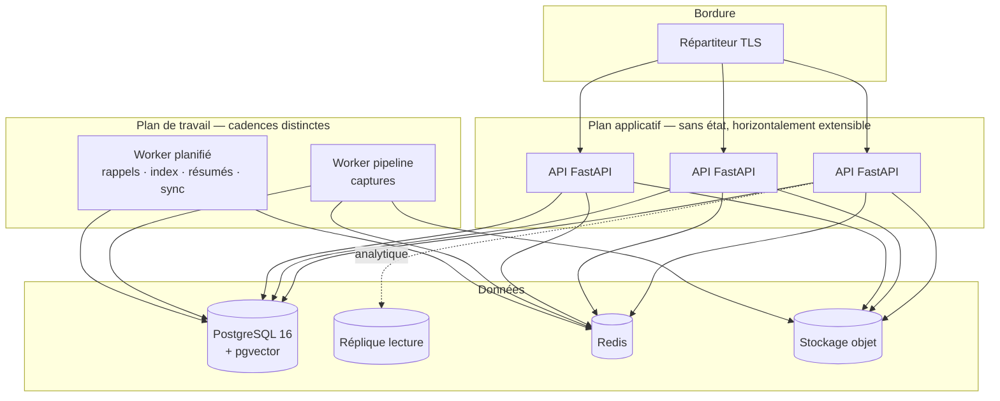

# MindFlow AI — Plan de déploiement

| | |
| --- | --- |
| **Version** | 1.0 — Phase 4 |
| **Public** | Ingénierie plateforme, astreinte |
| **Périmètre** | Mise en production initiale, montées de version, retour arrière |

> **Ce document décrit un plan, pas un historique.** Aucun de ces déploiements
> n'a été exécuté : le produit n'a jamais tourné ailleurs que sur une machine de
> développement, et le démon Docker n'était pas disponible pendant les quatre
> phases. Les commandes sont écrites pour être exécutées et vérifiées, pas pour
> être crues. Le §0 fait exception : il a été exécuté, et ce qu'il a trouvé est
> décrit à la fin.

---

## 0. Essayer le produit en local

**Exécuté le 2026-08-05, de bout en bout.** Pas un plan : une capture déclarée,
téléversée, transcrite par le worker, transformée en entrée, retrouvée dans le
tableau de bord. Sans clé d'API, sans Docker, sans compte Supabase.

```bash
cd mindflow && ./tool/dev_up.sh
```

Le script fait tout ce qui suit, dans cet ordre, et n'affiche « MindFlow
tourne » qu'après avoir vu `/health` répondre **et** le worker annoncer ses
tâches. Les deux vérifications comptent : un worker mort laisse une API qui
accepte tout et ne traite rien, ce qui est précisément le défaut décrit plus
bas. Il est idempotent — le relancer ne recrée ni le rôle, ni la base, ni le
`.env`, et ne redémarre pas ce qui tourne déjà.

`--stop` arrête l'API et le worker en laissant PostgreSQL et Redis, qui servent
probablement à autre chose. `--token` imprime un jeton de développement.

### Ce qu'il fait, si vous préférez le faire à la main

```bash
# 1. Les deux services d'infrastructure
pg_ctlcluster 16 main start        # ou: docker run -p 5432:5432 pgvector/pgvector:pg16
redis-server --daemonize yes

# 2. La base et ses extensions (une seule fois)
sudo -u postgres psql <<'SQL'
CREATE ROLE mindflow LOGIN PASSWORD 'mindflow';
CREATE DATABASE mindflow OWNER mindflow;
SQL
sudo -u postgres psql -d mindflow -c 'CREATE EXTENSION IF NOT EXISTS vector'

# 3. La configuration : les valeurs par défaut suffisent en local
cd mindflow/backend
cp .env.example .env
#    MINDFLOW_STORAGE_LOCAL_ROOT doit pointer sur un dossier inscriptible

# 4. Le schéma — migrations 0001 à 0009
uv run alembic upgrade head

# 5. Le worker d'abord, l'API ensuite
uv run arq app.workers.settings.WorkerSettings &
uv run uvicorn app.main:app --port 8000 &

curl -s localhost:8000/health     # {"status":"ok","version":"0.1.0","env":"local"}
```

Puis le client, au choix :

```bash
cd ../frontend
MINDFLOW_API_BASE_URL=http://localhost:8000 ./tool/build.sh linux   # ou: web
```

**Pourquoi aucune clé n'est nécessaire.** Deux mécanismes existent exactement
pour ça, et aucun des deux ne survit à la production :

| Mécanisme | En local | Ailleurs |
| --- | --- | --- |
| Jetons non signés (`make_local_token`, ADR-030) | Acceptés, avec un `warning` à chaque requête | Refusés |
| Moteurs `fake` (STT, LLM, embedding) | Renvoient du texte français plausible, hors ligne | Le contrôle de configuration refuse de démarrer (P6) |

Un tour complet en ligne de commande, si vous voulez voir le pipeline tourner
avant de compiler le client :

```bash
TOKEN=$(uv run python -c "from app.infra.auth.supabase import make_local_token
print(make_local_token('11111111-1111-4111-8111-111111111111','vous@example.com'))")

curl -X POST localhost:8000/v1/captures -H "Authorization: Bearer $TOKEN" \
  -H 'Content-Type: application/json' \
  -d '{"client_capture_id":"…","kind":"quick","duration_ms":18000,"audio_format":"m4a","captured_at":"…"}'
# → renvoie une URL signée : PUT l'audio dessus, puis POST …/complete,
#   et le worker fait le reste en une seconde.
```

**Ce que ce premier démarrage a révélé.** Trois défauts sur le chemin de
lancement, aucun visible depuis 892 tests au vert, parce que la suite appelle
les tâches directement et ne démarre jamais le processus :

1. `WorkerSettings.redis_settings` était une `@staticmethod`. `arq` lit
   `WorkerSettings.__dict__` et non l'attribut : le worker mourait au démarrage
   sur `'staticmethod' object has no attribute 'host'` — **avant** d'exécuter
   une seule tâche. C'est la commande du `docker-compose.yml`, jamais lancée
   faute de démon Docker.
2. `arq` nomme une tâche d'après son `__qualname__`, pas son `__name__`. La
   tâche s'enregistrait donc en `process_capture_job` quand l'API met
   `process_capture` en file : travail accepté, jamais exécuté, capture bloquée
   en `uploaded` — et le balayeur la ré-enfilait sous le même mauvais nom.
3. Le worker écoutait la file par défaut d'`arq` alors que l'API écrit sur
   `capture.realtime`. Même silence, un étage plus bas.

Les trois sont corrigés et couverts par `tests/unit/test_worker_settings.py`,
qui passe désormais par le chargeur d'`arq` lui-même plutôt qu'à côté.

**Ce que le §0 ne prouve pas** : ni la transcription réelle (le moteur est
`fake`), ni un fournisseur d'intégration réel, ni la tenue en charge, ni quoi
que ce soit de la §4. Il prouve que le produit démarre, encaisse une capture et
la rend.

---

## 1. Ce qu'il faut avant de commencer

| # | Prérequis | Pourquoi il bloque |
| --- | --- | --- |
| P1 | PostgreSQL 16 avec `pgvector` ≥ 0.5 | HNSW n'existe pas avant. Sur un managé où `CREATE EXTENSION` est refusé, l'extension doit être **pré-créée** — la migration 0006 la trouve et continue |
| P2 | Redis 7 | File de travaux (arq). Sans lui, aucune capture n'est traitée |
| P3 | Un secret `MINDFLOW_TOKEN_ENCRYPTION_KEYS` | Sans clé, le service refuse de démarrer en production. Voir §3 |
| P4 | Un `MINDFLOW_PUBLIC_BASE_URL` réel | Une valeur `localhost` fait pointer chaque lien de partage sur la machine de l'expéditeur. Le contrôle de configuration refuse de démarrer |
| P5 | Rôles `mindflow_app`, `mindflow_readonly`, `mindflow_maintenance` | Créés par la migration 0003. Le rôle applicatif est `NOBYPASSRLS` : c'est ce qui rend l'isolation réelle plutôt que déclarative |
| P6 | Un fournisseur STT, LLM, embedding et chat non `fake` | Les faux passent les tests et renvoient du bruit vraisemblable en production |

**Le point P6 mérite d'être détaillé** : le faux encodeur produit des vecteurs
qui s'indexent et se retrouvent *avec succès* et n'encodent rien. La recherche
sémantique aurait l'air de fonctionner en renvoyant les mauvaises notes. Le
contrôle de configuration refuse donc de démarrer avec, et c'est délibéré.

---

## 2. Topologie



**Le plan applicatif est sans état.** Aucune session en mémoire, aucun cache
local qui doive être cohérent entre instances : le seul état partagé est
PostgreSQL et Redis. C'est ce qui rend `replicas: N` suffisant.

**Les deux workers sont séparés par cadence, pas par domaine.** Le pipeline de
capture traite des travaux longs et coûteux ; les jobs planifiés sont courts et
fréquents. Les mélanger ferait attendre un rappel derrière une transcription de
quarante minutes.

---

## 3. Secrets

```bash
# Générer une clé de chiffrement de jetons
python -c "from app.infra.crypto import generate_key; print(generate_key())"

# Format attendu : id:base64[,id:base64…] — la clé active en premier
MINDFLOW_TOKEN_ENCRYPTION_KEYS="2026-08:AbC…=,2025-11:XyZ…="
```

**Rotation sans interruption.** Ajouter la nouvelle clé *en tête*, garder
l'ancienne dans la liste. Les nouvelles écritures utilisent la première, les
lectures utilisent celle que le chiffré nomme. Le job de réencodage repasse en
tâche de fond ; l'ancienne clé se retire quand `needs_rotation` ne renvoie plus
rien.

Une rotation qui exige une fenêtre de maintenance est une rotation qui n'a
jamais lieu — c'est pour cela que le format porte l'identifiant dans la valeur.

| Secret | Où | Rotation |
| --- | --- | --- |
| `TOKEN_ENCRYPTION_KEYS` | Gestionnaire de secrets | Annuelle, sans interruption |
| `SUPABASE_JWT_SECRET` / JWKS | Idem | Selon le fournisseur d'identité |
| Clés fournisseurs IA | Idem | Trimestrielle |
| `FCM_SERVICE_ACCOUNT_JSON` | Idem, chaîne verbatim | Annuelle |
| Mots de passe PostgreSQL | Idem, un par rôle | Trimestrielle |

---

## 4. Séquence de première mise en production

```bash
# 1. Extension, si le managé l'exige
psql "$ADMIN_URL" -c "CREATE EXTENSION IF NOT EXISTS vector"

# 2. Migrations, sur le rôle propriétaire
MINDFLOW_DATABASE_URL="$OWNER_URL" uv run alembic upgrade head

# 3. Vérifier ce que les migrations prétendent avoir fait
psql "$ADMIN_URL" -f ops/verify_schema.sql

# 4. Démarrer les workers avant l'API
#    Une capture déclarée sans worker reste en attente ; l'inverse ne se produit
#    pas, et le balayeur récupère de toute façon.
kubectl rollout status deploy/mindflow-worker

# 5. Démarrer l'API
kubectl rollout status deploy/mindflow-api

# 6. Vérifier
curl -fsS https://api.mindflow.ai/health/ready
```

**L'ordre des étapes 4 et 5 n'est pas cosmétique.** Une capture déclarée alors
qu'aucun worker ne tourne reste en attente et est reprise par le balayeur ; une
API absente pendant que les workers tournent ne casse rien non plus. Mais
démarrer les workers d'abord évite une file qui s'accumule pendant le premier
déploiement.

---

## 5. Migrations : ce qui est instantané et ce qui ne l'est pas

| Migration | Durée | Verrou | Note |
| --- | --- | --- | --- |
| 0001–0005 | Secondes | Aucun sur données existantes | Création de tables |
| 0006 | Secondes + `CREATE EXTENSION` | Aucun | HNSW sur table vide, donc instantané |
| 0007 | Secondes | `ACCESS EXCLUSIVE` bref sur `entry` (ajout de colonne nullable) | Une colonne nullable sans défaut est une opération de catalogue depuis PostgreSQL 11 |
| **0008** | **Proportionnelle à `audit_log`** | **`ACCESS EXCLUSIVE` sur `audit_log`** | **Voir ci-dessous** |

**La migration 0008 est la seule qui n'est pas instantanée.** PostgreSQL ne sait
pas convertir une table simple en table partitionnée : elle est renommée,
recréée partitionnée, et les lignes du mois courant sont recopiées. Les lignes
plus anciennes que la plus vieille partition sont abandonnées.

Sur une installation neuve c'est instantané. Sur une installation qui tourne
depuis des mois, prévoir une fenêtre proportionnelle au volume d'audit, ou
exporter d'abord.

---

## 6. Vérifications d'après-déploiement

Ce que le déploiement doit prouver avant d'être déclaré réussi.

```bash
# L'isolation multi-locataires est active — 35 tables au moins
psql "$RO_URL" -c "SELECT count(*) FROM pg_policy WHERE polname LIKE '%_tenant_isolation'"

# La visibilité par espace est RESTRICTIVE, pas permissive
psql "$RO_URL" -c "SELECT polname, polpermissive FROM pg_policy \
  WHERE polname LIKE '%_workspace_visibility'"
# Attendu : deux lignes, polpermissive = f

# Le rôle applicatif ne contourne pas RLS
psql "$RO_URL" -c "SELECT rolbypassrls FROM pg_roles WHERE rolname = 'mindflow_app'"
# Attendu : f

# Les partitions d'audit couvrent le mois prochain
psql "$RO_URL" -c "SELECT ensure_audit_partitions(3)"

# L'API répond et connaît sa version
curl -fsS https://api.mindflow.ai/health/ready | jq .
```

**La deuxième vérification est celle qui compte.** Une politique
`permissive` au lieu de `restrictive` élargirait l'accès au lieu de le
restreindre — et rien dans le comportement nominal ne le révélerait.

---

## 7. Retour arrière

| Situation | Action | Perte |
| --- | --- | --- |
| Bug applicatif, schéma inchangé | Redéployer l'image précédente | Aucune |
| Bug applicatif après 0007 | Redéployer l'image précédente **sans** annuler la migration | Aucune : les colonnes ajoutées sont nullables et ignorées par l'ancien code |
| Bug de politique RLS | `DROP POLICY entry_workspace_visibility` — le produit revient au comportement phase 3 | Isolation par espace suspendue. À faire en connaissance de cause |
| Migration 0008 problématique | `alembic downgrade 0007` | Les partitions d'audit sont recollées en table simple |

**La règle générale : revenir en arrière sur le code, pas sur le schéma.**
Chaque migration de la phase 4 est conçue pour qu'une version antérieure de
l'application continue de fonctionner contre le schéma nouveau — colonnes
nullables, tables inconnues ignorées. Annuler une migration est une opération de
dernier recours, pas la première réaction.

---

## 8. Capacité

Chiffres de dimensionnement, pas de mesure : **rien de ceci n'a été mesuré sous
charge.** Ce sont des points de départ à corriger dès les premières métriques
réelles.

| Composant | Départ | Ce qui le fait grandir |
| --- | --- | --- |
| API | 3 instances, 1 vCPU / 2 Gio | Latence p95 > 300 ms sur les routes de lecture |
| Worker pipeline | 2 instances | Profondeur de file > 50 pendant plus de 5 minutes |
| Worker planifié | 1 instance | `embedding_backlog` qui monte sans redescendre |
| PostgreSQL | 4 vCPU / 16 Gio, 100 Gio | Taux de succès du cache < 95 % |
| Redis | 1 Gio | Rarement le goulot ici |

**Le signal le plus utile n'est pas une métrique système.** C'est
`embedding_backlog` : un retard qui monte et ne redescend jamais signifie que la
recherche sémantique répond depuis un corpus périmé — indiscernable, de
l'extérieur, d'une recherche correcte.

---

## 9. Le client

| Cible | Commande | Hôte requis |
| --- | --- | --- |
| Web | `./tool/build.sh web` | N'importe lequel |
| Linux | `./tool/build.sh linux` | Linux + `libgtk-3-dev` |
| Windows | `./tool/build.sh windows` | **Windows** |
| macOS | `./tool/build.sh macos` | **macOS + Xcode** |

```bash
MINDFLOW_API_BASE_URL=https://api.mindflow.ai \
SUPABASE_URL=… SUPABASE_ANON_KEY=… \
  ./tool/build.sh web
```

**`WEB_BASE_HREF` si le site n'est pas servi à la racine.** Le laisser à `/`
sous un sous-chemin produit une page qui demande ses propres ressources en 404 —
visible immédiatement, ce qui est la seule bonne nouvelle de ce réglage.

**Le web doit être servi en application monopage** : toute route inconnue rend
`index.html`, sinon un lien de partage rechargé donne un 404 du serveur.

**Web et Linux ont été produits et vérifiés ici. Windows et macOS non**, et pas
par manque de temps : Flutter édite les liens contre le SDK de la plateforme, et
il n'y a pas de compilation croisée. La matrice CI les couvre ; aucun binaire
Windows ou macOS n'existe à ce jour.

---

## 10. Ce que ce plan ne couvre pas

Énoncé plutôt qu'omis.

- **Aucun déploiement n'a été exécuté.** Ni Docker Compose, ni Kubernetes, ni
  aucun fournisseur. Les manifestes n'existent pas. Le §0 est un démarrage
  local, pas un déploiement — et il a suffi à trouver trois défauts que la
  suite de tests ne pouvait pas voir.
- **Aucune restauration de sauvegarde n'a été testée.** Une sauvegarde jamais
  restaurée n'est pas une sauvegarde.
- **Aucun test de charge.** Les chiffres du §8 sont des hypothèses.
- **Aucun binaire Windows ni macOS n'a été produit.** Impossible depuis un hôte
  Linux ; la CI est écrite et n'a jamais tourné.
- **Aucune signature de code, aucun notariat.** Un `.app` non notarié est refusé
  par Gatekeeper, un `.exe` non signé déclenche SmartScreen.
- **Le déploiement multi-région n'est pas conçu.** `account.data_region` existe
  depuis la phase 1 et n'a jamais servi.
- **Pas de plan de reprise après sinistre.** RTO et RPO ne sont pas définis.
