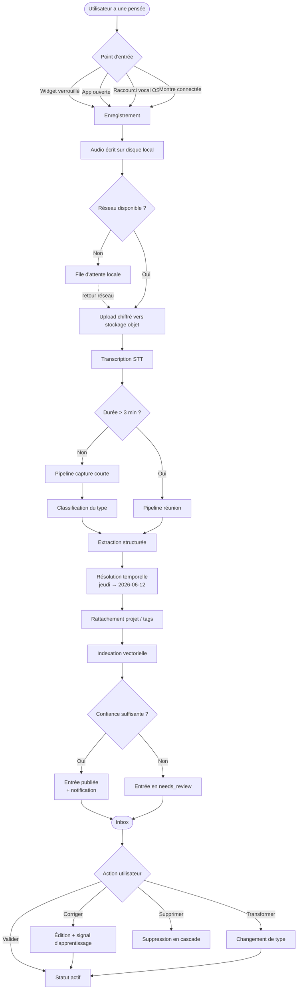
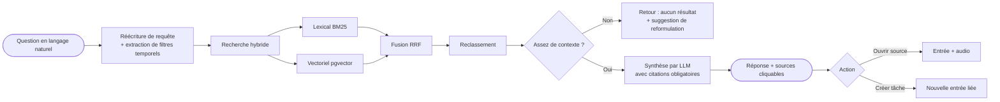

# MindFlow AI — Product Requirements Document

> **Phase 0 — Conception.** Ce document ne contient aucun code applicatif. Il décrit
> le produit, ses utilisateurs et son périmètre fonctionnel. L'architecture technique
> est dans `Architecture.md`, les arbitrages dans `Decisions.md`.
>
> MindFlow AI est un produit **nouveau et indépendant** du projet *Transformation OS*
> présent à la racine de ce dépôt. Les deux ne partagent ni code, ni base de données,
> ni cycle de vie.

| | |
| --- | --- |
| **Produit** | MindFlow AI |
| **Version du document** | 0.1 — Phase 0 |
| **Statut** | Conception validée, développement non démarré |
| **Auteurs** | Principal Software Architect / Product Manager / UX Designer / AI Engineer |

---

## Table des matières

1. [Vision produit](#1-vision-produit)
2. [Analyse du problème](#2-analyse-du-problème)
3. [Personas](#3-personas)
4. [Cas d'utilisation](#4-cas-dutilisation)
5. [User Journey](#5-user-journey)
6. [User Flow](#6-user-flow)
7. [Wireframes](#7-wireframes)
8. [Fonctionnalités MVP](#8-fonctionnalités-mvp)
9. [Fonctionnalités Premium](#9-fonctionnalités-premium)
10. [Métriques de succès](#10-métriques-de-succès)
11. [Hors périmètre](#11-hors-périmètre-explicite)

---

## 1. Vision produit

### 1.1 Énoncé

> **MindFlow AI transforme la parole en objets exploitables.**
> Vous parlez trois secondes ; le système vous rend une tâche datée, une décision
> tracée ou une idée classée — reliée à tout ce que vous avez déjà dit.

### 1.2 Le pari produit

La capture d'information souffre d'un déséquilibre : **le coût d'entrée est faible
mais le coût de mise en forme est élevé**. Un vocal de dix secondes prend trente
secondes à ranger. Résultat : soit on ne capture pas, soit on capture dans un magma
non exploitable (notes vocales du téléphone, messages qu'on s'envoie à soi-même,
post-its).

MindFlow AI déplace ce coût de mise en forme sur la machine. La promesse n'est pas
« notez plus vite » mais **« n'ayez plus jamais à ranger »**.

### 1.3 Positionnement

| Catégorie | Exemples | Ce qu'ils font | Ce qu'ils ne font pas |
| --- | --- | --- | --- |
| Notes vocales natives | Dictaphone iOS/Android | Capture instantanée | Aucune structure, aucune recherche sémantique |
| Notes texte | Notion, Obsidian, Apple Notes | Organisation riche | Exigent du clavier et du rangement manuel |
| Transcription de réunion | Otter, Fireflies, tl;dv | Compte-rendu long | Centrés réunion, pas la pensée quotidienne |
| Todo vocal | Assistants OS (Siri, Google) | Une tâche à la fois | Pas de mémoire, pas de corpus interrogeable |
| **MindFlow AI** | — | **Capture zéro-friction → objets typés → mémoire interrogeable** | Ne remplace pas un gestionnaire de projet |

**Différenciateur défendable** : la combinaison capture vocale instantanée +
extraction structurée typée + mémoire personnelle interrogeable en langage naturel.
Chaque brique existe isolément ; la boucle complète n'existe pas.

### 1.4 Principes directeurs

| # | Principe | Conséquence de conception |
| --- | --- | --- |
| P1 | **Le temps jusqu'à la capture est la métrique reine** | Un tap depuis l'écran verrouillé. Pas d'écran de choix avant de parler. |
| P2 | **La capture ne doit jamais échouer** | Enregistrement local d'abord, upload différé. Le mode avion est un mode normal. |
| P3 | **L'IA propose, l'utilisateur dispose** | Toute extraction est éditable ; aucune donnée n'est écrasée en silence. |
| P4 | **Le brut est sacré** | La transcription originale et l'audio sont conservés et toujours consultables. |
| P5 | **Rien n'est perdu, tout est retrouvable** | Recherche sémantique sur tout le corpus, y compris les captures « inutiles ». |
| P6 | **La vie privée est une fonctionnalité, pas une clause** | Chiffrement au repos, suppression réelle, aucune donnée utilisateur pour entraîner un modèle. |

### 1.5 Vision à 3 ans

Un **système de mémoire externe conversationnel**. L'utilisateur n'ouvre plus
l'application pour chercher : il demande. « Qu'est-ce que j'avais décidé sur le
recrutement du profil data ? » — et MindFlow répond en citant la capture du
14 mars et la décision révisée du 2 avril.

---

## 2. Analyse du problème

### 2.1 Le problème central

**Les idées, tâches et décisions naissent en mobilité, dans un contexte où la
saisie texte est impossible ou coûteuse — et meurent avant d'être structurées.**

### 2.2 Décomposition

#### Problème 1 — La friction de capture (le plus important)

L'écart entre « avoir une pensée » et « l'avoir enregistrée quelque part de fiable »
est de 15 à 60 secondes en moyenne (déverrouiller, choisir l'app, choisir le carnet,
taper, catégoriser). Dans les situations où l'idée survient — en marchant, en
conduisant, entre deux réunions, sous la douche — ce coût est prohibitif.

*Conséquence observable* : les gens s'envoient des messages à eux-mêmes sur WhatsApp
ou Slack. C'est le comportement de contournement le plus répandu, et c'est le vrai
concurrent.

#### Problème 2 — La friction de structuration

Une note vocale est un blob opaque. Pour être utile, elle doit devenir : une tâche
avec échéance, une décision avec parties prenantes, une idée avec des tags, un
compte-rendu avec des actions. Ce travail de transformation est manuel, ennuyeux,
et donc jamais fait.

*Conséquence observable* : des centaines de mémos vocaux jamais réécoutés.

#### Problème 3 — La friction de récupération

Même structurée, l'information est inutile si on ne peut pas la retrouver. La
recherche par mot-clé échoue quand on ne se souvient plus des mots exacts — ce qui
est le cas général six semaines plus tard.

*Conséquence observable* : on redécide deux fois la même chose, on reperd le même
temps.

#### Problème 4 — La fragmentation

Les tâches sont dans un outil, les notes dans un deuxième, les comptes-rendus dans
un troisième, les décisions nulle part. Aucun contexte ne circule.

### 2.3 Ce qui a changé et rend le produit possible maintenant

| Facteur | Situation 2020 | Situation 2026 |
| --- | --- | --- |
| Qualité STT multilingue | ~15 % WER en français bruité | < 6 % WER, ponctuation et diarisation incluses |
| Coût STT | Prohibitif à l'échelle | Modèles auto-hébergés viables, coût marginal ~0,003 €/min |
| Extraction structurée | Règles fragiles / NER limité | LLM avec sortie contrainte par schéma, fiable |
| Recherche sémantique | Infra vectorielle spécialisée | `pgvector` dans un PostgreSQL standard |
| Attentes utilisateurs | « Les assistants vocaux ne marchent pas » | Usage LLM quotidien normalisé |

### 2.4 Hypothèses à valider

| # | Hypothèse | Comment la tester | Risque si fausse |
| --- | --- | --- | --- |
| H1 | Les gens veulent parler à leur téléphone en public | Test terrain, mesure du ratio capture domicile/extérieur | Fort — recentrage sur usage bureau/domicile |
| H2 | La classification automatique atteint > 85 % de justesse perçue | Évaluation sur corpus annoté (voir `AI.md`) | Moyen — bascule sur un choix explicite post-capture |
| H3 | La recherche sémantique est utilisée après 4 semaines d'usage | Analytics : requêtes/utilisateur actif/semaine | Moyen — c'est le levier de rétention long terme |
| H4 | Le prix de 9 €/mois est acceptable pour l'individu | Landing page + tests tarifaires | Fort sur le modèle économique |

---

## 3. Personas

### Persona 1 — Léa, la consultante indépendante *(persona primaire)*

| | |
| --- | --- |
| **Âge / rôle** | 34 ans, consultante en transformation, indépendante |
| **Contexte** | 6 à 8 rendez-vous clients par semaine, souvent en déplacement |
| **Matériel** | iPhone (95 % de l'usage), MacBook |
| **Compétence tech** | Élevée sur les outils métier, faible tolérance à la configuration |

**Une journée type.** Sort d'un rendez-vous client à 11 h 40, marche vers le métro,
a trois choses en tête : relancer le DAF sur le budget, une idée de restructuration
de sa proposition commerciale, et le fait que le client a mentionné une contrainte
réglementaire qu'elle doit vérifier. À 12 h elle est en visio. À 18 h, deux des
trois éléments ont disparu.

**Douleurs**
- La perte d'information entre deux rendez-vous a un coût facturable direct.
- Le compte-rendu client prend 40 minutes le soir, quand elle est fatiguée.
- Elle ne retrouve pas ce qu'un client a dit il y a trois mois.

**Ce qu'elle attend de MindFlow**
1. Parler 20 secondes en marchant et retrouver trois objets distincts et rangés.
2. Un compte-rendu client exploitable généré à partir d'un enregistrement.
3. Pouvoir demander « qu'est-ce que le client X a dit sur la conformité ? ».

**Critère de succès personnel** : « Je n'ai rien perdu cette semaine. »

---

### Persona 2 — Karim, l'Engineering Manager *(persona primaire)*

| | |
| --- | --- |
| **Âge / rôle** | 41 ans, EM, 11 personnes dans l'équipe |
| **Contexte** | 22 h de réunion par semaine, dont 11 « 1:1 » |
| **Matériel** | Android + laptop Linux, souvent au casque |
| **Compétence tech** | Très élevée, méfiant sur la confidentialité |

**Une journée type.** Enchaîne les 1:1. Chaque conversation produit des engagements
(« je regarde ça », « on en reparle dans deux semaines ») et des signaux faibles
(« il a l'air démotivé »). Rien n'est écrit. Le suivi se fait à la mémoire, et la
mémoire est le point de rupture à partir de 8 personnes.

**Douleurs**
- Les engagements pris en 1:1 s'évaporent ; l'impact sur la confiance est réel.
- Les décisions techniques sont prises à l'oral et jamais tracées : six mois plus
  tard, personne ne sait *pourquoi*.
- Il refuse de mettre du contenu RH sensible dans un SaaS opaque.

**Ce qu'il attend de MindFlow**
1. Dicter après chaque 1:1 : 45 secondes → engagements + points de suivi datés.
2. Un journal de décisions techniques avec contexte, alternatives, arbitrage.
3. Des garanties explicites : chiffrement, localisation des données, suppression réelle.

**Critère de succès personnel** : « Je n'oublie plus ce que j'ai promis à quelqu'un. »

---

### Persona 3 — Sofia, la chercheuse-créatrice *(persona secondaire)*

| | |
| --- | --- |
| **Âge / rôle** | 27 ans, doctorante + créatrice de contenu |
| **Contexte** | Flux d'idées non structuré, lectures, brouillons |
| **Matériel** | Android, iPad, forte utilisation hors ligne |

**Douleurs**
- Ses idées arrivent en marchant ou en lisant, jamais devant un clavier.
- Elle a 400 notes vocales non exploitées.
- Elle veut connecter des idées entre elles, pas les ranger dans des dossiers.

**Ce qu'elle attend**
1. Un déversoir sans friction, sans arborescence à choisir.
2. Des liens automatiques : « cette idée ressemble à celle du 12 janvier ».
3. Un export propre vers Obsidian / Markdown.

**Critère de succès personnel** : « Mes idées se parlent entre elles. »

---

### Persona 4 — Marc, le dirigeant de PME *(persona secondaire, à fort ARPU)*

| | |
| --- | --- |
| **Âge / rôle** | 52 ans, dirigeant, 60 salariés |
| **Contexte** | Beaucoup de voiture, faible appétence technologique |
| **Matériel** | iPhone, CarPlay |

**Douleurs**
- Il délègue à l'oral et ne suit pas.
- Il n'ouvrira jamais une application avec plus de trois boutons.

**Ce qu'il attend**
1. Un bouton. Un seul.
2. Un récapitulatif quotidien par e-mail, sans ouvrir l'application.
3. Envoyer une consigne à son assistante depuis la voiture.

**Critère de succès personnel** : « Ça marche sans que j'y pense. »

---

### Persona 5 — Nadia, l'utilisatrice à besoin d'accessibilité *(persona d'inclusion)*

| | |
| --- | --- |
| **Contexte** | Dyslexie ; la saisie clavier est lente et coûteuse |

Ce persona n'est pas un segment marketing distinct mais **une contrainte de
conception** : la voix doit être un chemin complet, jamais un raccourci partiel.
Toute fonctionnalité qui exige du clavier pour être utile est un échec de conception.

---

### Anti-persona — qui n'est pas visé au MVP

| Anti-persona | Pourquoi |
| --- | --- |
| L'équipe cherchant un outil de gestion de projet collaboratif | MindFlow est individuel au MVP ; le collaboratif viendrait en v2+ |
| Le journaliste voulant transcrire 3 h d'interview | Cas d'usage transcription pure, économiquement défavorable |
| L'entreprise réglementée exigeant un déploiement on-premise | Complexité opérationnelle disproportionnée avant la traction |

---

## 4. Cas d'utilisation

Notation : **UC-xx**. Priorité : `P0` = MVP, `P1` = post-MVP, `P2` = premium/vision.

### UC-01 — Capture éclair *(P0, persona : tous)*

| | |
| --- | --- |
| **Acteur** | Utilisateur authentifié |
| **Déclencheur** | Une pensée survient |
| **Préconditions** | Application installée, micro autorisé |
| **Garantie minimale** | L'audio est persisté localement, même sans réseau |
| **Garantie de succès** | Une entrée typée et structurée existe dans l'inbox |

**Scénario nominal**
1. L'utilisateur active la capture (widget, raccourci, ou bouton principal).
2. L'enregistrement démarre en < 300 ms, retour haptique immédiat.
3. Il parle : « Faut que je rappelle le DAF de Vinci jeudi pour le budget Q3. »
4. Il relâche. L'audio est écrit sur le disque local.
5. L'upload démarre en tâche de fond.
6. Le pipeline transcrit, classifie, extrait.
7. Une notification arrive : « Tâche créée : Rappeler le DAF de Vinci — jeudi 12/06 ».

**Extensions**
- 3a. Silence > 2 s en début : l'enregistrement continue (on ne coupe jamais).
- 4a. Pas de réseau : file d'attente locale, tentative à chaque retour de connexion.
- 6a. Confiance de classification < seuil : l'entrée arrive en `needs_review`.
- 6b. Échec du STT : l'audio reste écoutable, l'entrée est marquée `transcription_failed`.

---

### UC-02 — Capture longue / réunion *(P0)*

L'utilisateur lance un enregistrement long (5 à 90 minutes). Le système segmente,
transcrit en flux, distingue les locuteurs quand c'est possible, puis produit :
résumé, décisions, actions avec responsable présumé et échéance, questions ouvertes.

**Contraintes** : indicateur d'enregistrement toujours visible ; l'application ne
doit pas être tuée en arrière-plan (service de premier plan Android, session audio
en arrière-plan iOS) ; consentement des participants rappelé au démarrage.

---

### UC-03 — Revue et correction de l'inbox *(P0)*

L'utilisateur ouvre l'inbox, voit les entrées récentes avec le type déduit,
corrige d'un geste ce qui est faux (changer le type, la date, le projet), valide
en lot. Toute correction est enregistrée comme signal d'amélioration (voir `AI.md`).

**Règle de conception** : corriger doit coûter moins cher que de créer. Un swipe,
pas un formulaire.

---

### UC-04 — Recherche en langage naturel *(P0 pour le lexical, P1 pour le sémantique)*

« Qu'est-ce que j'ai dit sur la refonte du site ? » → le système retourne les
extraits pertinents avec citation de la capture source, date, et lien vers l'audio.

**Exigence non négociable** : toute réponse générée cite ses sources. Une réponse
sans source est un bug.

---

### UC-05 — Revue quotidienne *(P0)*

Chaque jour à une heure choisie, l'utilisateur reçoit : ce qui est dû aujourd'hui,
ce qui est en retard, les entrées non traitées de plus de 3 jours, et une question
de relance sur une décision arrivée à échéance de révision.

---

### UC-06 — Transformation d'une entrée *(P0)*

Une idée devient une tâche. Une tâche devient un projet. Une note devient une
décision. La transformation conserve l'historique et le lien vers la capture d'origine.

---

### UC-07 — Export et intégrations *(P1)*

Export Markdown / JSON de tout le corpus (P0 — c'est une exigence de confiance).
Synchronisation sortante vers Todoist, Google Tasks, Notion, Google Calendar,
Slack (P1). Webhooks sortants (P2).

---

### UC-08 — Mode hors ligne *(P0)*

Capture, consultation du cache local et édition locale fonctionnent sans réseau.
La synchronisation est différée et résout les conflits par « dernière écriture
gagnante au niveau du champ » avec conservation de la version divergente.

---

### UC-09 — Multilingue et code-switching *(P0 pour FR/EN)*

Détection automatique de la langue. Un utilisateur qui parle français en glissant
des termes anglais métier ne doit pas casser la transcription.

---

### UC-10 — Partage d'un compte-rendu *(P1)*

Génération d'un lien public à durée de vie limitée, ou export PDF/e-mail, pour un
compte-rendu de réunion. Le partage exclut par défaut l'audio brut.

---

### UC-11 — Suppression et portabilité (RGPD) *(P0)*

L'utilisateur peut : exporter l'intégralité de ses données dans un format ouvert,
supprimer une capture (audio + transcription + dérivés + vecteurs), supprimer son
compte avec effacement effectif sous 30 jours et purge des sauvegardes sous 90 jours.

---

### UC-12 — Dictée en conduisant *(P1, persona Marc)*

Mode mains libres : activation par raccourci vocal système / CarPlay / Android Auto,
confirmation audible, aucun affichage requis.

---

### UC-13 — Question conversationnelle sur le corpus *(P2, premium)*

Un assistant qui interroge la mémoire personnelle sur plusieurs tours, avec
citations, et qui peut agir (« crée une tâche pour chacun de ces points »).

---

### Matrice cas d'utilisation × personas

| | Léa | Karim | Sofia | Marc | Nadia |
| --- | :-: | :-: | :-: | :-: | :-: |
| UC-01 Capture éclair | ●●● | ●●● | ●●● | ●●● | ●●● |
| UC-02 Réunion | ●●● | ●●● | ○ | ●● | ● |
| UC-03 Revue inbox | ●● | ●● | ●●● | ○ | ●● |
| UC-04 Recherche | ●●● | ●●● | ●●● | ● | ●● |
| UC-05 Revue quotidienne | ●● | ●●● | ● | ●●● | ●● |
| UC-07 Intégrations | ●●● | ●● | ●●● | ● | ● |
| UC-08 Hors ligne | ●● | ● | ●●● | ●● | ●● |
| UC-12 Mains libres | ● | ○ | ○ | ●●● | ●● |

`●●●` critique · `●●` important · `●` utile · `○` marginal

---

## 5. User Journey

### 5.1 Parcours d'adoption (macro, 90 jours)

| Phase | Jour | État mental | Action attendue | Risque de décrochage | Réponse produit |
| --- | --- | --- | --- | --- | --- |
| **Découverte** | J0 | « Encore une app de notes » | Installe | Très fort | Promesse en une phrase + démo de 15 s sans compte |
| **Première valeur** | J0 +2 min | « Est-ce que ça marche vraiment ? » | Première capture | Fort | Onboarding = *parler*, pas configurer. Résultat visible en < 20 s |
| **Activation** | J1–J3 | « J'y pense encore ? » | 3 captures / 2 jours | Fort | Widget écran verrouillé + rappel unique, non intrusif |
| **Habitude** | J4–J21 | « C'est devenu réflexe » | 5+ captures/semaine | Moyen | Revue quotidienne qui *rend* de la valeur au lieu d'en demander |
| **Dépendance** | J22–J60 | « J'ai peur de perdre ça » | Recherche sur son propre corpus | Faible | La recherche devient utile quand le corpus dépasse ~50 entrées |
| **Extension** | J60+ | « Je veux tout dedans » | Intégrations, réunions, upgrade | — | Déclencheur premium contextuel, jamais bloquant sur la capture |

**Point de bascule identifié** : la première fois que l'utilisateur *retrouve*
quelque chose qu'il avait oublié. C'est le moment où le produit passe d'outil de
saisie à mémoire externe. Tout le design doit accélérer l'arrivée de ce moment.

### 5.2 Parcours détaillé — Léa, semaine type

```
LUNDI 08:12   Métro          Capture 12 s   → 2 tâches + 1 idée
LUNDI 11:47   Sortie RDV     Capture 34 s   → 1 CR client + 3 actions
LUNDI 19:30   Domicile       Revue soir     → valide 5 entrées, corrige 1 date
MARDI 09:00   Bureau         Recherche      → « contrainte RGPD client Vinci »
MERCREDI      —              Aucune capture → aucune relance culpabilisante
JEUDI 14:00   Notification   Rappel tâche   → marque terminé à la voix
VENDREDI 17:00 Bilan hebdo   Résumé auto    → 14 captures, 9 tâches, 2 décisions
```

### 5.3 Courbe émotionnelle de la première session

```
Émotion
  +  │                                    ╭─── « ah, c'est déjà rangé »
     │                              ╭─────╯
  0  │──────╮              ╭────────╯
     │       ╲    ╭────────╯
  −  │        ╰───╯
     └────┬──────┬────────┬──────────┬──────────┬─────────▶ temps
        install  perms   1re parole  attente    résultat
                  ↑         ↑           ↑
              friction   gêne de     risque max :
              maximale   parler      si > 20 s, abandon
```

**Décisions de conception issues de cette courbe**
- Demander la permission micro **au moment de la première capture**, pas au lancement.
- Afficher la transcription en flux pendant le traitement : l'attente doit être visible.
- Ne jamais montrer un écran vide après la première capture.

---

## 6. User Flow

### 6.1 Flux principal — de la parole à l'objet structuré



### 6.2 Flux de recherche



### 6.3 Flux d'onboarding (première ouverture)

```
┌──────────┐   ┌───────────────┐   ┌──────────────┐   ┌───────────────┐
│ Écran 1  │──▶│ Écran 2       │──▶│ Écran 3      │──▶│ Écran 4       │
│ Promesse │   │ « Essayez »   │   │ Résultat     │   │ Compte        │
│ 1 phrase │   │ bouton micro  │   │ structuré    │   │ (différé)     │
└──────────┘   └───────────────┘   └──────────────┘   └───────────────┘
     3 s            15 s               8 s                20 s
                     ↑                                      ↑
          permission micro demandée ici        création de compte APRÈS
                                                la démonstration de valeur
```

**Règle** : aucune création de compte avant que l'utilisateur ait vu une capture
transformée. La valeur d'abord, l'engagement ensuite.

---

## 7. Wireframes

Basse fidélité, orientés structure et hiérarchie. Le design visuel est hors périmètre
de la phase 0.

### 7.1 Écran de capture (état repos)

```
┌─────────────────────────────────────┐
│  MindFlow            🔍      ⚙︎     │  ← barre minimale
├─────────────────────────────────────┤
│                                     │
│                                     │
│                                     │
│              ╭───────╮              │
│              │       │              │
│              │   ◉   │              │  ← bouton unique, 96 dp
│              │       │              │     zone tactile 120 dp
│              ╰───────╯              │
│                                     │
│         Maintenir pour parler       │
│         ou taper pour verrouiller   │
│                                     │
│                                     │
├─────────────────────────────────────┤
│  Aujourd'hui                        │
│  ┌───────────────────────────────┐  │
│  │ ✓ Rappeler le DAF     jeu 12  │  │  ← 3 dernières entrées
│  │ 💡 Refonte proposition        │  │     seulement
│  │ ⚑ Vérifier clause RGPD  urgent│  │
│  └───────────────────────────────┘  │
├─────────────────────────────────────┤
│   ◉        ☰         🔍        ⊙   │
│ Capture  Inbox    Recherche   Vous  │
└─────────────────────────────────────┘
```

### 7.2 Écran de capture (état enregistrement)

```
┌─────────────────────────────────────┐
│                            00:14    │
├─────────────────────────────────────┤
│                                     │
│      ▁▃▅█▇▅▃▂▄▆█▇▅▃▁▂▄▅▃▁         │  ← forme d'onde temps réel
│                                     │     (preuve que ça écoute)
│                                     │
│  « faut que je rappelle le DAF de   │  ← transcription partielle
│    Vinci jeudi pour le budget… »    │     en flux, opacité 60 %
│                                     │
│              ╭───────╮              │
│              │  ███  │              │  ← relâcher = terminer
│              ╰───────╯              │
│                                     │
│      ✕ Annuler        ⏸ Pause       │
│                                     │
└─────────────────────────────────────┘
```

### 7.3 Écran de traitement (post-capture)

```
┌─────────────────────────────────────┐
│  ← Retour                           │
├─────────────────────────────────────┤
│  Capture du 09/06 à 11:47 · 14 s    │
│  ▶ ━━━━━━━━━━━━━━━━━━━━━ 0:14      │  ← audio toujours accessible
├─────────────────────────────────────┤
│  ✓ Transcrit                        │
│  ✓ Classé                           │
│  ⟳ Extraction en cours…             │  ← étapes visibles
├─────────────────────────────────────┤
│  Transcription                      │
│  ┌───────────────────────────────┐  │
│  │ Faut que je rappelle le DAF   │  │
│  │ de Vinci jeudi pour le budget │  │
│  │ Q3. Et penser à relire la     │  │
│  │ clause RGPD avant.            │  │
│  └───────────────────────────────┘  │
├─────────────────────────────────────┤
│  2 éléments détectés                │
│  ┌───────────────────────────────┐  │
│  │ ⚑ TÂCHE                       │  │
│  │ Rappeler le DAF de Vinci      │  │
│  │ 📅 jeu. 12/06  📁 Vinci       │  │
│  │              [Modifier] [✓]   │  │
│  ├───────────────────────────────┤  │
│  │ ⚑ TÂCHE                       │  │
│  │ Relire la clause RGPD         │  │
│  │ 📅 avant jeu. 12/06           │  │
│  │              [Modifier] [✓]   │  │
│  └───────────────────────────────┘  │
│                                     │
│        [ Tout valider ]             │
└─────────────────────────────────────┘
```

### 7.4 Inbox

```
┌─────────────────────────────────────┐
│  Inbox                    3 à revoir│
│  [Tout] [Tâches] [Idées] [Décisions]│  ← filtres par type
├─────────────────────────────────────┤
│  ⚠ À revoir                         │
│  ┌───────────────────────────────┐  │
│  │ ? « on verra pour le recrut… »│  │  ← faible confiance
│  │   Type incertain              │  │
│  │   [Idée] [Tâche] [Note]       │  │  ← correction en 1 tap
│  └───────────────────────────────┘  │
├─────────────────────────────────────┤
│  Aujourd'hui                        │
│  ┌───────────────────────────────┐  │
│  │ ⚑ Rappeler le DAF   jeu 12/06 │  │
│  │   Vinci · 11:47               │  │
│  ├───────────────────────────────┤  │  ← swipe → : terminer
│  │ 💡 Refonte proposition co.    │  │  ← swipe ← : archiver
│  │   #commercial · 11:47         │  │
│  ├───────────────────────────────┤  │
│  │ ⚖ Décision : outil de CRM     │  │
│  │   Retenu : Pipedrive · 09:15  │  │
│  │   Révision : 09/09            │  │
│  └───────────────────────────────┘  │
│                                     │
│  Hier                          ▾    │
└─────────────────────────────────────┘
```

### 7.5 Détail d'une entrée

```
┌─────────────────────────────────────┐
│  ←                        ⋯ ⋮       │
├─────────────────────────────────────┤
│  ⚑ TÂCHE                            │
│                                     │
│  Rappeler le DAF de Vinci pour      │
│  le budget Q3                       │
│                                     │
│  📅 Échéance    jeudi 12 juin       │
│  📁 Projet      Vinci               │
│  🏷 Tags        #budget #client     │
│  ⚡ Priorité    Normale             │
├─────────────────────────────────────┤
│  Source                             │
│  🎙 Capture du 09/06 · 11:47 · 14 s │
│  ▶ ━━━━━━━━━━━━━━━━━ 0:14          │
│  « Faut que je rappelle le DAF de   │
│    Vinci jeudi pour le budget Q3 »  │
│  [Voir la transcription complète]   │
├─────────────────────────────────────┤
│  Lié à                              │
│  • Relire la clause RGPD (tâche)    │
│  • CR RDV Vinci du 09/06 (réunion)  │
│  • Décision : périmètre Q3 (12/05)  │
├─────────────────────────────────────┤
│  Historique                         │
│  09/06 11:47  Créé par IA           │
│  09/06 19:32  Échéance corrigée     │
├─────────────────────────────────────┤
│  [ Terminer ]      [ Reporter ]     │
└─────────────────────────────────────┘
```

### 7.6 Recherche

```
┌─────────────────────────────────────┐
│  🔍 qu'est-ce que j'ai dit sur      │
│     la refonte du site ?        ✕   │
├─────────────────────────────────────┤
│  💬 Réponse                          │
│  ┌───────────────────────────────┐  │
│  │ Vous en avez parlé 3 fois.    │  │
│  │ Le 12/03 vous envisagiez une  │  │
│  │ refonte complète [1]. Le      │  │
│  │ 02/04 vous avez arbitré pour  │  │
│  │ une refonte progressive par   │  │
│  │ pages, budget 15 k€ [2]. Le   │  │
│  │ 18/05 vous notiez que le      │  │
│  │ prestataire n'avait pas       │  │
│  │ répondu [3].                  │  │
│  └───────────────────────────────┘  │
│                                     │
│  Sources                            │
│  [1] 💡 Idée · 12/03 · 🎙 0:22      │
│  [2] ⚖ Décision · 02/04 · 🎙 1:14   │
│  [3] ⚑ Tâche · 18/05 · 🎙 0:09      │
│                                     │
│  ─────────────────────────────────  │
│  Toutes les entrées (7)         ▾   │
└─────────────────────────────────────┘
```

### 7.7 Compte-rendu de réunion (post UC-02)

```
┌─────────────────────────────────────┐
│  ← CR · Comité produit · 09/06      │
│                          [Partager] │
├─────────────────────────────────────┤
│  ⏱ 47 min · 4 participants          │
│  ▶ ━━━━━━━━━━━━━━━━━━━━ 47:12      │
├─────────────────────────────────────┤
│  Résumé                             │
│  Arbitrage sur le périmètre de la   │
│  v2. Report du module facturation…  │
│                        [Développer] │
├─────────────────────────────────────┤
│  Décisions (2)                      │
│  ⚖ Report du module facturation     │
│    → v2.1   Porté par : Karim       │
│  ⚖ Recrutement d'un dev front       │
│    → validé   Budget : 55 k€        │
├─────────────────────────────────────┤
│  Actions (5)                        │
│  ☐ Rédiger la fiche de poste        │
│    @Karim · 16/06                   │
│  ☐ Chiffrer le module facturation   │
│    @Léa · 20/06                     │
│  ☐ …                     [Voir tout]│
├─────────────────────────────────────┤
│  Questions ouvertes (1)             │
│  ? Qui reprend le sujet conformité ?│
├─────────────────────────────────────┤
│  [Exporter PDF]  [Envoyer par mail] │
└─────────────────────────────────────┘
```

### 7.8 Widget écran verrouillé / montre

```
   iOS Lock Screen             Wear OS / watchOS
┌───────────────────┐         ┌─────────────────┐
│                   │         │                 │
│   ◉   MindFlow    │         │       ◉         │
│                   │         │                 │
│  Appui long → REC │         │   Tap → REC     │
└───────────────────┘         └─────────────────┘
     1 geste, 0 déverrouillage      autonomie totale
```

---

## 8. Fonctionnalités MVP

**Objectif du MVP** : prouver que la boucle *capture → structuration → récupération*
tient debout pour un utilisateur individuel, en français et en anglais.

**Critère de sortie du MVP** : 40 % des utilisateurs ayant fait 3 captures en
semaine 1 sont encore actifs en semaine 4.

### 8.1 Périmètre fonctionnel

| ID | Fonctionnalité | Détail | Priorité |
| --- | --- | --- | --- |
| **F-01** | Capture vocale | Appui long + mode verrouillé, jusqu'à 10 min | Doit |
| **F-02** | Capture hors ligne | File d'attente locale, reprise automatique | Doit |
| **F-03** | Transcription | FR + EN, ponctuation, horodatage au mot | Doit |
| **F-04** | Classification | idée / tâche / note / décision / question / réunion | Doit |
| **F-05** | Extraction de tâche | titre, échéance, priorité, projet présumé | Doit |
| **F-06** | Résolution temporelle | « jeudi », « dans deux semaines », « fin de mois » | Doit |
| **F-07** | Inbox | liste, filtres par type, tri chronologique | Doit |
| **F-08** | Correction | changer type / date / projet / titre en ≤ 2 gestes | Doit |
| **F-09** | Détection multi-éléments | une capture → N entrées | Doit |
| **F-10** | Recherche lexicale | plein texte sur transcription + entrées | Doit |
| **F-11** | Recherche sémantique | pgvector, top-k avec citations | Doit |
| **F-12** | Lecture de l'audio source | depuis toute entrée dérivée | Doit |
| **F-13** | Revue quotidienne | notification + écran récapitulatif | Doit |
| **F-14** | Rappels | notification locale à l'échéance | Doit |
| **F-15** | Projets / tags | création implicite, rattachement suggéré | Doit |
| **F-16** | Export | Markdown + JSON, corpus complet | Doit |
| **F-17** | Compte et authentification | e-mail + lien magique, Apple/Google | Doit |
| **F-18** | Suppression RGPD | capture, entrée, compte complet | Doit |
| **F-19** | Compte-rendu de réunion | jusqu'à 30 min, résumé + actions | Devrait |
| **F-20** | Liens entre entrées | « similaire à » automatique | Devrait |
| **F-21** | Widget verrouillé | iOS + Android | Devrait |
| **F-22** | Web app (lecture) | consultation et édition, pas de capture | Devrait |

### 8.2 Exigences non fonctionnelles du MVP

| Domaine | Exigence | Seuil |
| --- | --- | --- |
| Latence de capture | Tap → début d'enregistrement | ≤ 300 ms (p95) |
| Latence de traitement | Fin de parole → entrée publiée, capture 15 s | ≤ 12 s (p50), ≤ 25 s (p95) |
| Disponibilité | API | 99,5 % mensuel |
| Fiabilité de capture | Captures perdues | 0 — objectif absolu |
| Précision STT | WER sur corpus FR conversationnel | ≤ 8 % |
| Justesse de classification | Accord avec l'utilisateur | ≥ 85 % |
| Justesse d'échéance | Dates correctement résolues | ≥ 90 % |
| Coût unitaire | Traitement d'une capture de 15 s | ≤ 0,004 € |
| Taille de l'app | Binaire mobile | ≤ 60 Mo |
| Accessibilité | WCAG 2.2 niveau AA | Conforme |
| Langues | Interface + traitement | FR, EN |

### 8.3 Ce qui est délibérément absent du MVP

| Absent | Raison |
| --- | --- |
| Collaboration / équipes | Multiplie la complexité (permissions, partage, facturation) sans valider l'hypothèse centrale |
| Intégrations tierces | Chacune est un projet ; on valide d'abord que le corpus a de la valeur |
| Assistant conversationnel multi-tours | La recherche one-shot suffit à valider H3 |
| Diarisation fine des locuteurs | Coûteuse, utile surtout en réunion longue (v1.1) |
| Applications desktop natives | La web app couvre le besoin |
| Chiffrement de bout en bout | Incompatible avec le traitement serveur ; à traiter en v3 (voir `Decisions.md` ADR-012) |

---

## 9. Fonctionnalités Premium

### 9.1 Modèle de monétisation

**Freemium avec limite de volume, pas de limite de valeur.**

Principe : la gratuité doit permettre de *vivre* le produit et d'atteindre le point
de bascule (§5.1). Ce qu'on limite, c'est le volume et les fonctions à coût marginal
élevé — jamais la capture elle-même.

| | **Free** | **Pro — 9 €/mois** | **Business — 19 €/utilisateur/mois** |
| --- | --- | --- | --- |
| Captures courtes / mois | 60 | Illimité | Illimité |
| Minutes de réunion / mois | 30 | 600 | 1 500 (mutualisées) |
| Historique consultable | 30 jours | Illimité | Illimité |
| Recherche lexicale | ✓ | ✓ | ✓ |
| Recherche sémantique | 10 requêtes/mois | Illimitée | Illimitée |
| Assistant conversationnel | — | ✓ | ✓ |
| Intégrations | — | 3 actives | Illimitées |
| Export | ✓ (toujours) | ✓ | ✓ + API |
| Partage de comptes-rendus | — | ✓ | ✓ + espaces partagés |
| Synthèses hebdo / mensuelles | — | ✓ | ✓ |
| Espaces d'équipe | — | — | ✓ |
| SSO / SCIM | — | — | ✓ |
| Rétention et audit | — | — | Configurables |
| Support | Communauté | E-mail 48 h | Prioritaire 8 h |

**Règle intangible** : l'export complet des données est gratuit et le restera. C'est
une garantie anti-verrouillage, et un argument commercial.

### 9.2 Fonctionnalités premium détaillées

| ID | Fonctionnalité | Palier | Justification du placement |
| --- | --- | --- | --- |
| **P-01** | Réunions longues (> 30 min) | Pro | Coût STT direct proportionnel |
| **P-02** | Assistant conversationnel multi-tours | Pro | Coût LLM significatif par échange |
| **P-03** | Synthèse hebdomadaire et mensuelle | Pro | Valeur perçue forte, coût modéré |
| **P-04** | Intégrations sortantes | Pro | Coût de développement et de maintenance |
| **P-05** | Historique illimité | Pro | Coût de stockage et d'index vectoriel |
| **P-06** | Détection de thèmes récurrents | Pro | Analyse batch coûteuse |
| **P-07** | Suivi de décisions avec relance | Pro | Différenciateur fort pour Karim |
| **P-08** | Partage de comptes-rendus | Pro | Ouvre l'usage professionnel |
| **P-09** | Espaces partagés d'équipe | Business | Nouvelle surface produit |
| **P-10** | Attribution d'actions à des tiers | Business | Nécessite la gestion d'utilisateurs |
| **P-11** | SSO SAML / OIDC, SCIM | Business | Exigence achat entreprise |
| **P-12** | Politiques de rétention configurables | Business | Exigence conformité |
| **P-13** | Journal d'audit exportable | Business | Exigence conformité |
| **P-14** | API publique + webhooks | Business | Usage avancé, coût de support |
| **P-15** | Résidence des données (UE/US) | Business | Exigence achat entreprise |
| **P-16** | Voix personnalisée / vocabulaire métier | Pro | Améliore le WER sur jargon |

### 9.3 Déclencheurs d'upgrade (conception)

| Moment | Message | Anti-pattern à éviter |
| --- | --- | --- |
| 50e capture du mois | « Il vous reste 10 captures ce mois-ci » | Ne jamais bloquer la capture en cours |
| Recherche n° 10 | « La recherche sémantique illimitée est dans Pro » | Ne pas dégrader les résultats déjà affichés |
| Réunion > 30 min | Proposé **avant** l'enregistrement, jamais pendant | Ne jamais couper un enregistrement en cours |
| Entrée de plus de 30 jours | « Débloquez votre historique complet » | Ne pas supprimer — masquer, et restaurer à l'upgrade |

**Règle** : une capture commencée se termine et se traite, quel que soit le quota.
Le dépassement est réglé au tour suivant. Perdre une capture pour une raison
commerciale détruirait le principe P2.

---

## 10. Métriques de succès

### 10.1 Métrique nord

**Captures structurées validées par utilisateur actif par semaine.**

Elle capture les trois moments de vérité : l'utilisateur a parlé (capture),
le système a compris (structurée), l'utilisateur a confirmé la valeur (validée).

### 10.2 Arbre de métriques

| Niveau | Métrique | Cible MVP |
| --- | --- | --- |
| **Acquisition** | Installation → 1re capture | ≥ 60 % |
| **Activation** | 3 captures en 7 jours | ≥ 35 % |
| **Rétention** | Actifs S4 / actifs S1 | ≥ 40 % |
| **Engagement** | Captures / utilisateur actif / semaine | ≥ 5 |
| **Qualité perçue** | Taux de correction manuelle | ≤ 15 % |
| **Qualité perçue** | Entrées en `needs_review` | ≤ 12 % |
| **Valeur** | Utilisateurs ayant fait ≥ 1 recherche en S4 | ≥ 50 % |
| **Fiabilité** | Captures perdues | 0 |
| **Économie** | Coût de traitement / utilisateur actif / mois | ≤ 0,45 € |
| **Monétisation** | Free → Pro à 90 jours | ≥ 4 % |

### 10.3 Contre-métriques (garde-fous)

| Contre-métrique | Seuil d'alerte | Ce qu'elle protège |
| --- | --- | --- |
| Temps moyen passé dans l'app par capture | > 45 s | Le produit doit faire *gagner* du temps |
| Entrées jamais consultées après 30 j | > 70 % | Signal que la structuration ne sert à rien |
| Corrections répétées sur le même type d'erreur | > 3/utilisateur/semaine | Défaillance du modèle d'extraction |
| Désinstallations après 1re capture | > 20 % | Échec de la promesse initiale |

---

## 11. Hors périmètre explicite

Ce que MindFlow AI **ne fera pas**, et pourquoi c'est un choix et non un manque :

| Non-objectif | Raison |
| --- | --- |
| Devenir un gestionnaire de projet | Le produit capture et structure ; il exporte vers les outils d'exécution |
| Devenir un éditeur de texte | La saisie clavier est un chemin secondaire, jamais le chemin principal |
| Transcrire de longs contenus (podcasts, cours) | Économie défavorable, concurrence installée |
| Générer du contenu à la place de l'utilisateur | Le produit structure la pensée existante, il ne l'invente pas |
| Fonctionner sans connexion pour l'IA | Le traitement local est un chantier v3, pas une promesse MVP |
| Faire de l'analyse de sentiment ou du scoring d'employés | Ligne rouge éthique, en particulier pour le persona Karim |

---

## Références

- Architecture technique → `Architecture.md`
- Décisions et compromis → `Decisions.md`
- Modèle de données → `Database.md`
- Contrat d'API → `API.md`
- Architecture IA et RAG → `AI.md`
- Trajectoire de versions → `Roadmap.md`
- Découpage en sprints → `Sprint01.md`, `Sprint02.md`, `Sprint03.md`
