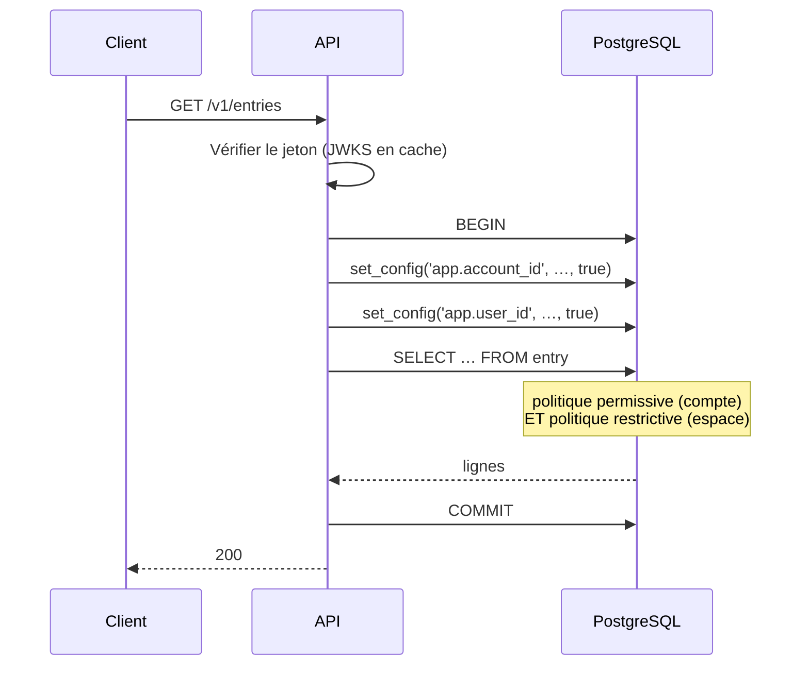

# MindFlow AI — Exploitation en production

| | |
| --- | --- |
| **Version** | 1.0 — Phase 4 |
| **Complément** | `Deployment.md` (mise en production), `DevOps.md` (runbooks) |

Ce document décrit **comment le système se comporte sous charge** et ce qui a
été fait pour qu'il tienne. Les optimisations sont énumérées avec la requête
qui les motive : une optimisation sans requête est une supposition.

---

## 1. Le chemin d'une requête



**Deux `set_config` par transaction, pas par requête.** `SET LOCAL` est lié à la
transaction et libéré au `COMMIT`, ce qui est la seule forme correcte avec un
pool de connexions : la forme non locale ferait fuiter le contexte d'un
locataire dans la requête suivante servie par la même connexion.

**Le coût ajouté par la phase 4 est une sous-requête `EXISTS` sur
`workspace_member`.** Elle est couverte par l'index `(user_id, workspace_id)
INCLUDE (role)`, donc elle ne touche jamais le tas. C'est l'index le plus chaud
du schéma : il est consulté sur chaque lecture de contenu d'une organisation.

---

## 2. Optimisations PostgreSQL

Chacune correspond à une requête existante.

| Optimisation | Requête servie | Effet |
| --- | --- | --- |
| `workspace_member (user_id, workspace_id) INCLUDE (role)` | La politique restrictive elle-même | Index-only scan au lieu d'un accès au tas, sur chaque lecture |
| `entry (workspace_id, occurred_at)` partiel sur les vivantes | Liste d'un espace | Évite un parcours des entrées du compte |
| `comment (entry_id, created_at)` partiel sur les vivantes | Fil d'une note | Les commentaires supprimés ne sont jamais listés |
| `mention (user_id, created_at)` partiel sur les non lues | Le badge de mentions | Les lues sont l'écrasante majorité et ne sont jamais comptées |
| `entity_mention (account_id, entity_id, occurred_at)` | « Quels sujets reviennent souvent ? » | La seule requête dont le coût croît avec le corpus, pas avec la page |
| `integration_connection (last_sync_at)` partiel sur actives | Le planificateur de synchronisation | Une connexion révoquée n'est jamais due |
| `share_link (token_hash)` partiel sur vivantes | Résolution d'un lien public | La seule requête sans contexte de locataire |
| **`audit_log` partitionné par mois** | Journal d'audit | Rétention par `DROP TABLE`, pas par `DELETE` |

### Le partitionnement, en détail

`audit_log` est la seule table qui croît sans borne et n'est jamais mise à jour
— exactement la forme pour laquelle le partitionnement existe.

```sql
SELECT ensure_audit_partitions(3);                  -- créer d'avance
SELECT drop_audit_partitions_before('2025-01-01');  -- purger
```

`DROP` d'une partition est instantané, récupère l'espace et ne verrouille pas le
reste de la table. Un `DELETE` équivalent prend un verrou, laisse la table
gonflée et demande un `VACUUM FULL` que personne ne planifie.

**Le piège** : un mois qui arrive sans partition fait échouer **chaque**
insertion d'audit. La fonction de création vit dans la base plutôt que dans un
job Python, pour qu'elle fonctionne même quand le worker est arrêté — c'est
précisément le moment où personne ne regarde.

### Ce qui n'a pas été fait, et pourquoi

| Écarté | Raison |
| --- | --- |
| Partitionner `entry` | Elle est bornée par compte, pas par le temps. Le partitionnement compliquerait chaque requête pour un gain nul |
| Index sur chaque clé étrangère | Un index qu'aucune requête n'utilise coûte en écriture et ne rapporte rien |
| Vues matérialisées pour les statistiques | Les agrégats actuels sont indexés et rapides. À reconsidérer avec des chiffres, pas avant |
| Réplique de lecture pour l'API | Non nécessaire aux volumes visés, et introduit un retard de réplication visible à l'utilisateur |

---

## 3. Optimisations FastAPI

| Optimisation | Pourquoi |
| --- | --- |
| Une transaction par requête, ouverte tard | Le contexte RLS y est posé ; une transaction plus longue tiendrait une connexion du pool pendant les appels HTTP sortants |
| Imports d'adaptateurs locaux aux branches | Un déploiement n'utilisant que Google ne construit ni n'importe six autres clients |
| Réponses en flux pour l'assistant | Le premier jeton dit à l'utilisateur que sa question a été comprise ; huit secondes de vide se lisent comme une panne |
| `X-Accel-Buffering: no` sur le flux | Sans lui, un proxy tamponne toute la réponse et retransforme le streaming en attente |
| Pas de cache applicatif | Un cache derrière RLS est un cache qu'il faut segmenter par locataire — et un segment oublié est une fuite |

**L'absence de cache est une décision, pas un oubli.** Mettre en cache une
réponse calculée sous un contexte de locataire est la façon la plus rapide de
servir les données d'un client à un autre. La bonne place pour du cache ici
serait le CDN sur des ressources non authentifiées ; il n'y en a pas.

---

## 4. Optimisations Flutter

Héritées de la phase 2 et toujours valables.

| Optimisation | Ce qu'elle évite |
| --- | --- |
| `itemExtent` sur les listes longues | Le calcul de hauteur de chaque élément à chaque image |
| `findChildIndexCallback` + `ValueKey` | La recréation de chaque widget quand un seul change |
| `provider.select` plutôt que `watch` | Soixante lignes reconstruites à chaque frappe |
| Clés de famille avec `==` | Une requête réseau par image de défilement |
| `RepaintBoundary` autour des blocs coûteux | Le repeint du graphique à chaque pixel de défilement |
| Pas d'`Opacity` par ligne | Un `saveLayer` par ligne fait tomber les images |
| `withValues(alpha:)` plutôt qu'un widget `Opacity` | Idem, sur les animations |

---

## 5. Montée en charge

Le plan applicatif est **sans état** : aucune session en mémoire, aucun cache
local à rendre cohérent. `replicas: N` suffit.

| Composant | Extension | Limite atteinte quand |
| --- | --- | --- |
| API | Horizontale | Les connexions PostgreSQL saturent — voir ci-dessous |
| Worker pipeline | Horizontale | Le fournisseur STT limite le débit |
| Worker planifié | **Une seule instance** | Voir ci-dessous |
| PostgreSQL | Verticale, puis réplique de lecture | Le taux de succès du cache descend |

**Le worker planifié ne s'étend pas horizontalement, et c'est un vrai plafond.**
Les jobs utilisent `FOR UPDATE SKIP LOCKED` là où ils réclament des lignes, donc
deux instances ne se marcheraient pas dessus pour les rappels. Mais
`ensure_audit_partitions` et les résumés ne sont pas protégés de la même façon.
À la prochaine phase, ou avant si le retard d'encodage devient le facteur
limitant.

**Les connexions PostgreSQL sont le vrai plafond.** Chaque instance d'API tient
un pool ; à trente instances, le nombre de connexions dépasse ce qu'un
PostgreSQL sert confortablement. La réponse est un pooler (PgBouncer en mode
transaction) — **non installé, non testé**, et incompatible avec les instructions
préparées de asyncpg sans configuration supplémentaire. C'est le premier travail
d'infrastructure à faire avant de dépasser une dizaine d'instances.

---

## 6. Ce qui n'a jamais été mesuré

Énoncé plutôt qu'implicite. **Aucun chiffre de ce document ne provient d'une
mesure.**

- Aucun test de charge, à aucune échelle.
- Aucun plan d'exécution examiné sur des données réelles : les index sont
  justifiés par la forme des requêtes, pas par un `EXPLAIN ANALYZE` sur un
  volume représentatif.
- Le coût réel de la politique restrictive sur une grande organisation est
  inconnu.
- Le comportement de HNSW sous filtre étroit reste théorique (limite L5 de
  `AI.md`).
- Aucun appel à un vrai fournisseur d'IA ou d'intégration n'a été passé.

La première action d'exploitation devrait être de mesurer, pas d'optimiser
davantage.
